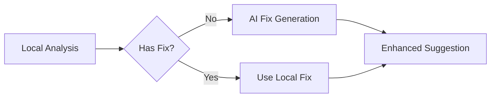

# WordWise Writing Assistant: Canonical System Reference

## 1. Vision & Architecture

### Guiding Principles
The WordWise assistant is architected around four core principles that ensure a seamless and intelligent user experience:

1.  **Responsiveness over Raw Power:** The perceived performance of the assistant is paramount. Our architecture prioritizes delivering the right feedback at the right time. We achieve this through a sophisticated event-driven system that runs different analyses based on specific user actions.
2.  **Clarity and User Agency:** The assistant's feedback must be clear, actionable, and understandable. The user should always feel in control, with the system acting as an intelligent partner, not an intrusive critic.
3.  **Server-Side Intelligence, Client-Side Agility:** To provide deep analysis without compromising client-side performance, the heavy lifting is done on the server. The client is a lightweight "sensor" that sends context to our powerful server-side engine for deep analysis, while handling instantaneous tasks like word count locally.
4.  **Incremental over Monolithic:** We analyze only what changed, not the entire document. This principle drives our performance and enables cost-effective AI integration.

### System Architecture: Event-Driven Analysis
Our architecture is a **server-side, event-driven, context-aware system**. The client-side editor detects specific user actions and triggers one of four distinct analysis events. This model avoids a slow, monolithic analysis and ensures the user receives the most relevant feedback with the appropriate urgency.

```mermaid
graph TD
    subgraph Client-Side (Browser)
        A[User Action in Editor] -- Triggers --> B{useUnifiedAnalysis Hook};
        B -- on every keystroke --> B1[Live Client Metrics];
        B -- on word boundary --> B2[API Call: Real-time Spell Check];
        B -- on 400ms idle --> B3[API Call: Fast Analysis Bundle];
        B -- on 800ms idle --> B4[API Call: Deep Analysis Bundle];

        subgraph State Management & UI
          C{SuggestionContext};
          D[UI Components <br/>(Underlines, Panels, Status Bar)];
        end
        
        B1 & B2 & B3 & B4 --> C;
        C --> D;
    end

    subgraph Server-Side (API)
        E[API Routes]
        subgraph Endpoints
            F1[/api/analysis/spell];
            F2[/api/analysis/fast];
            F3[/api/analysis/deep];
        end
        E -- uses --> G[UnifiedAnalysisEngine];
        G -- uses --> H[Analysis Toolbox];
    end

    B2 --> F1;
    B3 --> F2;
    B4 --> F3;
```

---

## 2. The Four Analysis Events

This is the core of our responsiveness strategy. The system is best understood as four distinct events triggered by user actions, with dynamic debouncing based on edit type.

| Event Name | What It Checks | How It's Triggered | The "Why" (Design Rationale) |
| :--- | :--- | :--- | :--- |
| **1. Live Client Metrics** | **Word Count** only. | **Instantly, on every keystroke.** | This is a pure client-side calculation in `useUnifiedAnalysis.ts`. It's decoupled from the server to give you the most critical metric with zero delay. It feels "live" because it is. |
| **2. Real-time Spell Check** | **A single word** for spelling errors. | **On word boundaries** (when you type a space or punctuation). | This is a lightweight, targeted server check (`/api/analysis/spell`). Its purpose is to create the *feeling* of instant, as-you-type spell check without the delay of the larger analysis bundles. |
| **3. "Fast" Analysis Bundle** | **Changed content only** for:<br/>- Spelling<br/>- Grammar<br/>- Style | **Dynamic timing:**<br/>- 100ms for paste<br/>- 200ms for deletions<br/>- 400ms for normal typing<br/>- 0ms for undo/redo | Incremental analysis that only checks what changed. Smart debouncing adapts to the type of edit for optimal responsiveness. |
| **4. "Deep" Analysis Bundle** | **Document-wide metrics** for:<br/>- SEO metrics & suggestions<br/>- Readability Level<br/>- Reading Time | **~800ms after you stop typing.** | This is a slower debounced check for holistic insights. These metrics are less urgent, so we wait longer to avoid distracting you while writing. |

---

## 3. The Analysis Toolbox & Services

All server-side analysis logic is modular and contained within our `UnifiedAnalysisEngine` (`services/analysis/engine.ts`).

#### Spelling
- **Purpose:** Fast, word-by-word and full-document spell-checking.
- **Service File:** `services/analysis/spellcheck.ts`
- **Core Library:** `nspell`
- **How it Works:** This service is used in two events:
    1.  **Real-time Spell Check:** Checks a single word.
    2.  **Fast Analysis Bundle:** Checks the entire document to catch pasted text or other complex changes.

#### Style & Basic Grammar
- **Purpose:** Detects common style issues and basic grammar errors.
- **Service Files:** `services/analysis/style.ts`, `services/analysis/basic-grammar.ts`
- **Core Library:** `write-good`
- **How it Works:** These services run as part of the **Fast Analysis Bundle**, leveraging `write-good` to find passive voice, weasel words, clichés, and custom rules for issues like repeated words.

#### SEO Analysis
- **Purpose:** Provides actionable feedback to help writers optimize content for search engines.
- **Service File:** `services/analysis/seo.ts`
- **Core Library:** Custom Rules
- **How it Works:** Runs a series of checks on the document's content and metadata as part of the **Deep Analysis Bundle**. It checks for the presence and optimal length of the title and meta description, and verifies the target keyword is used appropriately.

#### Document Metrics
- **Purpose:** Calculates quantitative metrics about the document.
- **Service File:** `services/analysis/metrics.ts`
- **Core Libraries:** `text-statistics`, `reading-time`
- **How it Works:** This service is used in two different ways:
    1.  **Live Client Metrics:** The **word count** is calculated instantly on the client inside `useUnifiedAnalysis.ts` on every keystroke.
    2.  **Deep Analysis Bundle:** **Reading Time** and **Readability** (Flesch-Kincaid Grade Level via `text-statistics`) are calculated on the server and sent back to the client. The `SuggestionContext` intelligently merges these with the live word count.

---

## 4. The Position-Independent Suggestion System

To ensure suggestions survive document edits and provide a stable user experience, our system separates **suggestion identity** from **position tracking**, leveraging ProseMirror's powerful position mapping capabilities.

### Core Architecture
The system uses a two-layer approach:

```typescript
// Layer 1: Suggestion Identity (stable, position-independent)
interface Suggestion {
  id: string;              // "spelling/misspelling-helo-0"
  ruleId: string;          // "spelling/misspelling"
  matchText: string;       // "helo"
  fixes: SuggestionAction[];
  message: string;
  severity: 'error' | 'warning';
  category: string;
  subCategory: string;
}

// Layer 2: Position Tracking (dynamic, updated via ProseMirror)
interface TrackedPosition {
  suggestionId: string;
  from: number;           // ProseMirror position
  to: number;             // ProseMirror position
}
```

### Stable ID Generation
IDs are generated using the formula: `${ruleId}-${textHash}-${occurrence}`
- **ruleId**: The specific rule that triggered (e.g., "spelling/misspelling")
- **textHash**: First 8 chars of the error text (normalized)
- **occurrence**: Which instance of this rule+text combination (0-based)

Example: `"grammar/punctuation-period-0"` for the first missing period

### Position Tracking via ProseMirror
Instead of searching for text, positions are tracked and updated through ProseMirror transactions:

```typescript
class SuggestionManager {
  updatePositions(tr: Transaction): void {
    this.positions.forEach((pos, id) => {
      // Map positions through the transaction
      const mappedFrom = tr.mapping.map(pos.from);
      const mappedTo = tr.mapping.map(pos.to);
      
      if (mappedFrom !== null && mappedTo !== null) {
        // Validate text hasn't changed
        const currentText = tr.doc.textBetween(mappedFrom, mappedTo);
        if (currentText === this.suggestions.get(id).matchText) {
          // Update position
          this.positions.set(id, { from: mappedFrom, to: mappedTo });
        }
        // Otherwise, suggestion is automatically removed
      }
    });
  }
}
```

### Key Benefits
1. **Real-time Compatible:** Works perfectly with live editing
2. **O(1) Performance:** No text searching required
3. **Handles All Edge Cases:** Undo/redo, collaborative editing, etc.
4. **Automatic Cleanup:** Suggestions removed when text is edited
5. **Position Accuracy:** Always accurate via transaction mapping

### Implementation Details

The system is implemented as a ProseMirror plugin that:
1. Tracks all suggestion positions in the document
2. Updates positions automatically on every transaction
3. Validates that text at each position hasn't changed
4. Provides decorations for visual rendering
5. Removes suggestions when their text is edited

```typescript
// ProseMirror plugin for automatic position tracking
const suggestionPlugin = new Plugin({
  key: suggestionTrackingKey,
  
  state: {
    apply(tr, value) {
      // Update all positions through transaction mapping
      value.manager.updatePositions(tr);
      return value;
    }
  },
  
  props: {
    decorations(state) {
      // Return decorations for rendering suggestions
      return DecorationSet.create(state.doc, /* ... */);
    }
  }
});
```

This approach ensures suggestions remain accurate even through complex editing operations like find-and-replace, undo/redo, or collaborative edits.

### Incremental Analysis System

To achieve optimal performance, the system only analyzes changed content:

```typescript
interface ParagraphCache {
  hash: string;                  // Content hash for validation
  suggestions: Suggestion[];     // Cached analysis results
  timestamp: number;
}

class IncrementalAnalyzer {
  analyze(previousDoc: Document, currentDoc: Document): AnalysisResult {
    // 1. Identify changed paragraphs
    const changes = diffParagraphs(previousDoc, currentDoc);
    
    // 2. Reuse cached results for unchanged paragraphs
    const cachedResults = getCachedSuggestions(unchanged);
    
    // 3. Only analyze changed paragraphs
    const newResults = analyzeChanges(changes);
    
    // 4. Merge and return
    return mergeResults(cachedResults, newResults);
  }
}
```

This enables:
- 80% reduction in analysis work on typical edits
- Sub-100ms response for single word changes
- Dramatic cost savings for AI-powered features
- Seamless integration with the position tracking system

---

## 5. AI Integration Architecture

WordWise integrates AI seamlessly into the existing architecture through two complementary approaches:

### AI-Enhanced Suggestions (Epic 2)
AI fills gaps where local analysis cannot provide fixes:



- **Selective Enhancement:** Only uses AI when needed
- **Progressive Disclosure:** AI suggestions marked with sparkle icon
- **Cost Effective:** Incremental analysis reduces AI calls by 100x

### AI Content Assistant (Epic 3)
A focused chat interface for content operations:

- **Simple Integration:** Tab in existing right panel
- **Context Aware:** Knows about document and selected text
- **Tool Calling:** Rewrite, generate, and improve tools
- **Streaming UI:** Real-time response with `useChat` hook

---

## 6. Performance Targets

After Epic 1.5 improvements, WordWise achieves:

| Metric | Current | Target | Status |
|--------|---------|--------|--------|
| Single word analysis | 400ms | < 50ms | 🟡 Pending |
| Full document (10k words) | 2-3s | < 500ms | 🟡 Pending |
| Suggestion accuracy | ~90% | 100% | 🟡 Pending |
| Memory usage | Unbounded | < 50MB | 🟡 Pending |
| AI response (first token) | N/A | < 500ms | 🟡 Pending |

---

## 7. Implementation Roadmap

### Epic 1.5: Architecture Improvements (4 weeks)
- ✅ Sprint 1-6: Foundation and basic features
- 🟡 Sprint 7: Position-independent suggestions with ProseMirror tracking
- 🟡 Sprint 8: Incremental analysis with paragraph-level caching
- 🟡 Sprint 9: Smart responsiveness with dynamic debouncing
- 🟡 Sprint 10: Performance optimization with virtual scrolling

### Epic 2: AI-Enhanced Suggestions (3 weeks)
- 🟡 Week 1: AI fix generation
- 🟡 Week 2: Contextual error detection
- 🟡 Week 3: Polish and preferences

### Epic 3: AI Content Assistant (4 weeks)
- 🟡 Week 1: Basic chat interface
- 🟡 Week 2: Tool calling implementation
- 🟡 Week 3: Templates and shortcuts
- 🟡 Week 4: Polish and launch

This document serves as the canonical reference for WordWise's architecture and should be updated as implementation progresses.
