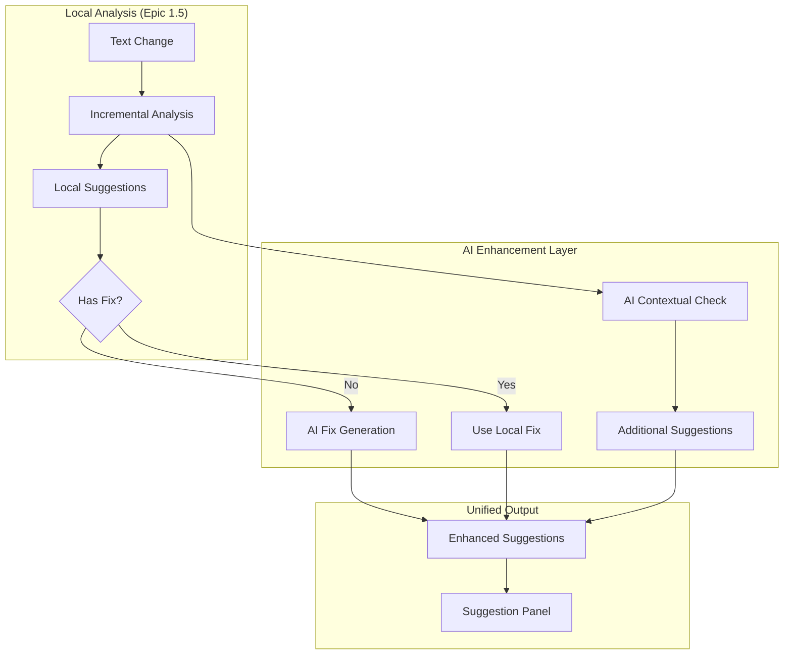

# Epic 2: AI-Enhanced Suggestions

## Overview

Seamlessly integrate AI into WordWise's suggestion system to provide intelligent fixes, detect contextual errors, and enhance the writing experience. This epic leverages the Vercel AI SDK and builds on Epic 1.5's robust text-based architecture.

## Core Principles

1. **Enhance, Don't Replace**: AI fills gaps where local analysis lacks fixes
2. **Progressive Enhancement**: System works without AI, better with it
3. **Performance First**: Leverage incremental analysis to minimize AI costs
4. **User Control**: AI features are optional and clearly marked

## Architecture Overview



## Sprint 1: AI Fix Generation (Week 1)

### Goals
- Add AI-generated fixes for suggestions that lack them
- Implement streaming for better UX
- Integrate with existing suggestion panel

### Implementation

#### 1.1 AI Service Setup

```typescript
// services/ai/suggestion-enhancer.ts
import { generateText, streamText } from 'ai';
import { openai } from '@ai-sdk/openai';
import type { TextBasedSuggestion } from '@/types/suggestions';

export class SuggestionEnhancer {
  private model = openai('gpt-3.5-turbo'); // Fast and cheap for fixes
  
  async enhanceSuggestion(
    suggestion: TextBasedSuggestion,
    context: string
  ): Promise<TextBasedSuggestion> {
    // Skip if already has a fix
    if (suggestion.replacementText) return suggestion;
    
    // Check cache first
    const cached = await this.cache.get(this.getCacheKey(suggestion));
    if (cached) {
      return { ...suggestion, replacementText: cached, aiGenerated: true };
    }
    
    try {
      const { text } = await generateText({
        model: this.model,
        messages: [{
          role: 'system',
          content: 'You are a writing assistant. Provide a single, concise fix for the given issue.'
        }, {
          role: 'user',
          content: `
            Issue: ${suggestion.message}
            Problem text: "${suggestion.matchText}"
            Context: "${context}"
            
            Provide only the corrected text, nothing else.
          `
        }],
        temperature: 0.3, // Low temperature for consistency
        maxTokens: 100
      });
      
      const fix = text.trim();
      
      // Cache the result
      await this.cache.set(this.getCacheKey(suggestion), fix);
      
      return {
        ...suggestion,
        replacementText: fix,
        aiGenerated: true,
        confidence: 0.9
      };
    } catch (error) {
      console.error('AI fix generation failed:', error);
      return suggestion; // Return unmodified
    }
  }
  
  // Batch enhance multiple suggestions
  async enhanceSuggestions(
    suggestions: TextBasedSuggestion[],
    documentText: string
  ): Promise<TextBasedSuggestion[]> {
    // Filter suggestions that need fixes
    const needsFixes = suggestions.filter(s => !s.replacementText);
    
    // Process in parallel with concurrency limit
    const enhanced = await Promise.all(
      needsFixes.map(s => this.enhanceSuggestion(s, documentText))
    );
    
    // Merge back with original suggestions
    const enhancedMap = new Map(enhanced.map(s => [s.id, s]));
    
    return suggestions.map(s => enhancedMap.get(s.id) || s);
  }
  
  private getCacheKey(suggestion: TextBasedSuggestion): string {
    return `fix:${suggestion.category}:${suggestion.matchText}`;
  }
}
```

#### 1.2 Integration with Analysis Pipeline

```typescript
// services/analysis/analyzers/ai-enhancement.ts
import { AnalysisLayer } from '../types';
import { SuggestionEnhancer } from '@/services/ai/suggestion-enhancer';

export const aiEnhancementLayer: AnalysisLayer = {
  name: 'ai-enhancement',
  priority: 5, // Runs after local analysis
  debounceMs: 1000,
  concurrent: false,
  
  async analyze(snapshot, context) {
    // Get previous results from local analysis
    const localSuggestions = context.previousResults.get('fast-local') || [];
    
    if (localSuggestions.length === 0) return [];
    
    // Only enhance if AI is enabled
    if (!context.userPreferences.aiEnabled) return [];
    
    const enhancer = new SuggestionEnhancer();
    const enhanced = await enhancer.enhanceSuggestions(
      localSuggestions,
      snapshot.plainText
    );
    
    // Return only the enhanced suggestions (others remain from local)
    return enhanced.filter(s => s.aiGenerated);
  }
};
```

#### 1.3 UI Updates

```typescript
// components/suggestions/SuggestionCard.tsx
import { Sparkles } from 'lucide-react';
import { motion } from 'framer-motion';

export function SuggestionCard({ suggestion, onApply }: Props) {
  const [showFix, setShowFix] = useState(false);
  
  // Auto-show fix for AI suggestions
  useEffect(() => {
    if (suggestion.aiGenerated && suggestion.replacementText) {
      setShowFix(true);
    }
  }, [suggestion]);
  
  return (
    <motion.div 
      className="suggestion-card"
      initial={{ opacity: 0, x: -20 }}
      animate={{ opacity: 1, x: 0 }}
    >
      <div className="flex items-start justify-between">
        <div className="flex-1">
          <h4 className="font-medium flex items-center gap-2">
            {suggestion.title}
            {suggestion.aiGenerated && (
              <Sparkles className="w-4 h-4 text-purple-500" />
            )}
          </h4>
          <p className="text-sm text-gray-600 mt-1">{suggestion.message}</p>
          
          {suggestion.replacementText && (
            <div className="mt-2">
              <div className="flex items-center gap-2">
                <span className="text-sm text-gray-500">Change to:</span>
                <code className="px-2 py-1 bg-green-50 text-green-700 rounded">
                  {suggestion.replacementText}
                </code>
              </div>
              
              <button
                onClick={() => onApply(suggestion)}
                className="mt-2 px-3 py-1 bg-green-600 text-white rounded hover:bg-green-700"
              >
                Apply Fix
              </button>
            </div>
          )}
        </div>
      </div>
    </motion.div>
  );
}
```

## Sprint 2: Contextual Error Detection (Week 2)

### Goals
- Detect contextual errors (their/there/they're)
- Add confidence scoring
- Implement streaming for real-time feedback

### Implementation

#### 2.1 Contextual Analyzer

```typescript
// services/ai/contextual-analyzer.ts
import { streamObject } from 'ai';
import { openai } from '@ai-sdk/openai';
import { z } from 'zod';

const contextualErrorSchema = z.object({
  errors: z.array(z.object({
    text: z.string(),
    replacement: z.string(),
    type: z.enum(['homophone', 'agreement', 'tense']),
    confidence: z.number().min(0).max(1),
    explanation: z.string()
  }))
});

export class ContextualAnalyzer {
  private model = openai('gpt-4-turbo'); // Better for context understanding
  
  async analyzeContext(
    text: string,
    existingSuggestions: TextBasedSuggestion[]
  ): Promise<TextBasedSuggestion[]> {
    // Skip short texts
    if (text.split(' ').length < 10) return [];
    
    // Extract already identified issues to avoid duplicates
    const identifiedIssues = existingSuggestions.map(s => s.matchText);
    
    const { partialObjectStream } = await streamObject({
      model: this.model,
      schema: contextualErrorSchema,
      messages: [{
        role: 'system',
        content: `You are an expert editor. Find contextual errors that spell checkers miss.
                  Focus on: homophones (their/there), subject-verb agreement, tense consistency.
                  Only report errors you're confident about (>80% certainty).`
      }, {
        role: 'user',
        content: `Analyze this text for contextual errors:
                  "${text}"
                  
                  Already identified: ${identifiedIssues.join(', ')}`
      }],
      temperature: 0.2
    });
    
    const suggestions: TextBasedSuggestion[] = [];
    
    // Stream results for progressive UI updates
    for await (const partialObject of partialObjectStream) {
      if (partialObject.errors) {
        for (const error of partialObject.errors) {
          if (error.confidence && error.confidence > 0.8) {
            suggestions.push({
              id: `ai-context-${error.text}-${suggestions.length}`,
              matchText: error.text,
              matchContext: this.extractContext(text, error.text),
              replacementText: error.replacement,
              message: error.explanation,
              category: 'grammar',
              subCategory: `contextual-${error.type}`,
              severity: 'warning',
              aiGenerated: true,
              confidence: error.confidence
            });
          }
        }
      }
    }
    
    return suggestions;
  }
  
  private extractContext(fullText: string, matchText: string): string {
    const index = fullText.indexOf(matchText);
    if (index === -1) return matchText;
    
    const start = Math.max(0, index - 20);
    const end = Math.min(fullText.length, index + matchText.length + 20);
    
    return fullText.substring(start, end);
  }
}
```

#### 2.2 Streaming UI Updates

```typescript
// hooks/useAISuggestions.ts
export function useAISuggestions(documentId: string) {
  const [aiSuggestions, setAiSuggestions] = useState<TextBasedSuggestion[]>([]);
  const [isAnalyzing, setIsAnalyzing] = useState(false);
  
  useEffect(() => {
    const analyzer = new ContextualAnalyzer();
    let aborted = false;
    
    async function analyze() {
      setIsAnalyzing(true);
      
      try {
        const suggestions = await analyzer.analyzeContext(
          documentText,
          existingSuggestions
        );
        
        if (!aborted) {
          setAiSuggestions(suggestions);
        }
      } finally {
        setIsAnalyzing(false);
      }
    }
    
    // Debounce AI analysis
    const timeout = setTimeout(analyze, 2000);
    
    return () => {
      aborted = true;
      clearTimeout(timeout);
    };
  }, [documentText, existingSuggestions]);
  
  return { aiSuggestions, isAnalyzing };
}
```

## Sprint 3: Polish & Performance (Week 3)

### Goals
- Implement intelligent batching
- Add user preferences
- Create settings UI
- Monitor usage and costs

### Implementation

#### 3.1 Batch Processing

```typescript
// services/ai/batch-processor.ts
export class AIBatchProcessor {
  private queue: Map<string, QueuedRequest> = new Map();
  private processing = false;
  
  async addToQueue(
    suggestion: TextBasedSuggestion,
    context: string
  ): Promise<TextBasedSuggestion> {
    return new Promise((resolve, reject) => {
      this.queue.set(suggestion.id, {
        suggestion,
        context,
        resolve,
        reject
      });
      
      this.processQueue();
    });
  }
  
  private async processQueue() {
    if (this.processing || this.queue.size === 0) return;
    
    this.processing = true;
    
    // Take up to 10 items from queue
    const batch = Array.from(this.queue.entries()).slice(0, 10);
    const batchIds = batch.map(([id]) => id);
    
    // Remove from queue
    batchIds.forEach(id => this.queue.delete(id));
    
    try {
      // Process batch with single AI call
      const results = await this.processBatch(batch);
      
      // Resolve promises
      results.forEach((result, index) => {
        const [, item] = batch[index];
        item.resolve(result);
      });
    } catch (error) {
      // Reject all promises in batch
      batch.forEach(([, item]) => item.reject(error));
    } finally {
      this.processing = false;
      
      // Process remaining items
      if (this.queue.size > 0) {
        setTimeout(() => this.processQueue(), 100);
      }
    }
  }
  
  private async processBatch(
    items: Array<[string, QueuedRequest]>
  ): Promise<TextBasedSuggestion[]> {
    const { text } = await generateText({
      model: openai('gpt-3.5-turbo'),
      messages: [{
        role: 'system',
        content: 'Generate fixes for multiple writing issues. Return a JSON array.'
      }, {
        role: 'user',
        content: JSON.stringify(
          items.map(([, item]) => ({
            id: item.suggestion.id,
            issue: item.suggestion.message,
            text: item.suggestion.matchText,
            context: item.context
          }))
        )
      }],
      temperature: 0.3
    });
    
    const fixes = JSON.parse(text);
    
    return items.map(([, item], index) => ({
      ...item.suggestion,
      replacementText: fixes[index].fix,
      aiGenerated: true
    }));
  }
}
```

#### 3.2 User Preferences

```typescript
// components/settings/AIPreferences.tsx
import { Switch } from '@/components/ui/switch';
import { Sparkles, Zap } from 'lucide-react';

export function AIPreferences() {
  const { preferences, updatePreferences } = useUserPreferences();
  
  return (
    <div className="space-y-6">
      <div className="flex items-center justify-between">
        <div className="flex items-center gap-3">
          <Sparkles className="w-5 h-5 text-purple-500" />
          <div>
            <h3 className="font-medium">AI Suggestions</h3>
            <p className="text-sm text-gray-600">
              Get AI-powered fixes for grammar and style issues
            </p>
          </div>
        </div>
        <Switch
          checked={preferences.aiEnabled}
          onCheckedChange={(checked) => 
            updatePreferences({ aiEnabled: checked })
          }
        />
      </div>
      
      <div className="flex items-center justify-between">
        <div className="flex items-center gap-3">
          <Zap className="w-5 h-5 text-yellow-500" />
          <div>
            <h3 className="font-medium">Fast Mode</h3>
            <p className="text-sm text-gray-600">
              Use faster AI model (may be less accurate)
            </p>
          </div>
        </div>
        <Switch
          checked={preferences.aiFastMode}
          onCheckedChange={(checked) => 
            updatePreferences({ aiFastMode: checked })
          }
        />
      </div>
      
      <div className="space-y-3">
        <h4 className="font-medium">AI Features</h4>
        <label className="flex items-center gap-2">
          <input
            type="checkbox"
            checked={preferences.aiContextualSpelling}
            onChange={(e) => 
              updatePreferences({ aiContextualSpelling: e.target.checked })
            }
          />
          <span className="text-sm">Contextual spelling (their/there)</span>
        </label>
        <label className="flex items-center gap-2">
          <input
            type="checkbox"
            checked={preferences.aiGrammarFixes}
            onChange={(e) => 
              updatePreferences({ aiGrammarFixes: e.target.checked })
            }
          />
          <span className="text-sm">Grammar corrections</span>
        </label>
      </div>
    </div>
  );
}
```

#### 3.3 Usage Tracking

```typescript
// services/ai/usage-tracker.ts
export class AIUsageTracker {
  async trackUsage(
    userId: string,
    type: 'fix' | 'contextual',
    tokens: number
  ) {
    await db.insert(aiUsageLogs).values({
      userId,
      type,
      tokens,
      cost: this.calculateCost(type, tokens),
      timestamp: new Date()
    });
    
    // Check monthly limits
    const monthlyUsage = await this.getMonthlyUsage(userId);
    if (monthlyUsage.tokens > PLAN_LIMITS[userPlan]) {
      throw new Error('Monthly AI limit exceeded');
    }
  }
  
  private calculateCost(type: string, tokens: number): number {
    const rates = {
      'fix': 0.002 / 1000, // GPT-3.5
      'contextual': 0.01 / 1000 // GPT-4
    };
    
    return tokens * rates[type];
  }
}
```

## API Routes

```typescript
// app/api/analysis/enhance/route.ts
import { auth } from '@/lib/auth';
import { SuggestionEnhancer } from '@/services/ai/suggestion-enhancer';

export async function POST(request: Request) {
  const session = await auth();
  if (!session) {
    return new Response('Unauthorized', { status: 401 });
  }
  
  const { suggestions, documentText } = await request.json();
  
  // Check user plan
  const hasAI = session.user.plan !== 'free';
  if (!hasAI) {
    return Response.json({ suggestions }); // Return unmodified
  }
  
  try {
    const enhancer = new SuggestionEnhancer();
    const enhanced = await enhancer.enhanceSuggestions(
      suggestions,
      documentText
    );
    
    return Response.json({ suggestions: enhanced });
  } catch (error) {
    console.error('AI enhancement failed:', error);
    return Response.json({ suggestions }); // Fallback to original
  }
}
```

## Success Metrics

1. **Performance**
   - AI enhancement < 300ms for single suggestion
   - Batch processing < 1s for 10 suggestions
   - Cache hit rate > 70%

2. **Quality**
   - 95% of grammar issues have fixes
   - Contextual error detection accuracy > 90%
   - User acceptance rate > 80%

3. **Cost**
   - Average cost per document < $0.01
   - Monthly cost per user < $1
   - Cost reduction via caching > 60%

## Migration Notes

- AI features are opt-in via settings
- Graceful degradation if AI fails
- Local analysis continues to work independently
- No breaking changes to existing UI

## Future Enhancements

1. **Model Selection** - Let users choose GPT-3.5 vs GPT-4
2. **Custom Prompts** - User-defined writing style
3. **Bulk Operations** - "Fix all AI suggestions" button
4. **Language Support** - Multi-language analysis