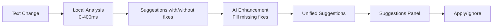

# Epic 1: AI-Enhanced Suggestions - Detailed Implementation

## Overview

Integrate AI into the existing suggestions panel to ensure every suggestion has actionable fixes. The system runs local checks first for instant feedback, then enhances with AI to fill gaps and provide better solutions.

## Architecture



## Sprint 1: AI Service Foundation

### 1.1 Install Dependencies

```bash
bun add ai @ai-sdk/openai zod
```

### 1.2 Create AI Analysis Service

```typescript
// services/ai/ai-analysis-service.ts
import { generateObject } from 'ai';
import { openai } from '@ai-sdk/openai';
import { z } from 'zod';
import type { UnifiedSuggestion } from '@/types/suggestions';

// Schema for AI to return structured suggestions
const aiSuggestionSchema = z.object({
  fixes: z.array(z.string()).min(1).describe('Possible fixes for the issue, best first'),
  explanation: z.string().optional().describe('Brief explanation of why this fix works'),
  confidence: z.number().min(0).max(1).describe('Confidence in the fix (0-1)')
});

const aiAnalysisSchema = z.object({
  suggestions: z.array(z.object({
    ruleId: z.string().describe('Identifier for the type of issue'),
    originalText: z.string().describe('The problematic text'),
    fixes: z.array(z.string()).min(1).describe('Suggested corrections'),
    explanation: z.string().describe('Why this is an issue'),
    confidence: z.number().min(0).max(1)
  }))
});

export class AIAnalysisService {
  private model = openai('gpt-4-turbo');
  
  // Enhance a suggestion that has no fixes
  async generateFixes(suggestion: UnifiedSuggestion): Promise<string[]> {
    try {
      const { object } = await generateObject({
        model: this.model,
        schema: aiSuggestionSchema,
        system: `You are a writing assistant. Generate fixes for the given writing issue.
                 Return 1-3 possible fixes, ordered by preference.`,
        prompt: `Issue: ${suggestion.message}
                 Category: ${suggestion.category}
                 Original text: "${suggestion.originalText || 'N/A'}"
                 
                 Generate appropriate fixes for this issue.`
      });
      
      return object.fixes;
    } catch (error) {
      console.error('AI fix generation failed:', error);
      return [];
    }
  }
  
  // Find issues that local tools missed
  async findAdditionalIssues(
    text: string, 
    existingSuggestions: UnifiedSuggestion[]
  ): Promise<UnifiedSuggestion[]> {
    try {
      // Create a summary of what we already found
      const existingIssuesSummary = existingSuggestions
        .map(s => `- ${s.category}: ${s.message}`)
        .join('\n');
      
      const { object } = await generateObject({
        model: this.model,
        schema: aiAnalysisSchema,
        system: `You are an expert writing assistant. Find writing issues that basic tools might miss.
                 Focus on: contextual spelling (their/there), complex grammar, clarity, and flow.
                 Do NOT duplicate these already-found issues.`,
        prompt: `Text to analyze: "${text}"
                 
                 Already found issues:
                 ${existingIssuesSummary || 'None'}
                 
                 Find additional issues that require context understanding.`
      });
      
      // Convert AI results to UnifiedSuggestions
      return object.suggestions.map(s => ({
        id: `ai-${this.generateStableId(s.ruleId, s.originalText)}`,
        source: 'ai' as const,
        severity: this.calculateSeverity(s.confidence),
        category: this.mapRuleToCategory(s.ruleId),
        message: s.explanation,
        shortMessage: s.ruleId,
        originalText: s.originalText,
        suggestions: s.fixes,
        position: this.findTextPosition(text, s.originalText),
        rule: s.ruleId,
        confidence: s.confidence,
        impact: 'medium' as const,
        autoApplicable: s.fixes.length === 1 && s.confidence > 0.9,
        aiGenerated: true
      }));
    } catch (error) {
      console.error('AI analysis failed:', error);
      return [];
    }
  }
  
  private generateStableId(rule: string, text: string): string {
    return `${rule}-${text}`.toLowerCase().replace(/[^a-z0-9]/g, '-');
  }
  
  private calculateSeverity(confidence: number): 'error' | 'warning' | 'info' {
    if (confidence > 0.8) return 'error';
    if (confidence > 0.5) return 'warning';
    return 'info';
  }
  
  private mapRuleToCategory(ruleId: string): string {
    const categoryMap: Record<string, string> = {
      'contextual-spelling': 'Spelling',
      'grammar-complex': 'Grammar',
      'clarity': 'Style',
      'flow': 'Style',
      'word-choice': 'Style'
    };
    return categoryMap[ruleId] || 'General';
  }
  
  private findTextPosition(fullText: string, searchText: string): { start: number; end: number } {
    const index = fullText.indexOf(searchText);
    if (index === -1) {
      return { start: 0, end: 0 };
    }
    return {
      start: index,
      end: index + searchText.length
    };
  }
}
```

### 1.3 Create Hybrid Analyzer

```typescript
// services/analysis/hybrid-analyzer.ts
import { UnifiedAnalysisEngine } from './engine';
import { AIAnalysisService } from '../ai/ai-analysis-service';
import type { UnifiedSuggestion, AnalysisResult } from '@/types/suggestions';

interface HybridAnalysisOptions {
  aiEnabled: boolean;
  includeAIFixes: boolean;
  findAdditionalIssues: boolean;
}

export class HybridAnalyzer {
  private localEngine: UnifiedAnalysisEngine;
  private aiService: AIAnalysisService;
  
  constructor() {
    this.localEngine = new UnifiedAnalysisEngine();
    this.aiService = new AIAnalysisService();
  }
  
  async analyze(
    text: string,
    event: 'spell' | 'fast' | 'deep',
    options: HybridAnalysisOptions
  ): Promise<AnalysisResult> {
    // Always run local analysis first
    const localResults = await this.localEngine.analyze(text, event);
    
    // If AI is disabled, return local results
    if (!options.aiEnabled) {
      return localResults;
    }
    
    // For spell check, don't use AI (too slow)
    if (event === 'spell') {
      return localResults;
    }
    
    // Enhance with AI
    const enhancedSuggestions = await this.enhanceWithAI(
      text,
      localResults.suggestions,
      options
    );
    
    return {
      ...localResults,
      suggestions: enhancedSuggestions,
      analysisSource: 'hybrid'
    };
  }
  
  private async enhanceWithAI(
    text: string,
    localSuggestions: UnifiedSuggestion[],
    options: HybridAnalysisOptions
  ): Promise<UnifiedSuggestion[]> {
    const enhanced = [...localSuggestions];
    
    // Step 1: Add fixes to suggestions that don't have them
    if (options.includeAIFixes) {
      const suggestionsNeedingFixes = localSuggestions.filter(
        s => !s.suggestions || s.suggestions.length === 0
      );
      
      // Process in parallel but limit concurrency
      const fixPromises = suggestionsNeedingFixes.map(async (suggestion) => {
        const fixes = await this.aiService.generateFixes(suggestion);
        if (fixes.length > 0) {
          // Update the suggestion with AI-generated fixes
          const index = enhanced.findIndex(s => s.id === suggestion.id);
          if (index !== -1) {
            enhanced[index] = {
              ...enhanced[index],
              suggestions: fixes,
              aiEnhanced: true
            };
          }
        }
      });
      
      await Promise.all(fixPromises);
    }
    
    // Step 2: Find additional issues that local tools missed
    if (options.findAdditionalIssues) {
      const additionalIssues = await this.aiService.findAdditionalIssues(
        text,
        localSuggestions
      );
      
      // Add AI-found issues to the list
      enhanced.push(...additionalIssues);
    }
    
    // Sort by position for better UX
    return enhanced.sort((a, b) => 
      (a.position?.start || 0) - (b.position?.start || 0)
    );
  }
}
```

## Sprint 2: API Routes & Integration

### 2.1 Create Analysis API Route

```typescript
// app/api/analysis/[event]/route.ts
import { NextRequest, NextResponse } from 'next/server';
import { HybridAnalyzer } from '@/services/analysis/hybrid-analyzer';
import { auth } from '@/lib/auth';

export async function POST(
  request: NextRequest,
  { params }: { params: { event: 'spell' | 'fast' | 'deep' } }
) {
  try {
    const session = await auth();
    if (!session) {
      return NextResponse.json({ error: 'Unauthorized' }, { status: 401 });
    }
    
    const { text, options } = await request.json();
    
    // Check user's plan for AI features
    const userPlan = await getUserPlan(session.user.id);
    const hasAIAccess = userPlan.plan !== 'free';
    
    const analyzer = new HybridAnalyzer();
    const result = await analyzer.analyze(text, params.event, {
      aiEnabled: hasAIAccess && options.aiEnabled !== false,
      includeAIFixes: hasAIAccess,
      findAdditionalIssues: hasAIAccess && params.event === 'deep'
    });
    
    return NextResponse.json(result);
  } catch (error) {
    console.error('Analysis error:', error);
    return NextResponse.json(
      { error: 'Analysis failed', suggestions: [] },
      { status: 500 }
    );
  }
}
```

### 2.2 Update useUnifiedAnalysis Hook

```typescript
// hooks/useUnifiedAnalysis.ts
import { useState, useEffect, useRef, useCallback } from 'react';
import { Editor } from '@tiptap/core';
import { debounce } from 'lodash';
import type { UnifiedSuggestion, AnalysisResult } from '@/types/suggestions';

interface UseUnifiedAnalysisOptions {
  aiEnabled?: boolean;
  documentContext?: {
    title?: string;
    targetKeyword?: string;
  };
}

export function useUnifiedAnalysis(
  editor: Editor | null,
  options: UseUnifiedAnalysisOptions = {}
) {
  const [suggestions, setSuggestions] = useState<UnifiedSuggestion[]>([]);
  const [metrics, setMetrics] = useState<any>(null);
  const [isAnalyzing, setIsAnalyzing] = useState(false);
  const [analysisSource, setAnalysisSource] = useState<'local' | 'hybrid'>('local');
  
  // Track applied suggestions for reconciliation
  const recentlyAppliedRef = useRef<Set<string>>(new Set());
  const reconciliationTimeoutRef = useRef<NodeJS.Timeout>();
  
  // Debounced analysis functions
  const runSpellCheck = useCallback(async (text: string, word: string) => {
    const response = await fetch('/api/analysis/spell', {
      method: 'POST',
      headers: { 'Content-Type': 'application/json' },
      body: JSON.stringify({ text, options: { lastWord: word } })
    });
    
    const result: AnalysisResult = await response.json();
    updateSuggestions(result.suggestions, 'spell');
  }, []);
  
  const runFastAnalysis = useCallback(
    debounce(async (text: string) => {
      setIsAnalyzing(true);
      
      const response = await fetch('/api/analysis/fast', {
        method: 'POST',
        headers: { 'Content-Type': 'application/json' },
        body: JSON.stringify({ 
          text, 
          options: { 
            aiEnabled: options.aiEnabled,
            documentContext: options.documentContext 
          } 
        })
      });
      
      const result: AnalysisResult = await response.json();
      updateSuggestions(result.suggestions, 'fast');
      setAnalysisSource(result.analysisSource || 'local');
      setIsAnalyzing(false);
    }, 400),
    [options]
  );
  
  const runDeepAnalysis = useCallback(
    debounce(async (text: string) => {
      const response = await fetch('/api/analysis/deep', {
        method: 'POST',
        headers: { 'Content-Type': 'application/json' },
        body: JSON.stringify({ 
          text, 
          options: { 
            aiEnabled: options.aiEnabled,
            documentContext: options.documentContext 
          } 
        })
      });
      
      const result: AnalysisResult = await response.json();
      updateSuggestions(result.suggestions, 'deep');
      if (result.metrics) {
        setMetrics(result.metrics);
      }
    }, 800),
    [options]
  );
  
  // Smart suggestion update with reconciliation
  const updateSuggestions = useCallback((
    newSuggestions: UnifiedSuggestion[],
    source: string
  ) => {
    setSuggestions(current => {
      // If we're in reconciliation window, be careful
      if (recentlyAppliedRef.current.size > 0) {
        return reconcileSuggestions(current, newSuggestions, recentlyAppliedRef.current);
      }
      
      // Otherwise, replace suggestions from this source
      const otherSuggestions = current.filter(s => 
        !s.id.startsWith(source === 'spell' ? 'spell-' : '')
      );
      
      return [...otherSuggestions, ...newSuggestions];
    });
  }, []);
  
  // Apply suggestion with reconciliation
  const applySuggestion = useCallback((suggestion: UnifiedSuggestion) => {
    if (!editor || !suggestion.suggestions?.[0]) return;
    
    // Start reconciliation window
    recentlyAppliedRef.current.add(suggestion.id);
    clearTimeout(reconciliationTimeoutRef.current);
    reconciliationTimeoutRef.current = setTimeout(() => {
      recentlyAppliedRef.current.clear();
    }, 3000);
    
    // Apply the fix in editor
    const { from, to } = mapSuggestionToEditorPosition(suggestion, editor);
    editor
      .chain()
      .focus()
      .setTextSelection({ from, to })
      .insertContent(suggestion.suggestions[0])
      .run();
    
    // Optimistically remove from UI
    setSuggestions(prev => prev.filter(s => s.id !== suggestion.id));
  }, [editor]);
  
  // Watch editor changes
  useEffect(() => {
    if (!editor) return;
    
    const handleUpdate = () => {
      const text = editor.getText();
      const { from } = editor.state.selection;
      const lastChar = text[from - 1] || '';
      
      // Cancel pending analyses
      runFastAnalysis.cancel();
      runDeepAnalysis.cancel();
      
      // Trigger appropriate analysis
      if (lastChar === ' ' || lastChar === '\n') {
        // Word boundary - check spelling
        const words = text.slice(0, from).split(/\s+/);
        const lastWord = words[words.length - 2];
        if (lastWord) {
          runSpellCheck(text, lastWord);
        }
      }
      
      // Always schedule deeper analyses
      runFastAnalysis(text);
      runDeepAnalysis(text);
    };
    
    editor.on('update', handleUpdate);
    return () => editor.off('update', handleUpdate);
  }, [editor, runSpellCheck, runFastAnalysis, runDeepAnalysis]);
  
  return {
    suggestions,
    metrics,
    isAnalyzing,
    analysisSource,
    applySuggestion,
    ignoreSuggestion: (id: string) => {
      setSuggestions(prev => prev.filter(s => s.id !== id));
    }
  };
}

// Helper function for reconciliation
function reconcileSuggestions(
  current: UnifiedSuggestion[],
  incoming: UnifiedSuggestion[],
  recentlyApplied: Set<string>
): UnifiedSuggestion[] {
  // Keep all current suggestions that weren't recently applied
  const kept = current.filter(s => !recentlyApplied.has(s.id));
  
  // Add new suggestions that aren't duplicates
  const existingIds = new Set(kept.map(s => s.id));
  const newSuggestions = incoming.filter(s => 
    !existingIds.has(s.id) && !recentlyApplied.has(s.id)
  );
  
  return [...kept, ...newSuggestions];
}

// Helper to map suggestion position to editor position
function mapSuggestionToEditorPosition(
  suggestion: UnifiedSuggestion,
  editor: Editor
): { from: number; to: number } {
  // TipTap positions are 1-indexed
  return {
    from: (suggestion.position?.start || 0) + 1,
    to: (suggestion.position?.end || suggestion.position?.start || 0) + 1
  };
}
```

## Sprint 3: Enhanced UI Components

### 3.1 Update Suggestion Card Component

```typescript
// components/suggestions/SuggestionCard.tsx
import { motion } from 'framer-motion';
import { Check, X, Sparkles, ChevronDown, Zap } from 'lucide-react';
import { useState } from 'react';
import type { UnifiedSuggestion } from '@/types/suggestions';

interface SuggestionCardProps {
  suggestion: UnifiedSuggestion;
  onApply: (suggestion: UnifiedSuggestion) => void;
  onIgnore: (id: string) => void;
}

export function SuggestionCard({ 
  suggestion, 
  onApply, 
  onIgnore 
}: SuggestionCardProps) {
  const [showAlternatives, setShowAlternatives] = useState(false);
  const [selectedFix, setSelectedFix] = useState(0);
  
  const isAIEnhanced = suggestion.aiEnhanced || suggestion.aiGenerated;
  const hasFixes = suggestion.suggestions && suggestion.suggestions.length > 0;
  
  return (
    <motion.div
      initial={{ opacity: 0, x: -20 }}
      animate={{ opacity: 1, x: 0 }}
      exit={{ opacity: 0, x: 20 }}
      className={`
        suggestion-card p-3 mb-2 rounded-lg border
        ${suggestion.severity === 'error' ? 'border-red-200 bg-red-50' : ''}
        ${suggestion.severity === 'warning' ? 'border-amber-200 bg-amber-50' : ''}
        ${suggestion.severity === 'info' ? 'border-blue-200 bg-blue-50' : ''}
        ${isAIEnhanced ? 'ring-1 ring-purple-200' : ''}
      `}
    >
      {/* Header */}
      <div className="flex items-start justify-between mb-2">
        <div className="flex items-start gap-2 flex-1">
          <span className={`
            w-2 h-2 rounded-full mt-1.5 flex-shrink-0
            ${suggestion.severity === 'error' ? 'bg-red-500' : ''}
            ${suggestion.severity === 'warning' ? 'bg-amber-500' : ''}
            ${suggestion.severity === 'info' ? 'bg-blue-500' : ''}
          `} />
          
          <div className="flex-1">
            <p className="text-sm text-gray-800">{suggestion.message}</p>
            <p className="text-xs text-gray-500 mt-0.5">
              {suggestion.category}
              {isAIEnhanced && (
                <span className="ml-2 inline-flex items-center gap-1">
                  <Sparkles className="w-3 h-3" />
                  AI Enhanced
                </span>
              )}
            </p>
          </div>
        </div>
      </div>
      
      {/* Fixes */}
      {hasFixes && (
        <div className="mt-3">
          {/* Primary Fix */}
          <div className="flex items-center gap-2 p-2 bg-white rounded border">
            <span className="text-sm font-mono text-red-600 line-through">
              {suggestion.originalText || 'current text'}
            </span>
            <span className="text-gray-400">→</span>
            <span className="text-sm font-mono text-green-600">
              {suggestion.suggestions[selectedFix]}
            </span>
          </div>
          
          {/* Alternative Fixes */}
          {suggestion.suggestions.length > 1 && (
            <button
              onClick={() => setShowAlternatives(!showAlternatives)}
              className="mt-2 text-xs text-gray-600 hover:text-gray-800 
                       flex items-center gap-1"
            >
              <ChevronDown className={`w-3 h-3 transition-transform
                ${showAlternatives ? 'rotate-180' : ''}`} 
              />
              {suggestion.suggestions.length - 1} alternative{suggestion.suggestions.length > 2 ? 's' : ''}
            </button>
          )}
          
          {showAlternatives && (
            <motion.div
              initial={{ height: 0, opacity: 0 }}
              animate={{ height: 'auto', opacity: 1 }}
              exit={{ height: 0, opacity: 0 }}
              className="mt-2 space-y-1"
            >
              {suggestion.suggestions.slice(1).map((fix, index) => (
                <button
                  key={index}
                  onClick={() => setSelectedFix(index + 1)}
                  className={`
                    w-full text-left p-2 rounded text-sm font-mono
                    ${selectedFix === index + 1 
                      ? 'bg-purple-100 text-purple-700' 
                      : 'bg-gray-50 hover:bg-gray-100'
                    }
                  `}
                >
                  {fix}
                </button>
              ))}
            </motion.div>
          )}
        </div>
      )}
      
      {/* Actions */}
      <div className="flex gap-2 mt-3">
        {hasFixes && (
          <button
            onClick={() => onApply({
              ...suggestion,
              suggestions: [suggestion.suggestions[selectedFix]]
            })}
            className="flex items-center gap-1.5 px-3 py-1.5 text-sm
                     bg-green-600 text-white rounded hover:bg-green-700
                     transition-colors"
          >
            {suggestion.autoApplicable ? <Zap className="w-3.5 h-3.5" /> : <Check className="w-3.5 h-3.5" />}
            Apply
          </button>
        )}
        
        <button
          onClick={() => onIgnore(suggestion.id)}
          className="flex items-center gap-1.5 px-3 py-1.5 text-sm
                   text-gray-600 hover:text-gray-800 transition-colors"
        >
          <X className="w-3.5 h-3.5" />
          Ignore
        </button>
      </div>
    </motion.div>
  );
}
```

### 3.2 Update Suggestions Panel

```typescript
// components/panels/EnhancedSuggestionsPanel.tsx
import { AnimatePresence, motion } from 'framer-motion';
import { AlertCircle, CheckCircle, Sparkles } from 'lucide-react';
import { SuggestionCard } from '@/components/suggestions/SuggestionCard';
import type { UnifiedSuggestion } from '@/types/suggestions';

interface EnhancedSuggestionsPanelProps {
  suggestions: UnifiedSuggestion[];
  isAnalyzing: boolean;
  analysisSource: 'local' | 'hybrid';
  onApply: (suggestion: UnifiedSuggestion) => void;
  onIgnore: (id: string) => void;
}

export function EnhancedSuggestionsPanel({
  suggestions,
  isAnalyzing,
  analysisSource,
  onApply,
  onIgnore
}: EnhancedSuggestionsPanelProps) {
  // Group by category
  const grouped = suggestions.reduce((acc, suggestion) => {
    const category = suggestion.category;
    if (!acc[category]) acc[category] = [];
    acc[category].push(suggestion);
    return acc;
  }, {} as Record<string, UnifiedSuggestion[]>);
  
  const totalAISuggestions = suggestions.filter(
    s => s.aiEnhanced || s.aiGenerated
  ).length;
  
  return (
    <div className="h-full flex flex-col">
      {/* Header */}
      <div className="px-4 py-3 border-b">
        <div className="flex items-center justify-between">
          <h3 className="font-medium">Suggestions</h3>
          <div className="flex items-center gap-2 text-sm">
            {analysisSource === 'hybrid' && (
              <span className="flex items-center gap-1 text-purple-600">
                <Sparkles className="w-3.5 h-3.5" />
                AI Enhanced
              </span>
            )}
            {isAnalyzing && (
              <span className="text-gray-500">Analyzing...</span>
            )}
          </div>
        </div>
        
        {totalAISuggestions > 0 && (
          <p className="text-xs text-gray-500 mt-1">
            {totalAISuggestions} AI-enhanced suggestion{totalAISuggestions !== 1 ? 's' : ''}
          </p>
        )}
      </div>
      
      {/* Suggestions List */}
      <div className="flex-1 overflow-y-auto p-4">
        <AnimatePresence mode="popLayout">
          {suggestions.length === 0 && !isAnalyzing ? (
            <motion.div
              initial={{ opacity: 0 }}
              animate={{ opacity: 1 }}
              exit={{ opacity: 0 }}
              className="text-center py-8"
            >
              <CheckCircle className="w-12 h-12 text-green-500 mx-auto mb-3" />
              <p className="text-gray-600">Great job! No issues found.</p>
            </motion.div>
          ) : (
            Object.entries(grouped).map(([category, items]) => (
              <motion.div
                key={category}
                initial={{ opacity: 0, y: 20 }}
                animate={{ opacity: 1, y: 0 }}
                exit={{ opacity: 0, y: -20 }}
                className="mb-4"
              >
                <h4 className="text-sm font-medium text-gray-700 mb-2 flex items-center gap-2">
                  {category}
                  <span className="text-xs text-gray-500">({items.length})</span>
                </h4>
                
                <AnimatePresence>
                  {items.map(suggestion => (
                    <SuggestionCard
                      key={suggestion.id}
                      suggestion={suggestion}
                      onApply={onApply}
                      onIgnore={onIgnore}
                    />
                  ))}
                </AnimatePresence>
              </motion.div>
            ))
          )}
        </AnimatePresence>
      </div>
    </div>
  );
}
```

### 3.3 Integration with BlogEditor

```typescript
// components/editor/BlogEditor.tsx (partial update)
import { useUnifiedAnalysis } from '@/hooks/useUnifiedAnalysis';
import { EnhancedSuggestionsPanel } from '@/components/panels/EnhancedSuggestionsPanel';

export function BlogEditor({ document }: BlogEditorProps) {
  const editor = useEditor({
    // ... existing config
  });
  
  const {
    suggestions,
    metrics,
    isAnalyzing,
    analysisSource,
    applySuggestion,
    ignoreSuggestion
  } = useUnifiedAnalysis(editor, {
    aiEnabled: true, // Or based on user plan
    documentContext: {
      title: document.title,
      targetKeyword: document.targetKeyword
    }
  });
  
  return (
    <div className="flex h-full">
      <div className="flex-1">
        <EditorContent editor={editor} />
      </div>
      
      <div className="w-80 border-l">
        <EnhancedSuggestionsPanel
          suggestions={suggestions}
          isAnalyzing={isAnalyzing}
          analysisSource={analysisSource}
          onApply={applySuggestion}
          onIgnore={ignoreSuggestion}
        />
      </div>
    </div>
  );
}
```

## Database Updates

```sql
-- Add AI tracking to suggestions
ALTER TABLE suggestions ADD COLUMN IF NOT EXISTS
  ai_enhanced BOOLEAN DEFAULT FALSE,
  ai_generated BOOLEAN DEFAULT FALSE,
  ai_confidence DECIMAL(3,2);

-- Track AI usage for billing
CREATE TABLE IF NOT EXISTS ai_usage_logs (
  id SERIAL PRIMARY KEY,
  user_id UUID REFERENCES users(id),
  usage_type VARCHAR(50), -- 'suggestion_fix', 'additional_analysis'
  tokens_used INTEGER,
  cost_cents INTEGER,
  created_at TIMESTAMP DEFAULT CURRENT_TIMESTAMP
);
```

## Environment Variables

```bash
# .env.local
OPENAI_API_KEY=sk-...
AI_MODEL=gpt-4-turbo-preview
AI_MAX_TOKENS_PER_REQUEST=500
AI_TEMPERATURE=0.3
```

## Testing Plan

### 1. Test Local Analysis Still Works
```typescript
// Disable AI and ensure basic functionality
const { suggestions } = useUnifiedAnalysis(editor, { aiEnabled: false });
// Should still catch spelling, grammar, style issues
```

### 2. Test AI Enhancement
```typescript
// Enable AI and verify fixes are added
const { suggestions } = useUnifiedAnalysis(editor, { aiEnabled: true });
// All suggestions should have at least one fix
```

### 3. Test Reconciliation
```typescript
// Apply a fix and ensure no bouncing
applySuggestion(suggestions[0]);
// Other suggestions should remain stable
```

## Key Implementation Details

1. **AI Only Enhances**: Never replaces local analysis, only adds to it
2. **Graceful Degradation**: If AI fails, local suggestions still work
3. **Smart Timing**: No AI for spell check (too slow), only for fast/deep analysis
4. **Cost Control**: Track usage, implement quotas based on user plan
5. **Visual Distinction**: AI suggestions clearly marked with purple accents

## Deliverables

- [ ] AI service that generates fixes for all suggestions
- [ ] Hybrid analyzer that merges local + AI results
- [ ] API routes with proper error handling
- [ ] Updated UI components with AI indicators
- [ ] Reconciliation system preventing UI bounce
- [ ] Database tracking for AI usage
- [ ] Complete integration with existing suggestion system

This implementation ensures every suggestion has actionable fixes while maintaining the fast, responsive feel users expect. 