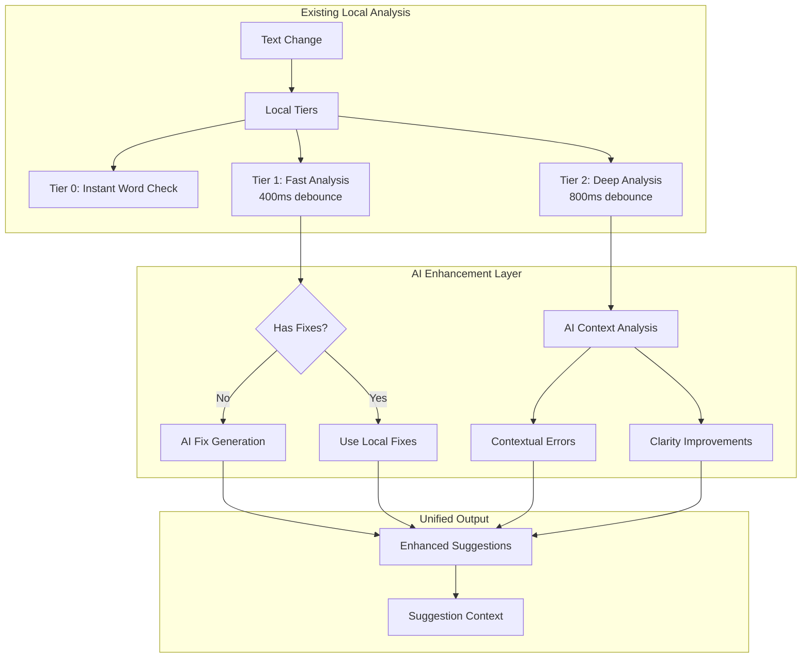

# Epic 2: AI-Enhanced Writing Assistant - Comprehensive Implementation Plan

## Overview

Enhance WordWise's existing local-first analysis system with selective AI capabilities to fill gaps in suggestion fixes, detect contextual errors, and provide creative rewrites. This plan maintains the responsive, local-first architecture while strategically adding AI where it provides the most value.

## Core Principles

1. **Enhance, Don't Replace**: AI augments the existing analysis system, never replaces it
2. **Selective Enhancement**: Only use AI where local analysis falls short
3. **Performance First**: Maintain sub-second response times through smart batching and caching
4. **Progressive Disclosure**: AI features are clearly marked and optional
5. **Graceful Degradation**: System remains fully functional without AI

## Architecture Overview



## Current System Analysis

### What Works Well
- **Spelling**: Full fix suggestions via `nspell`
- **Word Count**: Instant client-side calculation
- **SEO Analysis**: Comprehensive checks (though no rewrites)
- **UI/UX**: Responsive, stable suggestion system

### Gaps to Fill
1. **Grammar Fixes**: Currently identifies issues but provides no corrections
2. **Style Improvements**: Limited to removal suggestions (e.g., "remove weasel word")
3. **Contextual Spelling**: Cannot detect their/there/they're errors
4. **Content Rewrites**: No ability to suggest clarity improvements
5. **SEO Rewrites**: Identifies issues but cannot suggest improved content

## Sprint 1: Foundation & Grammar Fixes (Week 1-2)

### Goals
- Set up AI service infrastructure
- Add fixes to all grammar suggestions
- Implement smart caching system

### 1.1 Create AI Service Foundation

```typescript
// services/ai/ai-service.ts
import { generateObject, generateText } from 'ai';
import { openai } from '@ai-sdk/openai';
import { z } from 'zod';
import type { UnifiedSuggestion, SuggestionAction } from '@/types/suggestions';

// Cache for common fixes
const fixCache = new Map<string, string[]>();

export class AIService {
  private model = openai('gpt-4-turbo');
  
  // Generate fixes for a suggestion that lacks them
  async generateFixes(
    suggestion: UnifiedSuggestion,
    context: string
  ): Promise<SuggestionAction[]> {
    // Check cache first
    const cacheKey = `${suggestion.ruleId}:${suggestion.context.text}`;
    const cached = fixCache.get(cacheKey);
    if (cached) {
      return cached.map(fix => ({
        label: fix,
        type: 'fix' as const,
        value: fix
      }));
    }
    
    try {
      const { object } = await generateObject({
        model: this.model,
        schema: z.object({
          fixes: z.array(z.string()).min(1).max(3),
          confidence: z.number().min(0).max(1)
        }),
        system: 'You are a writing assistant. Generate 1-3 concise fixes for the given issue.',
        prompt: `
          Issue: ${suggestion.message}
          Category: ${suggestion.category}
          Problem text: "${suggestion.context.text}"
          Surrounding context: "${context}"
          
          Generate appropriate fixes. Return the most likely fix first.
        `
      });
      
      // Cache the result
      fixCache.set(cacheKey, object.fixes);
      
      return object.fixes.map((fix, index) => ({
        label: fix,
        type: 'fix' as const,
        value: fix,
        aiGenerated: true,
        confidence: object.confidence * (1 - index * 0.1) // Decrease confidence for alternatives
      }));
    } catch (error) {
      console.error('AI fix generation failed:', error);
      return [];
    }
  }
  
  // Batch process multiple suggestions
  async batchGenerateFixes(
    suggestions: UnifiedSuggestion[],
    fullText: string
  ): Promise<Map<string, SuggestionAction[]>> {
    const results = new Map<string, SuggestionAction[]>();
    
    // Filter to only suggestions without fixes
    const needsFixes = suggestions.filter(s => 
      !s.actions || s.actions.length === 0 || 
      s.actions.every(a => a.type !== 'fix')
    );
    
    // Process in parallel with concurrency limit
    const BATCH_SIZE = 5;
    for (let i = 0; i < needsFixes.length; i += BATCH_SIZE) {
      const batch = needsFixes.slice(i, i + BATCH_SIZE);
      const promises = batch.map(async (suggestion) => {
        const fixes = await this.generateFixes(suggestion, fullText);
        results.set(suggestion.id, fixes);
      });
      
      await Promise.all(promises);
    }
    
    return results;
  }
}
```

### 1.2 Enhance Analysis Engine

```typescript
// services/analysis/engine.ts (additions)
import { AIService } from '../ai/ai-service';

export class UnifiedAnalysisEngine {
  private aiService: AIService | null = null;
  
  // Add AI service initialization
  async initializeWithAI(apiKey?: string) {
    await this.initialize();
    if (apiKey) {
      this.aiService = new AIService();
    }
  }
  
  // Enhanced fast checks with AI fix generation
  async runFastChecksWithAI(doc: any): Promise<UnifiedSuggestion[]> {
    const localSuggestions = this.runFastChecks(doc);
    
    if (!this.aiService) {
      return localSuggestions;
    }
    
    // Get AI fixes for suggestions that need them
    const fullText = doc.textContent;
    const aiFixes = await this.aiService.batchGenerateFixes(
      localSuggestions,
      fullText
    );
    
    // Merge AI fixes into suggestions
    return localSuggestions.map(suggestion => {
      const fixes = aiFixes.get(suggestion.id);
      if (fixes && fixes.length > 0) {
        return {
          ...suggestion,
          actions: [...(suggestion.actions || []), ...fixes],
          hasAIFixes: true
        };
      }
      return suggestion;
    });
  }
}
```

### 1.3 Update API Routes

```typescript
// app/api/analysis/fast/route.ts
import { NextRequest, NextResponse } from 'next/server';
import { getSchema } from '@tiptap/core';
import { serverEditorExtensions } from '@/lib/editor/extensions-registry';
import { UnifiedAnalysisEngine } from '@/services/analysis/engine';
import { auth } from '@/lib/auth';

const engine = new UnifiedAnalysisEngine();

export async function POST(request: NextRequest) {
  try {
    const session = await auth();
    if (!session) {
      return NextResponse.json({ error: 'Unauthorized' }, { status: 401 });
    }
    
    const { document, options } = await request.json();
    
    // Check user plan for AI access
    const hasAIAccess = session.user.plan !== 'free';
    const useAI = hasAIAccess && options?.aiEnabled !== false;
    
    // Initialize engine with AI if available
    if (useAI && !engine.aiService) {
      await engine.initializeWithAI(process.env.OPENAI_API_KEY);
    }
    
    // Convert JSON to TipTap document
    const schema = getSchema(serverEditorExtensions);
    const doc = schema.nodeFromJSON(document);
    
    // Run analysis with or without AI
    const suggestions = useAI 
      ? await engine.runFastChecksWithAI(doc)
      : engine.runFastChecks(doc);
    
    return NextResponse.json({
      suggestions,
      analysisType: useAI ? 'hybrid' : 'local'
    });
  } catch (error) {
    console.error('Fast analysis error:', error);
    return NextResponse.json(
      { error: 'Analysis failed', suggestions: [] },
      { status: 500 }
    );
  }
}
```

### 1.4 Update UI Components

```typescript
// components/suggestions/SuggestionActions.tsx
import { Check, Sparkles, ChevronDown } from 'lucide-react';
import { useState } from 'react';
import type { SuggestionAction } from '@/types/suggestions';

interface SuggestionActionsProps {
  actions: SuggestionAction[];
  onApply: (action: SuggestionAction) => void;
}

export function SuggestionActions({ actions, onApply }: SuggestionActionsProps) {
  const [showAlternatives, setShowAlternatives] = useState(false);
  const [selectedIndex, setSelectedIndex] = useState(0);
  
  const fixes = actions.filter(a => a.type === 'fix');
  const selectedFix = fixes[selectedIndex];
  const hasAIFixes = fixes.some(f => f.aiGenerated);
  
  if (fixes.length === 0) return null;
  
  return (
    <div className="mt-2">
      {/* Primary fix display */}
      <div className="flex items-center gap-2 p-2 bg-white rounded border">
        <span className="text-sm font-mono text-green-600 flex items-center gap-1">
          {selectedFix.value}
          {hasAIFixes && (
            <Sparkles className="w-3 h-3 text-purple-500" />
          )}
        </span>
      </div>
      
      {/* Alternative fixes */}
      {fixes.length > 1 && (
        <>
          <button
            onClick={() => setShowAlternatives(!showAlternatives)}
            className="mt-1 text-xs text-gray-600 hover:text-gray-800 flex items-center gap-1"
          >
            <ChevronDown className={`w-3 h-3 transition-transform ${
              showAlternatives ? 'rotate-180' : ''
            }`} />
            {fixes.length - 1} alternative{fixes.length > 2 ? 's' : ''}
          </button>
          
          {showAlternatives && (
            <div className="mt-2 space-y-1">
              {fixes.slice(1).map((fix, index) => (
                <button
                  key={index}
                  onClick={() => setSelectedIndex(index + 1)}
                  className={`w-full text-left p-2 rounded text-sm font-mono ${
                    selectedIndex === index + 1
                      ? 'bg-purple-100 text-purple-700'
                      : 'bg-gray-50 hover:bg-gray-100'
                  }`}
                >
                  <span className="flex items-center gap-1">
                    {fix.value}
                    {fix.aiGenerated && (
                      <Sparkles className="w-3 h-3 text-purple-500" />
                    )}
                  </span>
                </button>
              ))}
            </div>
          )}
        </>
      )}
      
      {/* Apply button */}
      <button
        onClick={() => onApply(selectedFix)}
        className="mt-2 flex items-center gap-1 px-3 py-1.5 text-sm bg-green-600 text-white rounded hover:bg-green-700"
      >
        <Check className="w-3.5 h-3.5" />
        Apply Fix
      </button>
    </div>
  );
}
```

## Sprint 2: Contextual Error Detection (Week 3-4)

### Goals
- Implement contextual spelling detection (their/there/they're)
- Add homophone detection
- Create context-aware grammar checks

### 2.1 Contextual Analysis Service

```typescript
// services/ai/contextual-analyzer.ts
import { generateObject } from 'ai';
import { openai } from '@ai-sdk/openai';
import { z } from 'zod';
import type { UnifiedSuggestion } from '@/types/suggestions';
import { createSuggestion } from '@/lib/editor/suggestion-factory';

const contextualErrorSchema = z.object({
  errors: z.array(z.object({
    text: z.string(),
    position: z.object({ start: z.number(), end: z.number() }),
    type: z.enum(['homophone', 'agreement', 'tense', 'context']),
    message: z.string(),
    fixes: z.array(z.string()).min(1).max(3),
    confidence: z.number().min(0).max(1)
  }))
});

export class ContextualAnalyzer {
  private model = openai('gpt-4-turbo');
  
  async analyze(text: string, existingSuggestions: UnifiedSuggestion[]): Promise<UnifiedSuggestion[]> {
    // Don't run on very short texts
    if (text.length < 50) return [];
    
    try {
      const { object } = await generateObject({
        model: this.model,
        schema: contextualErrorSchema,
        system: `You are an expert editor. Find contextual errors that basic spell checkers miss.
                 Focus on: homophones (their/there), subject-verb agreement, tense consistency.
                 Only report high-confidence errors.`,
        prompt: `Analyze this text for contextual errors:
                "${text}"
                
                Already identified issues (don't duplicate):
                ${existingSuggestions.map(s => s.message).join('\n')}`,
        temperature: 0.3 // Lower temperature for consistency
      });
      
      // Convert to UnifiedSuggestions
      return object.errors
        .filter(e => e.confidence > 0.7) // Only high-confidence errors
        .map(error => createSuggestion(
          error.position.start,
          error.position.end,
          error.text,
          text.substring(
            Math.max(0, error.position.start - 20),
            Math.min(text.length, error.position.end + 20)
          ),
          'grammar',
          `contextual-${error.type}`,
          `ai-context-${error.type}`,
          'Contextual Error',
          error.message,
          error.fixes.map(fix => ({
            label: fix,
            type: 'fix' as const,
            value: fix,
            aiGenerated: true
          })),
          'error'
        ));
    } catch (error) {
      console.error('Contextual analysis failed:', error);
      return [];
    }
  }
}
```

### 2.2 Integrate with Deep Analysis

```typescript
// services/analysis/engine.ts (additions)
import { ContextualAnalyzer } from '../ai/contextual-analyzer';

export class UnifiedAnalysisEngine {
  private contextualAnalyzer: ContextualAnalyzer | null = null;
  
  async runDeepChecksWithAI(
    doc: any,
    documentMetadata: DocumentMetadata
  ): Promise<{ suggestions: UnifiedSuggestion[]; metrics: DocumentMetrics }> {
    // Run standard deep checks first
    const baseResult = await this.runDeepChecks(doc, documentMetadata);
    
    if (!this.aiService) {
      return baseResult;
    }
    
    // Initialize contextual analyzer if needed
    if (!this.contextualAnalyzer) {
      this.contextualAnalyzer = new ContextualAnalyzer();
    }
    
    // Run contextual analysis
    const contextualErrors = await this.contextualAnalyzer.analyze(
      doc.textContent,
      baseResult.suggestions
    );
    
    // Merge results
    return {
      ...baseResult,
      suggestions: [...baseResult.suggestions, ...contextualErrors]
    };
  }
}
```

## Sprint 3: Style Enhancement & Clarity (Week 5-6)

### Goals
- Implement clarity and readability improvements
- Add tone adjustments
- Create style enhancement suggestions

### 3.1 Style Enhancement Service

```typescript
// services/ai/style-enhancer.ts
import { generateObject } from 'ai';
import { openai } from '@ai-sdk/openai';
import { z } from 'zod';
import type { UnifiedSuggestion } from '@/types/suggestions';

const styleEnhancementSchema = z.object({
  enhancements: z.array(z.object({
    originalText: z.string(),
    position: z.object({ start: z.number(), end: z.number() }),
    issue: z.enum(['wordiness', 'passive_voice', 'clarity', 'tone', 'flow']),
    severity: z.enum(['minor', 'moderate', 'significant']),
    suggestions: z.array(z.object({
      text: z.string(),
      explanation: z.string()
    })).min(1).max(3)
  }))
});

export class StyleEnhancer {
  private model = openai('gpt-4-turbo');
  
  async enhance(
    text: string,
    targetTone: 'professional' | 'casual' | 'academic' | 'conversational' = 'professional'
  ): Promise<UnifiedSuggestion[]> {
    try {
      const { object } = await generateObject({
        model: this.model,
        schema: styleEnhancementSchema,
        system: `You are a skilled editor focused on clarity and style.
                 Target tone: ${targetTone}.
                 Only suggest changes that significantly improve readability.`,
        prompt: `Review this text for style improvements:
                "${text}"
                
                Focus on:
                - Wordiness and redundancy
                - Passive voice that obscures meaning
                - Unclear or ambiguous phrasing
                - Tone consistency
                - Sentence flow and variety`,
        temperature: 0.5
      });
      
      return object.enhancements.map(enhancement => ({
        id: `style-ai-${enhancement.position.start}`,
        ruleId: `ai-style-${enhancement.issue}`,
        category: 'style',
        subCategory: enhancement.issue,
        severity: this.mapSeverity(enhancement.severity),
        title: 'Style Improvement',
        message: `Consider revising for ${enhancement.issue.replace('_', ' ')}`,
        context: { 
          text: enhancement.originalText,
          snippet: text.substring(
            Math.max(0, enhancement.position.start - 30),
            Math.min(text.length, enhancement.position.end + 30)
          )
        },
        position: enhancement.position,
        actions: enhancement.suggestions.map((sugg, index) => ({
          label: sugg.text,
          type: 'fix' as const,
          value: sugg.text,
          aiGenerated: true,
          tooltip: sugg.explanation,
          priority: index === 0 ? 'primary' : 'alternative'
        })),
        metadata: {
          aiGenerated: true,
          enhancementType: enhancement.issue
        }
      }));
    } catch (error) {
      console.error('Style enhancement failed:', error);
      return [];
    }
  }
  
  private mapSeverity(severity: string): 'error' | 'warning' | 'suggestion' {
    switch (severity) {
      case 'significant': return 'warning';
      case 'moderate': return 'suggestion';
      default: return 'suggestion';
    }
  }
}
```

### 3.2 User Preference System

```typescript
// services/ai/user-preferences.ts
export interface WritingPreferences {
  tone: 'professional' | 'casual' | 'academic' | 'conversational';
  complexity: 'simple' | 'moderate' | 'advanced';
  oxfordComma: boolean;
  contractions: boolean;
  passiveVoice: 'avoid' | 'minimize' | 'allow';
}

export class PreferenceManager {
  private preferences: WritingPreferences = {
    tone: 'professional',
    complexity: 'moderate',
    oxfordComma: true,
    contractions: false,
    passiveVoice: 'minimize'
  };
  
  async loadUserPreferences(userId: string): Promise<WritingPreferences> {
    // Load from database
    const saved = await db.query.userPreferences.findFirst({
      where: eq(userPreferences.userId, userId)
    });
    
    if (saved) {
      this.preferences = saved.preferences as WritingPreferences;
    }
    
    return this.preferences;
  }
  
  async saveUserPreferences(userId: string, prefs: Partial<WritingPreferences>) {
    this.preferences = { ...this.preferences, ...prefs };
    
    await db.insert(userPreferences)
      .values({
        userId,
        preferences: this.preferences
      })
      .onConflictDoUpdate({
        target: userPreferences.userId,
        set: { preferences: this.preferences }
      });
  }
  
  getPreferences(): WritingPreferences {
    return this.preferences;
  }
}
```

## Sprint 4: SEO Content Generation (Week 7-8)

### Goals
- Implement SEO-optimized content suggestions
- Add meta description generation
- Create keyword optimization recommendations

### 4.1 SEO Content Generator

```typescript
// services/ai/seo-content-generator.ts
import { generateText, generateObject } from 'ai';
import { openai } from '@ai-sdk/openai';
import { z } from 'zod';

export class SEOContentGenerator {
  private model = openai('gpt-4-turbo');
  
  async generateMetaDescription(
    title: string,
    content: string,
    targetKeyword: string
  ): Promise<string[]> {
    const { text } = await generateText({
      model: this.model,
      system: 'You are an SEO expert. Create compelling meta descriptions.',
      prompt: `Create 3 meta descriptions for this content:
              Title: "${title}"
              Target keyword: "${targetKeyword}"
              Content summary: "${content.substring(0, 500)}..."
              
              Requirements:
              - 150-160 characters
              - Include target keyword naturally
              - Compelling and clickable
              - Unique for each option`,
      temperature: 0.7
    });
    
    return text.split('\n').filter(line => line.trim().length > 0);
  }
  
  async optimizeHeading(
    currentHeading: string,
    targetKeyword: string,
    headingLevel: number
  ): Promise<string[]> {
    const { object } = await generateObject({
      model: this.model,
      schema: z.object({
        suggestions: z.array(z.string()).min(2).max(4)
      }),
      system: 'You are an SEO copywriter. Optimize headings for search and readability.',
      prompt: `Optimize this H${headingLevel} heading:
              Current: "${currentHeading}"
              Target keyword: "${targetKeyword}"
              
              Create 2-4 alternatives that:
              - Include the keyword naturally (if relevant)
              - Are clear and compelling
              - Match the heading level's purpose`,
      temperature: 0.6
    });
    
    return object.suggestions;
  }
  
  async suggestKeywordPlacements(
    content: string,
    targetKeyword: string,
    currentDensity: number
  ): Promise<KeywordPlacement[]> {
    const { object } = await generateObject({
      model: this.model,
      schema: z.object({
        placements: z.array(z.object({
          position: z.object({ start: z.number(), end: z.number() }),
          originalText: z.string(),
          suggestedText: z.string(),
          reasoning: z.string()
        }))
      }),
      system: 'You are an SEO expert. Suggest natural keyword placements.',
      prompt: `Analyze keyword placement opportunities:
              Content: "${content}"
              Target keyword: "${targetKeyword}"
              Current density: ${currentDensity}%
              
              Suggest 3-5 places where the keyword could be naturally added.
              Focus on readability and natural flow.`,
      temperature: 0.4
    });
    
    return object.placements;
  }
}
```

### 4.2 Integrate with SEO Analysis

```typescript
// services/analysis/seo.ts (enhanced)
import { SEOContentGenerator } from '../ai/seo-content-generator';

export class SEOAnalyzer {
  private aiGenerator: SEOContentGenerator | null = null;
  
  async analyzeWithAI(params: SEOAnalysisParams): Promise<SEOAnalysisResult> {
    // Run standard SEO analysis
    const baseResult = this.analyze(params);
    
    if (!this.aiGenerator && params.aiEnabled) {
      this.aiGenerator = new SEOContentGenerator();
    }
    
    if (!this.aiGenerator) {
      return baseResult;
    }
    
    // Enhance with AI suggestions
    const suggestions = [...baseResult.suggestions];
    
    // Add meta description suggestions if missing or poor
    if (!params.metaDescription || params.metaDescription.length < 100) {
      const metaSuggestions = await this.aiGenerator.generateMetaDescription(
        params.title,
        params.plainText,
        params.targetKeyword
      );
      
      suggestions.push({
        id: 'seo-ai-meta',
        ruleId: 'meta-description-ai',
        category: 'seo',
        subCategory: 'meta',
        severity: 'warning',
        title: 'Meta Description',
        message: 'AI-generated meta description options available',
        actions: metaSuggestions.map((meta, index) => ({
          label: meta,
          type: 'fix' as const,
          value: meta,
          aiGenerated: true,
          priority: index === 0 ? 'primary' : 'alternative'
        }))
      });
    }
    
    return {
      ...baseResult,
      suggestions,
      aiEnhanced: true
    };
  }
}
```

## Sprint 5: Performance & Polish (Week 9-10)

### Goals
- Implement intelligent caching
- Add request batching and debouncing
- Create offline fallbacks
- Polish UI/UX

### 5.1 AI Cache Manager

```typescript
// services/ai/cache-manager.ts
import { LRUCache } from 'lru-cache';

export class AICacheManager {
  private fixCache: LRUCache<string, string[]>;
  private analysisCache: LRUCache<string, any>;
  
  constructor() {
    this.fixCache = new LRUCache({
      max: 1000,
      ttl: 1000 * 60 * 60 * 24 // 24 hours
    });
    
    this.analysisCache = new LRUCache({
      max: 100,
      ttl: 1000 * 60 * 60 // 1 hour
    });
  }
  
  getCachedFix(ruleId: string, text: string): string[] | undefined {
    const key = `${ruleId}:${text}`;
    return this.fixCache.get(key);
  }
  
  cacheFix(ruleId: string, text: string, fixes: string[]) {
    const key = `${ruleId}:${text}`;
    this.fixCache.set(key, fixes);
  }
  
  getCachedAnalysis(text: string, type: string): any | undefined {
    const key = `${type}:${this.hashText(text)}`;
    return this.analysisCache.get(key);
  }
  
  cacheAnalysis(text: string, type: string, result: any) {
    const key = `${type}:${this.hashText(text)}`;
    this.analysisCache.set(key, result);
  }
  
  private hashText(text: string): string {
    // Simple hash for cache keys
    let hash = 0;
    for (let i = 0; i < text.length; i++) {
      const char = text.charCodeAt(i);
      hash = ((hash << 5) - hash) + char;
      hash = hash & hash;
    }
    return hash.toString(36);
  }
}
```

### 5.2 Request Batching

```typescript
// services/ai/request-batcher.ts
export class AIRequestBatcher {
  private pendingRequests: Map<string, {
    resolve: (value: any) => void;
    reject: (error: any) => void;
    request: any;
  }[]> = new Map();
  
  private batchTimeout: NodeJS.Timeout | null = null;
  private readonly BATCH_DELAY = 50; // ms
  private readonly MAX_BATCH_SIZE = 10;
  
  async add<T>(
    type: string,
    request: any,
    processor: (batch: any[]) => Promise<T[]>
  ): Promise<T> {
    return new Promise((resolve, reject) => {
      const pending = this.pendingRequests.get(type) || [];
      pending.push({ resolve, reject, request });
      this.pendingRequests.set(type, pending);
      
      if (pending.length >= this.MAX_BATCH_SIZE) {
        this.processBatch(type, processor);
      } else {
        this.scheduleBatch(type, processor);
      }
    });
  }
  
  private scheduleBatch(type: string, processor: Function) {
    if (this.batchTimeout) return;
    
    this.batchTimeout = setTimeout(() => {
      this.batchTimeout = null;
      this.processBatch(type, processor);
    }, this.BATCH_DELAY);
  }
  
  private async processBatch(type: string, processor: Function) {
    const pending = this.pendingRequests.get(type);
    if (!pending || pending.length === 0) return;
    
    this.pendingRequests.delete(type);
    
    try {
      const requests = pending.map(p => p.request);
      const results = await processor(requests);
      
      pending.forEach((p, index) => {
        p.resolve(results[index]);
      });
    } catch (error) {
      pending.forEach(p => p.reject(error));
    }
  }
}
```

### 5.3 Settings UI

```typescript
// components/settings/AISettings.tsx
import { Switch } from '@/components/ui/switch';
import { Select } from '@/components/ui/select';
import { Card } from '@/components/ui/card';
import { Sparkles, Zap, Brain } from 'lucide-react';

export function AISettings({ preferences, onChange }: AISettingsProps) {
  return (
    <Card className="p-6">
      <h3 className="text-lg font-semibold mb-4 flex items-center gap-2">
        <Sparkles className="w-5 h-5 text-purple-500" />
        AI Writing Assistant
      </h3>
      
      <div className="space-y-4">
        {/* AI Toggle */}
        <div className="flex items-center justify-between">
          <div>
            <label className="font-medium">Enable AI Suggestions</label>
            <p className="text-sm text-gray-600">
              Get AI-powered fixes and improvements
            </p>
          </div>
          <Switch
            checked={preferences.aiEnabled}
            onCheckedChange={(checked) => onChange({ aiEnabled: checked })}
          />
        </div>
        
        {/* Performance Mode */}
        <div className="flex items-center justify-between">
          <div>
            <label className="font-medium flex items-center gap-2">
              <Zap className="w-4 h-4" />
              Fast Mode
            </label>
            <p className="text-sm text-gray-600">
              Prioritize speed over comprehensiveness
            </p>
          </div>
          <Switch
            checked={preferences.fastMode}
            onCheckedChange={(checked) => onChange({ fastMode: checked })}
          />
        </div>
        
        {/* Writing Tone */}
        <div>
          <label className="font-medium block mb-2">Writing Tone</label>
          <Select
            value={preferences.tone}
            onValueChange={(tone) => onChange({ tone })}
          >
            <option value="professional">Professional</option>
            <option value="casual">Casual</option>
            <option value="academic">Academic</option>
            <option value="conversational">Conversational</option>
          </Select>
        </div>
        
        {/* Advanced Features */}
        <div className="pt-4 border-t">
          <h4 className="font-medium mb-3 flex items-center gap-2">
            <Brain className="w-4 h-4" />
            Advanced Features
          </h4>
          
          <div className="space-y-3">
            <label className="flex items-center gap-2">
              <input
                type="checkbox"
                checked={preferences.contextualSpelling}
                onChange={(e) => onChange({ contextualSpelling: e.target.checked })}
              />
              <span className="text-sm">Contextual spelling (their/there)</span>
            </label>
            
            <label className="flex items-center gap-2">
              <input
                type="checkbox"
                checked={preferences.styleEnhancement}
                onChange={(e) => onChange({ styleEnhancement: e.target.checked })}
              />
              <span className="text-sm">Style improvements</span>
            </label>
            
            <label className="flex items-center gap-2">
              <input
                type="checkbox"
                checked={preferences.seoOptimization}
                onChange={(e) => onChange({ seoOptimization: e.target.checked })}
              />
              <span className="text-sm">SEO optimization</span>
            </label>
          </div>
        </div>
      </div>
    </Card>
  );
}
```

## Database Schema Updates

```sql
-- User preferences for AI features
CREATE TABLE user_ai_preferences (
  id SERIAL PRIMARY KEY,
  user_id UUID REFERENCES users(id) ON DELETE CASCADE,
  ai_enabled BOOLEAN DEFAULT true,
  fast_mode BOOLEAN DEFAULT false,
  tone VARCHAR(20) DEFAULT 'professional',
  contextual_spelling BOOLEAN DEFAULT true,
  style_enhancement BOOLEAN DEFAULT true,
  seo_optimization BOOLEAN DEFAULT true,
  preferences JSONB DEFAULT '{}',
  created_at TIMESTAMP DEFAULT CURRENT_TIMESTAMP,
  updated_at TIMESTAMP DEFAULT CURRENT_TIMESTAMP
);

-- AI usage tracking
CREATE TABLE ai_usage_logs (
  id SERIAL PRIMARY KEY,
  user_id UUID REFERENCES users(id),
  request_type VARCHAR(50), -- 'fix_generation', 'contextual_analysis', etc.
  model_used VARCHAR(50),
  tokens_input INTEGER,
  tokens_output INTEGER,
  cache_hit BOOLEAN DEFAULT false,
  response_time_ms INTEGER,
  created_at TIMESTAMP DEFAULT CURRENT_TIMESTAMP
);

-- Create indexes
CREATE INDEX idx_ai_usage_user_date ON ai_usage_logs(user_id, created_at);
CREATE INDEX idx_ai_preferences_user ON user_ai_preferences(user_id);
```

## Testing Strategy

### Unit Tests
```typescript
// tests/ai/ai-service.test.ts
describe('AIService', () => {
  it('should generate fixes for grammar suggestions', async () => {
    const suggestion = createMockSuggestion('grammar', 'no fixes');
    const fixes = await aiService.generateFixes(suggestion, 'context');
    expect(fixes.length).toBeGreaterThan(0);
    expect(fixes[0].type).toBe('fix');
  });
  
  it('should use cache for repeated requests', async () => {
    const suggestion = createMockSuggestion('grammar', 'cached');
    await aiService.generateFixes(suggestion, 'context');
    const start = Date.now();
    await aiService.generateFixes(suggestion, 'context');
    const duration = Date.now() - start;
    expect(duration).toBeLessThan(10); // Should be instant
  });
});
```

### Integration Tests
```typescript
// tests/integration/analysis-flow.test.ts
describe('Analysis Flow', () => {
  it('should enhance local suggestions with AI', async () => {
    const response = await fetch('/api/analysis/fast', {
      method: 'POST',
      body: JSON.stringify({
        document: createTestDocument(),
        options: { aiEnabled: true }
      })
    });
    
    const result = await response.json();
    const aiEnhanced = result.suggestions.filter(s => s.hasAIFixes);
    expect(aiEnhanced.length).toBeGreaterThan(0);
  });
});
```

## Rollout Plan

### Phase 1: Internal Testing (Week 1-2)
- Deploy to staging environment
- Internal team testing
- Performance benchmarking

### Phase 2: Beta Users (Week 3-4)
- Roll out to 10% of premium users
- Monitor performance and feedback
- Iterate on UI/UX

### Phase 3: General Availability (Week 5-6)
- Roll out to all premium users
- Add to pricing page
- Update documentation

## Success Metrics

1. **Performance**
   - AI-enhanced suggestions delivered < 500ms (p95)
   - Cache hit rate > 60%
   - No degradation in local analysis speed

2. **Quality**
   - 90% of grammar suggestions have fixes
   - User acceptance rate of AI fixes > 70%
   - Reduction in unresolved suggestions by 50%

3. **Adoption**
   - 80% of premium users enable AI features
   - 20% increase in suggestion applications
   - Positive user feedback score > 4.5/5

## Cost Management

### API Usage Optimization
- Cache common patterns aggressively
- Batch requests when possible
- Use GPT-3.5 for simple tasks, GPT-4 for complex
- Implement usage quotas per user tier

### Monitoring
```typescript
// services/ai/usage-monitor.ts
export class AIUsageMonitor {
  async trackUsage(userId: string, type: string, tokens: number) {
    await db.insert(aiUsageLogs).values({
      userId,
      requestType: type,
      tokensUsed: tokens,
      timestamp: new Date()
    });
    
    // Check monthly quota
    const monthlyUsage = await this.getMonthlyUsage(userId);
    if (monthlyUsage > USER_QUOTA_LIMITS[userPlan]) {
      throw new Error('AI usage quota exceeded');
    }
  }
}
```

## Conclusion

This comprehensive plan transforms WordWise from a local-only writing assistant to an AI-enhanced powerhouse while maintaining its core strengths of speed and reliability. The phased approach ensures we can validate each enhancement before moving to the next, and the architecture allows for easy rollback if needed.

The key to success is maintaining the local-first philosophy while strategically using AI where it provides the most value. By focusing on filling existing gaps rather than replacing working systems, we can deliver a superior user experience without sacrificing performance.