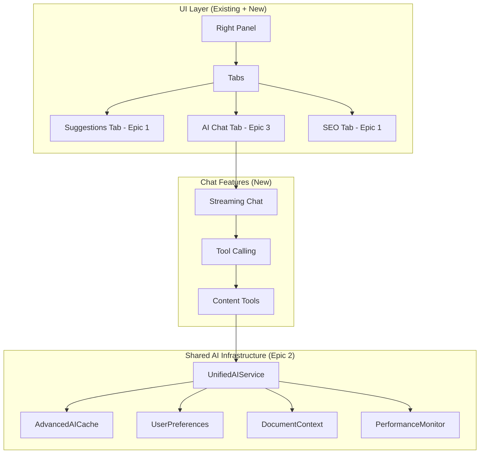

# Epic 3: AI Content Assistant (Revised)

## Overview

Build a unified AI chat interface that extends Epic 2's enhancement system to provide content generation, rewriting, and creative assistance. This epic leverages the existing AI infrastructure from Epic 2 while adding chat-based interactions for more complex content operations.

## Core Principles

1. **Build on Epic 2**: Reuse all AI services, caching, monitoring, and UI components
2. **Unified Experience**: Chat is an extension of enhancements, not a separate system
3. **Context Aware**: Leverages learned preferences and document understanding
4. **Performance First**: Same <500ms targets using Epic 2's optimization strategies

## Architecture Overview



## Implementation Plan (3 Weeks Total)

### Sprint 014: Chat Interface Foundation (5 days)

#### Goals
- Implement chat UI that matches Epic 2's design language
- Integrate with existing AI services and monitoring
- Add streaming responses with shared infrastructure
- Support context-aware interactions

#### Implementation

##### 1. Unified AI Service Extension

```typescript
// services/ai/unified-ai-service.ts
import { AIEnhancementService } from './enhancement-service';
import { streamText, tool } from 'ai';
import { openai } from '@ai-sdk/openai';

export class UnifiedAIService extends AIEnhancementService {
  // Inherit all Epic 2 functionality
  // Add chat-specific methods
  
  async streamChat(
    messages: Message[],
    context: EnhancedDocumentContext,
    preferences: UserWritingPreferences
  ) {
    // Use existing performance monitor
    return await aiPerformanceMonitor.trackAPICall(
      async () => {
        // Check cache first (reuse Epic 2's cache)
        const cacheKey = this.generateChatCacheKey(messages, context);
        const cached = await this.cache.get<ChatResponse>(cacheKey);
        if (cached) {
          this.trackCacheHit(true);
          return cached;
        }
        
        // Build system prompt with user preferences
        const systemPrompt = this.buildChatSystemPrompt(context, preferences);
        
        const result = await streamText({
          model: this.selectModel(messages), // Reuse Epic 2's tiered model selection
          messages,
          system: systemPrompt,
          temperature: 0.7,
          maxTokens: 1000,
          tools: this.chatTools // Define below
        });
        
        return result;
      },
      { 
        promptTokens: this.tokenCounter.countTokens(messages),
        model: 'gpt-4o' 
      }
    );
  }
  
  private buildChatSystemPrompt(
    context: EnhancedDocumentContext,
    preferences: UserWritingPreferences
  ): string {
    return `You are a helpful writing assistant integrated with WordWise.
    
    Document Context:
    - Title: ${context.title}
    - Topic: ${context.detectedTopic}
    - Writing Style: ${context.writingStyle.tone}
    - Current word count: ${context.documentLength}
    
    User Preferences (learned from their writing):
    - Preferred tone: ${preferences.writingStyle.preferredTone}
    - Common corrections: ${preferences.writingStyle.commonCorrections.slice(0, 5).map(c => `${c.from} → ${c.to}`).join(', ')}
    - Often ignores: ${preferences.writingStyle.ignoredRules.join(', ')}
    
    Guidelines:
    - Match the user's established writing style
    - Be concise and actionable
    - When rewriting, preserve their voice while improving clarity
    - Respect their SEO keywords when present`;
  }
}
```

##### 2. Enhanced Chat Panel with Advanced AI SDK Features

```typescript
// components/panels/AIChatPanel.tsx
'use client';

import { useChat } from 'ai/react';
import { useEditor } from '@tiptap/react';
import { Send, Sparkles, StopCircle, RefreshCw, Save } from 'lucide-react';
import { useDocumentContext } from '@/hooks/useDocumentContext';
import { useSuggestionContext } from '@/contexts/SuggestionContext';
import { motion, AnimatePresence } from 'framer-motion';
import { cn } from '@/lib/utils';
import { useChatMemory } from '@/hooks/useChatMemory';
import { useToast } from '@/components/ui/use-toast';

export function AIChatPanel() {
  const editor = useEditor();
  const { documentContext, enhancementState } = useSuggestionContext();
  const { selectedText, documentStats } = useDocumentContext(editor);
  const [showQuickActions, setShowQuickActions] = useState(true);
  const [rateLimitInfo, setRateLimitInfo] = useState<{
    remaining: number;
    reset: number;
  } | null>(null);
  const { toast } = useToast();
  const { savedChats, saveChat, loadChat } = useChatMemory(documentContext.id);
  
  const {
    messages,
    input,
    handleInputChange,
    handleSubmit,
    isLoading,
    error,
    append,
    reload,      // Retry last message
    stop,        // Stop current generation
    setMessages, // For loading saved chats
    data         // Additional metadata
  } = useChat({
    api: '/api/chat',
    headers: {
      'x-user-tier': session?.user?.tier || 'free'
    },
    body: {
      documentContext,
      enhancementState,
      selectedText,
      documentStats
    },
    onResponse: (response) => {
      // Extract rate limit info from headers
      const remaining = response.headers.get('x-ratelimit-remaining');
      const reset = response.headers.get('x-ratelimit-reset');
      
      if (remaining && reset) {
        setRateLimitInfo({
          remaining: parseInt(remaining),
          reset: parseInt(reset)
        });
      }
    },
    onError: (error) => {
      // Enhanced error handling
      if (error.message.includes('rate limit')) {
        toast({
          title: 'Rate Limit Reached',
          description: `Please wait ${formatTime(rateLimitInfo?.reset)} before sending more messages.`,
          variant: 'destructive'
        });
      } else if (error.message.includes('unauthorized')) {
        toast({
          title: 'Session Expired',
          description: 'Please log in again to continue.',
          variant: 'destructive'
        });
      } else {
        toast({
          title: 'Error',
          description: 'Failed to send message. Please try again.',
          variant: 'destructive'
        });
      }
    },
    onFinish: (message) => {
      // Track with Epic 2's feedback system
      if (message.toolInvocations) {
        feedbackTracker.trackToolUsage(
          session.user.id,
          message.toolInvocations
        );
      }
      
      // Auto-save conversation
      if (userPreferences.autoSaveConversations) {
        saveChat(messages);
      }
    },
    initialMessages: savedChats[0]?.messages // Load last conversation
  });
  
  // Quick actions based on context
  const quickActions = useQuickActions(selectedText, documentContext);
  
  return (
    <div className="flex flex-col h-full">
      {/* Header - Match Epic 2's style */}
      <div className="border-b px-4 py-3">
        <h3 className="font-medium flex items-center gap-2">
          <motion.div
            animate={{ rotate: isLoading ? 360 : 0 }}
            transition={{ duration: 1, repeat: isLoading ? Infinity : 0 }}
          >
            <Sparkles className="w-5 h-5 text-purple-500" />
          </motion.div>
          AI Content Assistant
        </h3>
      </div>
      
      {/* Quick Actions - Context aware */}
      <AnimatePresence>
        {showQuickActions && quickActions.length > 0 && (
          <motion.div
            initial={{ height: 0, opacity: 0 }}
            animate={{ height: 'auto', opacity: 1 }}
            exit={{ height: 0, opacity: 0 }}
            className="border-b overflow-hidden"
          >
            <QuickActions 
              actions={quickActions}
              onAction={(action) => {
                append({ role: 'user', content: action.prompt });
                setShowQuickActions(false);
              }}
            />
          </motion.div>
        )}
      </AnimatePresence>
      
      {/* Messages */}
      <div className="flex-1 overflow-y-auto p-4 space-y-4">
        {messages.length === 0 ? (
          <EmptyState 
            selectedText={selectedText}
            suggestions={documentContext.suggestions}
          />
        ) : (
          messages.map((message) => (
            <ChatMessage
              key={message.id}
              message={message}
              onApplyToDocument={(text) => applyToDocument(editor, text)}
              isEnhancing={isLoading && message.id === messages[messages.length - 1]?.id}
            />
          ))
        )}
      </div>
      
      {/* Selected text indicator - Reuse Epic 2's style */}
      {selectedText && (
        <motion.div
          initial={{ opacity: 0, y: 10 }}
          animate={{ opacity: 1, y: 0 }}
          className="mx-4 mb-2 p-2 bg-purple-50 rounded text-sm flex items-center gap-2"
        >
          <Sparkles className="w-4 h-4 text-purple-500" />
          <span className="text-purple-700">Selected: </span>
          <span className="text-purple-900 truncate">"{selectedText}"</span>
        </motion.div>
      )}
      
      {/* Input */}
      <form onSubmit={handleSubmit} className="border-t p-4">
        <div className="flex gap-2">
          <input
            className="flex-1 px-3 py-2 border rounded-lg focus:outline-none focus:ring-2 focus:ring-purple-500"
            value={input}
            onChange={handleInputChange}
            placeholder={
              selectedText 
                ? "Ask me to rewrite or improve the selection..."
                : "Ask me anything about your document..."
            }
            disabled={isLoading}
          />
          <button
            type="submit"
            disabled={isLoading || !input.trim()}
            className={cn(
              "px-4 py-2 rounded-lg transition-all",
              "bg-purple-600 text-white hover:bg-purple-700",
              "disabled:opacity-50 disabled:cursor-not-allowed"
            )}
          >
            <Send className="w-5 h-5" />
          </button>
        </div>
      </form>
    </div>
  );
}
```

##### 3. Chat API Route with Advanced AI SDK Features

```typescript
// app/api/chat/route.ts
import { auth } from '@/lib/auth';
import { UnifiedAIService } from '@/services/ai/unified-ai-service';
import { checkUserAIUsage, trackAIUsage } from '@/services/ai/usage-limiter';
import { SuggestionFeedbackTracker } from '@/services/ai/suggestion-feedback';
import { aiPerformanceMonitor } from '@/services/ai/performance-monitor';
import { experimental_createModelRegistry } from 'ai';

const aiService = new UnifiedAIService();
const feedbackTracker = new SuggestionFeedbackTracker();

// Rate limit headers
function getRateLimitHeaders(remaining: number, reset: number) {
  return {
    'X-RateLimit-Limit': '20',
    'X-RateLimit-Remaining': remaining.toString(),
    'X-RateLimit-Reset': reset.toString(),
  };
}

export async function POST(req: Request) {
  const session = await auth();
  if (!session?.user) {
    return new Response('Unauthorized', { status: 401 });
  }
  
  // Use Epic 2's usage limiting with rate limit info
  const usageInfo = await checkUserAIUsageWithInfo(session.user.id);
  if (!usageInfo.allowed) {
    return new Response('Daily AI limit reached', { 
      status: 429,
      headers: getRateLimitHeaders(0, usageInfo.resetTime)
    });
  }
  
  const { messages, documentContext, selectedText } = await req.json();
  
  // Get user preferences and tier from Epic 2
  const [preferences, userTier] = await Promise.all([
    feedbackTracker.getUserPreferences(session.user.id),
    getUserTier(session.user.id)
  ]);
  
  // Select optimal model based on context
  const model = aiService.selectChatModel({
    messages,
    userTier,
    documentLength: documentContext.documentLength,
    hasSelection: !!selectedText
  });
  
  try {
    // Use unified AI service with callbacks
    const result = await aiService.streamChat(
      messages,
      documentContext,
      preferences,
      {
        model,
        ...aiPerformanceMonitor.createCallbacks(model),
        experimental_telemetry: {
          isEnabled: true,
          functionId: 'chat',
          metadata: {
            userTier,
            hasSelection: !!selectedText,
            messageCount: messages.length
          }
        }
      }
    );
    
    // Return with rate limit headers
    return new Response(result.toDataStreamResponse().body, {
      headers: {
        ...result.toDataStreamResponse().headers,
        ...getRateLimitHeaders(usageInfo.remaining - 1, usageInfo.resetTime)
      }
    });
  } catch (error) {
    // Use Epic 2's error handling
    return aiService.handleChatError(error, model);
  }
}

// OPTIONS endpoint for CORS
export async function OPTIONS(req: Request) {
  return new Response(null, {
    status: 200,
    headers: {
      'Access-Control-Allow-Origin': '*',
      'Access-Control-Allow-Methods': 'POST, OPTIONS',
      'Access-Control-Allow-Headers': 'Content-Type, Authorization',
    },
  });
}
```

### Sprint 015: Advanced Chat Features (5 days)

#### Goals
- Implement tool calling for rewrite/generate operations
- Add template system leveraging Epic 2's context
- Create quick actions based on learned preferences
- Integrate all Story 5 & 6 features

#### Implementation

##### 1. Enhanced Content Tools with Progress Streaming

```typescript
// services/ai/chat-tools.ts
import { tool } from 'ai';
import { z } from 'zod';

export const chatTools = {
  rewriteText: tool({
    description: 'Rewrite text with a specific style or goal',
    parameters: z.object({
      text: z.string().describe('The text to rewrite'),
      style: z.enum(['formal', 'casual', 'concise', 'expanded', 'persuasive', 'simple'])
        .describe('The target style'),
      audience: z.enum(['general', 'beginner', 'expert', 'academic', 'business'])
        .optional().describe('Target audience'),
      preserveSEO: z.boolean().optional()
        .describe('Whether to preserve SEO keywords'),
      goal: z.string().optional()
        .describe('Specific goal for the rewrite')
    }),
    // Use generate for streaming progress
    generate: async function* ({ text, style, audience, preserveSEO, goal }) {
      // Step 1: Analyze text
      yield {
        toolCallId: this.toolCallId,
        state: 'analyzing',
        progress: 'Analyzing text style and structure...'
      };
      
      const analysis = await enhancementService.analyzeText(text, {
        detectStyle: true,
        detectAudience: true,
        extractKeywords: preserveSEO
      });
      
      yield {
        toolCallId: this.toolCallId,
        state: 'rewriting',
        progress: 'Generating rewrite...',
        analysis
      };
      
      // Step 2: Generate rewrite with Epic 2's service
      const enhanced = await enhancementService.enhanceText(text, {
        style,
        audience,
        preserveSEO,
        userPreferences: preferences,
        documentContext: context,
        analysis // Pass analysis to avoid re-computation
      });
      
      // Step 3: Compare and finalize
      yield {
        toolCallId: this.toolCallId,
        state: 'finalizing',
        progress: 'Comparing versions...'
      };
      
      const comparison = await enhancementService.compareTexts(text, enhanced.text);
      
      // Final result
      return {
        toolCallId: this.toolCallId,
        state: 'complete',
        result: {
          original: text,
          rewritten: enhanced.text,
          style,
          confidence: enhanced.confidence,
          wordCountChange: enhanced.text.split(' ').length - text.split(' ').length,
          preservedKeywords: enhanced.preservedKeywords,
          improvements: comparison.improvements,
          readabilityChange: comparison.readabilityChange
        }
      };
    }
  }),
  
  generateContent: tool({
    description: 'Generate new content based on parameters',
    parameters: z.object({
      type: z.enum(['ideas', 'outline', 'introduction', 'conclusion', 'paragraph', 'expansion']),
      topic: z.string().optional(),
      context: z.string().optional(),
      length: z.enum(['short', 'medium', 'long']).optional(),
      tone: z.string().optional(),
      includeKeywords: z.array(z.string()).optional()
    }),
    execute: async ({ type, topic, context, length = 'medium', tone, includeKeywords }) => {
      // Use document context and preferences
      const prompt = buildGenerationPrompt(type, {
        topic: topic || documentContext.detectedTopic,
        context: context || documentContext.firstParagraph,
        length,
        tone: tone || preferences.writingStyle.preferredTone,
        keywords: includeKeywords || documentContext.seoKeywords
      });
      
      const generated = await aiService.generate(prompt, {
        maxTokens: lengthToTokens[length],
        temperature: type === 'ideas' ? 0.8 : 0.7
      });
      
      return {
        type,
        content: generated,
        wordCount: generated.split(' ').length,
        metadata: {
          usedTopic: topic || documentContext.detectedTopic,
          usedTone: tone || preferences.writingStyle.preferredTone
        }
      };
    }
  }),
  
  improveText: tool({
    description: 'Improve text clarity, engagement, and flow',
    parameters: z.object({
      text: z.string(),
      focusAreas: z.array(z.enum(['clarity', 'engagement', 'flow', 'conciseness', 'seo']))
        .optional(),
      maintainVoice: z.boolean().optional().default(true)
    }),
    execute: async ({ text, focusAreas = ['clarity', 'engagement'], maintainVoice }) => {
      // This is the "Improve This" functionality from Story 4
      const analysis = await aiService.analyzeText(text, documentContext);
      const improved = await aiService.improveWithFocus(text, {
        focusAreas,
        analysis,
        userVoice: maintainVoice ? preferences.writingStyle : null,
        context: documentContext
      });
      
      return {
        original: text,
        improved: improved.text,
        changes: improved.changes,
        improvements: improved.improvements,
        confidence: improved.confidence
      };
    }
  })
};
```

##### 2. Template System

```typescript
// services/ai/content-templates.ts
export const contentTemplates = {
  // Story 6: AI-Assisted Content Creation
  blogIdeas: {
    name: 'Blog Post Ideas',
    icon: Lightbulb,
    prompt: (vars: { topic: string; audience?: string }) => 
      `Generate 10 creative blog post ideas about "${vars.topic}"${vars.audience ? ` for ${vars.audience}` : ''}. 
       Consider current trends and SEO potential.`,
    variables: ['topic', 'audience?'],
    category: 'ideation',
    tool: 'generateContent',
    toolParams: { type: 'ideas' }
  },
  
  outline: {
    name: 'Blog Post Outline',
    icon: List,
    prompt: (vars: { title: string; keywords?: string[] }) =>
      `Create a detailed outline for a blog post titled "${vars.title}".
       ${vars.keywords ? `Include these keywords naturally: ${vars.keywords.join(', ')}` : ''}`,
    variables: ['title', 'keywords?'],
    category: 'structure',
    tool: 'generateContent',
    toolParams: { type: 'outline' }
  },
  
  introduction: {
    name: 'Compelling Introduction',
    icon: FileText,
    prompt: (vars: { topic: string; hook?: string }) =>
      `Write an engaging introduction for an article about "${vars.topic}".
       ${vars.hook ? `Start with this hook: ${vars.hook}` : 'Include a strong hook.'}`,
    variables: ['topic', 'hook?'],
    category: 'writing',
    tool: 'generateContent',
    toolParams: { type: 'introduction' }
  },
  
  conclusion: {
    name: 'Strong Conclusion',
    icon: CheckCircle,
    prompt: (vars: { mainPoints: string; cta?: string }) =>
      `Write a powerful conclusion that summarizes these points: ${vars.mainPoints}.
       ${vars.cta ? `Include this call-to-action: ${vars.cta}` : ''}`,
    variables: ['mainPoints', 'cta?'],
    category: 'writing',
    tool: 'generateContent',
    toolParams: { type: 'conclusion' }
  },
  
  // Story 5: Goal-Oriented Rewriting
  formalTone: {
    name: 'Make Formal',
    icon: Briefcase,
    prompt: () => 'Rewrite the selected text in a formal, professional tone.',
    variables: [],
    category: 'rewrite',
    tool: 'rewriteText',
    toolParams: { style: 'formal', audience: 'business' }
  },
  
  casualTone: {
    name: 'Make Casual',
    icon: MessageCircle,
    prompt: () => 'Rewrite the selected text in a friendly, conversational tone.',
    variables: [],
    category: 'rewrite',
    tool: 'rewriteText',
    toolParams: { style: 'casual', audience: 'general' }
  },
  
  beginnerFriendly: {
    name: 'Simplify for Beginners',
    icon: Baby,
    prompt: () => 'Rewrite the selected text to be easily understood by beginners.',
    variables: [],
    category: 'rewrite',
    tool: 'rewriteText',
    toolParams: { style: 'simple', audience: 'beginner' }
  },
  
  // Story 4: Improve This
  improveClarity: {
    name: 'Improve Clarity',
    icon: Eye,
    prompt: () => 'Improve the clarity and readability of the selected text.',
    variables: [],
    category: 'improve',
    tool: 'improveText',
    toolParams: { focusAreas: ['clarity', 'flow'] }
  }
};
```

##### 3. Quick Actions System

```typescript
// hooks/useQuickActions.ts
export function useQuickActions(
  selectedText: string | null,
  context: EnhancedDocumentContext
) {
  const { preferences } = useUserPreferences();
  
  return useMemo(() => {
    const actions: QuickAction[] = [];
    
    if (selectedText) {
      // Selection-based actions
      actions.push(
        { 
          id: 'improve',
          label: 'Improve This',
          icon: Sparkles,
          prompt: 'Improve the selected text for clarity and engagement.',
          template: 'improveClarity'
        },
        {
          id: 'rewrite-formal',
          label: 'Make Formal',
          icon: Briefcase,
          prompt: 'Rewrite the selected text in a formal tone.',
          template: 'formalTone'
        },
        {
          id: 'rewrite-casual',
          label: 'Make Casual',
          icon: MessageCircle,
          prompt: 'Rewrite the selected text in a casual tone.',
          template: 'casualTone'
        },
        {
          id: 'expand',
          label: 'Expand',
          icon: Maximize,
          prompt: 'Expand the selected text with more detail.',
          tool: 'rewriteText',
          toolParams: { style: 'expanded' }
        },
        {
          id: 'condense',
          label: 'Make Concise',
          icon: Minimize,
          prompt: 'Make the selected text more concise.',
          tool: 'rewriteText',
          toolParams: { style: 'concise' }
        }
      );
      
      // Add user's frequently used styles
      if (preferences?.frequentStyles) {
        preferences.frequentStyles.forEach(style => {
          actions.push({
            id: `custom-${style}`,
            label: `Make ${style}`,
            icon: Wand,
            prompt: `Rewrite in ${style} style.`,
            tool: 'rewriteText',
            toolParams: { style }
          });
        });
      }
    } else {
      // Document-level actions
      actions.push(
        {
          id: 'ideas',
          label: 'Generate Ideas',
          icon: Lightbulb,
          prompt: `Generate blog post ideas related to ${context.detectedTopic || 'the current topic'}.`,
          template: 'blogIdeas'
        },
        {
          id: 'outline',
          label: 'Create Outline',
          icon: List,
          prompt: 'Create an outline for this document.',
          template: 'outline'
        },
        {
          id: 'intro',
          label: 'Write Introduction',
          icon: FileText,
          prompt: 'Write an introduction for this document.',
          template: 'introduction'
        },
        {
          id: 'conclusion',
          label: 'Write Conclusion',
          icon: CheckCircle,
          prompt: 'Write a conclusion for this document.',
          template: 'conclusion'
        }
      );
    }
    
    return actions;
  }, [selectedText, context, preferences]);
}
```

### Sprint 016: Polish & Integration (5 days)

#### Goals
- Complete integration with Epic 2's monitoring
- Extend usage dashboard for chat metrics
- Add keyboard shortcuts and command palette
- Polish UI/UX to match Epic 2's quality

#### Implementation

##### 1. Unified Monitoring

```typescript
// Update Epic 2's monitoring dashboard
// components/admin/AIMonitoringDashboard.tsx (additions)
export function AIMonitoringDashboard() {
  // ... existing Epic 2 monitoring ...
  
  // Add chat-specific metrics
  const chatMetrics = {
    messagesPerSession: metrics.chat.avgMessagesPerSession,
    toolUsage: metrics.chat.toolCallFrequency,
    templateUsage: metrics.chat.popularTemplates,
    applyRate: metrics.chat.contentApplyRate
  };
  
  return (
    <>
      {/* Existing Epic 2 metrics */}
      
      {/* Chat Metrics Section */}
      <Card>
        <CardHeader>
          <CardTitle className="flex items-center gap-2">
            <MessageSquare className="w-5 h-5 text-blue-500" />
            Chat Assistant Metrics
          </CardTitle>
        </CardHeader>
        <CardContent>
          <div className="grid grid-cols-2 gap-4">
            <div>
              <p className="text-sm text-muted-foreground">Avg Messages/Session</p>
              <p className="text-2xl font-bold">{chatMetrics.messagesPerSession}</p>
            </div>
            <div>
              <p className="text-sm text-muted-foreground">Content Apply Rate</p>
              <p className="text-2xl font-bold">{Math.round(chatMetrics.applyRate * 100)}%</p>
            </div>
          </div>
          
          {/* Tool usage breakdown */}
          <div className="mt-4">
            <h4 className="text-sm font-medium mb-2">Tool Usage</h4>
            <div className="space-y-2">
              {Object.entries(chatMetrics.toolUsage).map(([tool, count]) => (
                <div key={tool} className="flex justify-between">
                  <span className="text-sm">{tool}</span>
                  <span className="text-sm font-medium">{count}</span>
                </div>
              ))}
            </div>
          </div>
        </CardContent>
      </Card>
    </>
  );
}
```

##### 2. Extended Usage Tracking

```typescript
// Extend Epic 2's usage tables
// migrations/extend_ai_usage_for_chat.sql
ALTER TABLE ai_usage_logs 
  ADD COLUMN chat_messages INTEGER DEFAULT 0,
  ADD COLUMN tool_calls INTEGER DEFAULT 0,
  ADD COLUMN templates_used INTEGER DEFAULT 0;

ALTER TABLE suggestion_feedback 
  ADD COLUMN source TEXT DEFAULT 'enhancement' CHECK (source IN ('enhancement', 'chat', 'tool'));

-- New table for chat-specific analytics
CREATE TABLE chat_sessions (
  id TEXT PRIMARY KEY,
  user_id TEXT NOT NULL REFERENCES user(id),
  started_at TIMESTAMP DEFAULT CURRENT_TIMESTAMP,
  ended_at TIMESTAMP,
  message_count INTEGER DEFAULT 0,
  tool_calls_count INTEGER DEFAULT 0,
  content_applied_count INTEGER DEFAULT 0,
  total_tokens INTEGER DEFAULT 0,
  metadata JSONB
);
```

##### 3. Keyboard Shortcuts

```typescript
// hooks/useAIChatShortcuts.ts
export function useAIChatShortcuts(editor: Editor) {
  const { openChat, focusChatInput } = useChatPanel();
  const { append } = useChat();
  
  useEffect(() => {
    const shortcuts: ShortcutConfig[] = [
      {
        key: 'cmd+k',
        description: 'Open AI chat',
        handler: () => openChat()
      },
      {
        key: 'cmd+shift+i',
        description: 'Improve selected text',
        handler: () => {
          const selection = editor.state.selection;
          if (!selection.empty) {
            openChat();
            append({
              role: 'user',
              content: 'Improve the selected text for clarity and engagement.'
            });
          }
        }
      },
      {
        key: 'cmd+shift+r',
        description: 'Rewrite selection',
        handler: () => {
          if (editor.state.selection.empty) return;
          openChat();
          showRewriteOptions();
        }
      },
      {
        key: 'cmd+shift+g',
        description: 'Generate content',
        handler: () => {
          openChat();
          showTemplateSelector();
        }
      },
      {
        key: 'cmd+/',
        description: 'Focus chat input',
        handler: () => focusChatInput()
      }
    ];
    
    // Register shortcuts
    shortcuts.forEach(shortcut => {
      registerShortcut(shortcut);
    });
    
    return () => {
      shortcuts.forEach(shortcut => {
        unregisterShortcut(shortcut.key);
      });
    };
  }, [editor, openChat, append]);
}
```

##### 4. Settings Integration

```typescript
// Add to Epic 2's AI preferences
// components/settings/AIPreferences.tsx (additions)
export function AIPreferencesSettings({ userId }: { userId: string }) {
  // ... existing Epic 2 preferences ...
  
  // Add chat-specific preferences
  const [chatPrefs, setChatPrefs] = useState({
    enableTemplates: true,
    defaultRewriteStyle: 'balanced',
    showQuickActions: true,
    streamingEnabled: true,
    autoSaveConversations: true,
    preferredTemplates: []
  });
  
  return (
    <>
      {/* Existing Epic 2 preferences */}
      
      {/* Chat Preferences Section */}
      <Card>
        <CardHeader>
          <CardTitle className="flex items-center gap-2">
            <MessageSquare className="w-5 h-5 text-blue-500" />
            Chat Assistant Preferences
          </CardTitle>
        </CardHeader>
        <CardContent className="space-y-4">
          <div className="flex items-center justify-between">
            <Label htmlFor="show-quick-actions">Show Quick Actions</Label>
            <Switch
              id="show-quick-actions"
              checked={chatPrefs.showQuickActions}
              onCheckedChange={(checked) => 
                setChatPrefs(prev => ({ ...prev, showQuickActions: checked }))
              }
            />
          </div>
          
          <div>
            <Label>Default Rewrite Style</Label>
            <Select
              value={chatPrefs.defaultRewriteStyle}
              onValueChange={(value) => 
                setChatPrefs(prev => ({ ...prev, defaultRewriteStyle: value }))
              }
            >
              <SelectTrigger>
                <SelectValue />
              </SelectTrigger>
              <SelectContent>
                <SelectItem value="formal">Formal</SelectItem>
                <SelectItem value="casual">Casual</SelectItem>
                <SelectItem value="balanced">Balanced</SelectItem>
                <SelectItem value="concise">Concise</SelectItem>
              </SelectContent>
            </Select>
          </div>
          
          <div className="flex items-center justify-between">
            <Label htmlFor="auto-save">Auto-save Conversations</Label>
            <Switch
              id="auto-save"
              checked={chatPrefs.autoSaveConversations}
              onCheckedChange={(checked) => 
                setChatPrefs(prev => ({ ...prev, autoSaveConversations: checked }))
              }
            />
          </div>
        </CardContent>
      </Card>
    </>
  );
}
```

## Testing Strategy

### Unit Tests
- Test tool execution with mocked AI responses
- Verify preference integration
- Test cache key generation for chat

### Integration Tests  
- End-to-end chat flow with Epic 2's infrastructure
- Tool calling and document application
- Usage tracking across both systems

### Performance Tests
- Verify <500ms first token (using Epic 2's monitoring)
- Test cache hit rates for common operations
- Load test with concurrent users

## Success Metrics

1. **Feature Coverage**
   - ✅ All Story 4, 5, 6 features implemented
   - ✅ "Improve This" selection feature
   - ✅ All rewriting styles and audiences
   - ✅ Complete content generation toolkit

2. **Performance** (Matching Epic 2)
   - First token latency < 500ms
   - Cache hit rate > 70% for common operations
   - Tool execution < 2s

3. **Adoption**
   - 60% of users try chat in first week
   - 40% weekly active usage
   - >50% apply rate for generated content

4. **Quality**
   - Maintains user's writing voice
   - Respects learned preferences
   - SEO keywords preserved when requested

## Migration Strategy

1. **Week 1**: Deploy Sprint 014 behind feature flag
2. **Week 2**: Beta test with 10% of users
3. **Week 3**: Full rollout with Sprint 015-016

## Key Differences from Original Epic 3

1. **Unified Infrastructure**: One AI system, not two
2. **Shared Monitoring**: Single dashboard for all AI features  
3. **Integrated Preferences**: Chat uses Epic 2's learned preferences
4. **Consistent UI**: Same design language and components
5. **Combined Usage Limits**: One limit for all AI features
6. **Reduced Scope**: 3 weeks instead of 4 by reusing Epic 2

## AI SDK Utilization Summary

### Epic 2 Enhancements (Sprint 2 & 3)
1. **Streaming Object Generation** - Added in Sprint 2 for real-time UI updates
2. **Advanced Error Handling** - Using `APICallError` for better error recovery
3. **Token Usage Tracking** - Built-in callbacks for accurate cost tracking
4. **Provider Registry** - Multi-provider support with fallbacks (Sprint 3)
5. **Smart Model Selection** - Tiered models based on complexity

### Epic 3 Advanced Features
1. **useChat Hook Maximization**
   - Rate limit header extraction
   - Conversation persistence with `setMessages`
   - Stop/reload functionality
   - Custom metadata tracking

2. **Tool Calling with Progress**
   - Generator functions for multi-step operations
   - Streaming progress updates
   - Better error recovery

3. **Performance Optimizations**
   - Request batching
   - Intelligent caching
   - Token optimization
   - Model-specific callbacks

4. **Enhanced Monitoring**
   - Per-model metrics
   - Finish reason tracking
   - Error categorization
   - Cost breakdown by model

## Future Enhancements

1. **Voice Input**: Add speech-to-text for chat using AI SDK's audio support
2. **Multi-modal**: Support image uploads with vision models
3. **Collaborative**: Share chat sessions with team
4. **Export**: Download conversations as markdown
5. **Function Calling v2**: Migrate to new function calling when stable