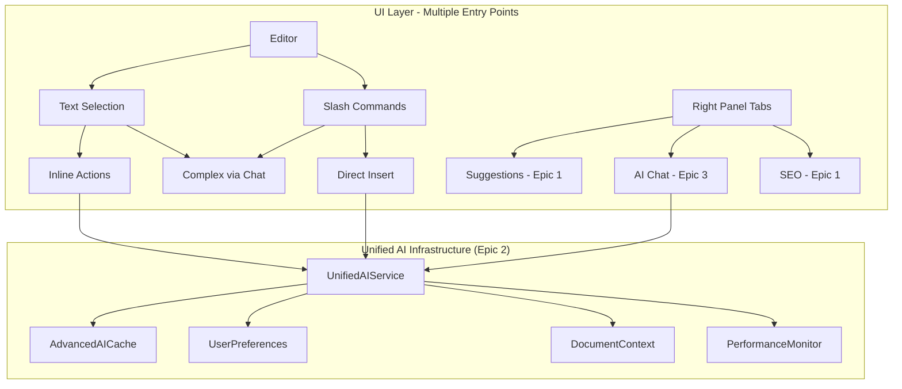

# Epic 3: AI Content Assistant - Unified Plan

## Overview

Build a comprehensive AI writing assistant that combines chat-based interactions with inline editing capabilities, leveraging Epic 2's AI infrastructure. This epic delivers both conversational AI for complex tasks and quick inline transformations for maintaining writing flow.

## Core Principles

1. **Build on Epic 2**: Reuse all AI services, caching, monitoring, and UI components
2. **Dual Interface**: Chat for exploration, inline for quick edits
3. **Context Aware**: Leverages learned preferences and document understanding
4. **Performance First**: Same <500ms targets using Epic 2's optimization strategies
5. **Progressive Enhancement**: Core inline features in MVP, advanced later

## Architecture Overview



## Implementation Plan (3 Weeks Total)

### Sprint 014: Foundation + Basic Inline (5 days)

#### Goals
- Implement chat UI that matches Epic 2's design language
- Add basic text selection → chat integration
- Support slash commands that route to chat
- Integrate with existing AI services and monitoring

#### Features

##### F3.6: Chat Interface Foundation
Build the core chat panel as specified in the original plan, with streaming responses and Epic 2 integration.

##### F3.7: Selection-to-Chat Bridge (NEW)
```typescript
// hooks/useSelectionActions.ts
export function useSelectionActions(editor: Editor) {
  const { openChat, appendToChat } = useChatPanel();
  const [selectedText, setSelectedText] = useState<string>('');
  const [selectionRange, setSelectionRange] = useState<Range | null>(null);
  
  useEffect(() => {
    const handleSelectionChange = () => {
      const { from, to } = editor.state.selection;
      if (from !== to) {
        const text = editor.state.doc.textBetween(from, to);
        setSelectedText(text);
        setSelectionRange({ from, to });
      } else {
        setSelectedText('');
        setSelectionRange(null);
      }
    };
    
    editor.on('selectionUpdate', handleSelectionChange);
    return () => editor.off('selectionUpdate', handleSelectionChange);
  }, [editor]);
  
  const improveSelection = useCallback(() => {
    if (!selectedText) return;
    
    openChat();
    appendToChat({
      role: 'user',
      content: `Improve this text for clarity and engagement: "${selectedText}"`
    });
  }, [selectedText, openChat, appendToChat]);
  
  return {
    selectedText,
    selectionRange,
    hasSelection: !!selectedText,
    improveSelection,
    // More actions added in Sprint 015
  };
}

// components/editor/SelectionIndicator.tsx
export function SelectionIndicator({ editor }: { editor: Editor }) {
  const { selectedText, improveSelection } = useSelectionActions(editor);
  
  if (!selectedText) return null;
  
  return (
    <motion.div
      initial={{ opacity: 0, y: -10 }}
      animate={{ opacity: 1, y: 0 }}
      exit={{ opacity: 0, y: -10 }}
      className="fixed bottom-4 right-4 bg-white shadow-lg rounded-lg p-3 flex items-center gap-2 z-50"
    >
      <span className="text-sm text-gray-600 max-w-[200px] truncate">
        "{selectedText}"
      </span>
      <Button
        size="sm"
        onClick={improveSelection}
        className="bg-purple-600 hover:bg-purple-700"
      >
        <Sparkles className="w-4 h-4 mr-1" />
        Improve with AI
      </Button>
    </motion.div>
  );
}
```

##### F3.8: Basic Slash Commands (NEW)
```typescript
// components/editor/SlashCommandMenu.tsx
interface SlashCommand {
  id: string;
  label: string;
  icon: LucideIcon;
  action: 'chat' | 'direct';
  execute: (editor: Editor) => void;
}

const SLASH_COMMANDS: SlashCommand[] = [
  {
    id: 'improve',
    label: 'Improve paragraph',
    icon: Sparkles,
    action: 'chat',
    execute: (editor) => {
      const paragraph = getCurrentParagraph(editor);
      openChat();
      appendToChat({
        role: 'user',
        content: `Improve this paragraph: "${paragraph}"`
      });
    }
  },
  {
    id: 'continue',
    label: 'Continue writing',
    icon: PenTool,
    action: 'chat',
    execute: (editor) => {
      const context = getContextBeforeCursor(editor, 500);
      openChat();
      appendToChat({
        role: 'user',
        content: `Continue writing from: "${context}"`
      });
    }
  },
  // More commands added in Sprint 015
];

// ProseMirror plugin for slash detection
export const slashCommandPlugin = new Plugin({
  key: new PluginKey('slashCommand'),
  state: {
    init: () => ({ active: false, query: '', pos: 0 }),
    apply(tr, state) {
      const { selection } = tr;
      const { $from } = selection;
      
      // Check if we typed '/'
      const textBefore = $from.nodeBefore?.text || '';
      if (textBefore.endsWith('/')) {
        return { active: true, query: '', pos: $from.pos - 1 };
      }
      
      // Update query if active
      if (state.active) {
        const text = tr.doc.textBetween(state.pos, $from.pos);
        if (text.includes(' ')) {
          return { active: false, query: '', pos: 0 };
        }
        return { ...state, query: text.slice(1) };
      }
      
      return state;
    }
  },
  props: {
    decorations(state) {
      const { active, pos } = this.getState(state);
      if (!active) return null;
      
      // Show dropdown at position
      return DecorationSet.create(state.doc, [
        Decoration.widget(pos, () => {
          const dom = document.createElement('div');
          dom.className = 'slash-command-menu';
          ReactDOM.render(<SlashCommandDropdown />, dom);
          return dom;
        })
      ]);
    }
  }
});
```

#### Implementation Updates

The chat panel implementation remains as in your revised plan, with these additions:

```typescript
// components/panels/AIChatPanel.tsx (additions)
export function AIChatPanel() {
  // ... existing implementation ...
  
  // Add method to handle selection-based prompts
  const handleSelectionPrompt = useCallback((prompt: string, selection: string) => {
    // Store selection reference for apply-back functionality
    setActiveSelection({ text: selection, prompt });
    
    append({
      role: 'user',
      content: prompt
    });
  }, [append]);
  
  // Expose methods for external use
  useImperativeHandle(ref, () => ({
    appendToChat: append,
    handleSelectionPrompt,
    focus: () => inputRef.current?.focus()
  }));
  
  // ... rest of implementation
}
```

### Sprint 015: Advanced Features + True Inline (5 days)

#### Goals
- Implement floating selection toolbar for direct transforms
- Add inline slash commands with immediate execution
- Create quick apply mechanisms without chat interaction
- Implement all Story 4, 5, 6 features with both interfaces

#### Features

##### F3.9: Floating Selection Toolbar (NEW)
```typescript
// components/editor/SelectionToolbar.tsx
export function SelectionToolbar({ editor }: { editor: Editor }) {
  const { selectedText, selectionRange, applyToSelection } = useSelectionActions(editor);
  const [isProcessing, setIsProcessing] = useState(false);
  const [position, setPosition] = useState({ top: 0, left: 0 });
  
  // Position toolbar above selection
  useEffect(() => {
    if (!selectionRange) return;
    
    const coords = editor.view.coordsAtPos(selectionRange.from);
    setPosition({
      top: coords.top - 50,
      left: coords.left
    });
  }, [selectionRange, editor]);
  
  const quickActions = [
    {
      id: 'improve',
      icon: Sparkles,
      label: 'Improve',
      handler: async () => {
        setIsProcessing(true);
        const improved = await aiService.quickImprove(selectedText);
        applyToSelection(improved.text);
        setIsProcessing(false);
      }
    },
    {
      id: 'simplify',
      icon: Target,
      label: 'Simplify',
      handler: async () => {
        setIsProcessing(true);
        const simplified = await aiService.quickTransform(selectedText, 'simplify');
        applyToSelection(simplified.text);
        setIsProcessing(false);
      }
    },
    {
      id: 'formal',
      icon: Briefcase,
      label: 'Formal',
      handler: async () => {
        setIsProcessing(true);
        const formal = await aiService.quickTransform(selectedText, 'formal');
        applyToSelection(formal.text);
        setIsProcessing(false);
      }
    },
    {
      id: 'expand',
      icon: Maximize,
      label: 'Expand',
      handler: async () => {
        setIsProcessing(true);
        const expanded = await aiService.quickTransform(selectedText, 'expand');
        applyToSelection(expanded.text);
        setIsProcessing(false);
      }
    },
    {
      id: 'chat',
      icon: MessageSquare,
      label: 'More...',
      handler: () => {
        openChat();
        handleSelectionPrompt(`Help me with: "${selectedText}"`);
      }
    }
  ];
  
  if (!selectedText || isProcessing) return null;
  
  return (
    <Portal>
      <motion.div
        initial={{ opacity: 0, scale: 0.9 }}
        animate={{ opacity: 1, scale: 1 }}
        exit={{ opacity: 0, scale: 0.9 }}
        style={{ 
          position: 'fixed', 
          top: position.top, 
          left: position.left,
          transform: 'translateX(-50%)'
        }}
        className="bg-white shadow-lg rounded-lg p-1 flex items-center gap-1 z-50"
      >
        {quickActions.map(action => (
          <TooltipProvider key={action.id}>
            <Tooltip>
              <TooltipTrigger asChild>
                <Button
                  size="sm"
                  variant="ghost"
                  onClick={action.handler}
                  disabled={isProcessing}
                  className="h-8 w-8 p-0"
                >
                  <action.icon className="w-4 h-4" />
                </Button>
              </TooltipTrigger>
              <TooltipContent>
                <p>{action.label}</p>
              </TooltipContent>
            </Tooltip>
          </TooltipProvider>
        ))}
      </motion.div>
    </Portal>
  );
}
```

##### F3.10: Direct Slash Execution (NEW)
```typescript
// services/ai/quick-transforms.ts
export class QuickTransformService {
  constructor(private aiService: UnifiedAIService) {}
  
  async executeSlashCommand(
    command: string,
    context: EditorContext
  ): Promise<{ text: string; replaceRange?: Range }> {
    switch (command) {
      case 'continue':
        const continuation = await this.aiService.generateContinuation(
          context.textBefore,
          { maxTokens: 150, streaming: false }
        );
        return { text: continuation };
        
      case 'tldr':
        const summary = await this.aiService.generateSummary(
          context.paragraph,
          { style: 'concise' }
        );
        return { 
          text: summary,
          replaceRange: context.paragraphRange 
        };
        
      case 'bullets':
        const bulletPoints = await this.aiService.convertToBullets(
          context.paragraph
        );
        return { 
          text: bulletPoints,
          replaceRange: context.paragraphRange 
        };
        
      default:
        throw new Error(`Unknown command: ${command}`);
    }
  }
}

// Enhanced slash commands
const ENHANCED_SLASH_COMMANDS: SlashCommand[] = [
  {
    id: 'continue',
    label: 'Continue writing',
    icon: PenTool,
    action: 'direct',
    execute: async (editor) => {
      const result = await quickTransform.executeSlashCommand('continue', {
        textBefore: getTextBefore(editor, 500),
        cursorPos: editor.state.selection.from
      });
      editor.chain().insertContent(result.text).run();
    }
  },
  {
    id: 'tldr',
    label: 'Summarize paragraph',
    icon: FileText,
    action: 'direct',
    execute: async (editor) => {
      const para = getCurrentParagraph(editor);
      const result = await quickTransform.executeSlashCommand('tldr', {
        paragraph: para.text,
        paragraphRange: para.range
      });
      editor.chain()
        .setTextSelection(result.replaceRange)
        .insertContent(result.text)
        .run();
    }
  },
  // ... more direct commands
];
```

##### F3.11: Inline Apply with Diff Preview (NEW)
```typescript
// components/editor/InlineDiff.tsx
export function InlineDiff({ 
  original: string,
  suggested: string,
  onAccept: () => void,
  onReject: () => void,
  onModify: (text: string) => void
}) {
  const [showDiff, setShowDiff] = useState(true);
  const diffs = diffWords(original, suggested);
  
  return (
    <div className="inline-diff-container bg-gray-50 p-2 rounded border">
      {showDiff ? (
        <div className="diff-view">
          {diffs.map((part, index) => (
            <span
              key={index}
              className={cn(
                part.added && 'bg-green-100 text-green-800',
                part.removed && 'bg-red-100 text-red-800 line-through'
              )}
            >
              {part.value}
            </span>
          ))}
        </div>
      ) : (
        <div 
          contentEditable
          className="suggested-text"
          onBlur={(e) => onModify(e.currentTarget.textContent || '')}
        >
          {suggested}
        </div>
      )}
      
      <div className="flex gap-2 mt-2">
        <Button size="xs" onClick={onAccept}>Accept</Button>
        <Button size="xs" variant="outline" onClick={onReject}>Reject</Button>
        <Button 
          size="xs" 
          variant="ghost" 
          onClick={() => setShowDiff(!showDiff)}
        >
          {showDiff ? 'Edit' : 'Diff'}
        </Button>
      </div>
    </div>
  );
}
```

#### Tool Updates

Update the existing tool definitions to support both chat and inline usage:

```typescript
// services/ai/unified-tools.ts
export const unifiedTools = {
  ...chatTools, // existing tools from your plan
  
  // Add quick transform tool for inline usage
  quickTransform: tool({
    description: 'Quick text transformation without chat',
    parameters: z.object({
      text: z.string(),
      transform: z.enum(['improve', 'simplify', 'formal', 'casual', 'expand', 'condense']),
      preserveLength: z.boolean().optional()
    }),
    execute: async ({ text, transform, preserveLength }) => {
      // Use Epic 2's cached enhancement service
      const result = await enhancementService.quickEnhance(text, {
        operation: transform,
        preserveLength,
        streaming: false,
        maxLatency: 1000 // Strict latency for inline
      });
      
      return {
        original: text,
        transformed: result.text,
        confidence: result.confidence,
        cached: result.fromCache
      };
    }
  })
};
```

### Sprint 016: Polish & Integration (5 days)

#### Goals
- Unify keyboard shortcuts for both inline and chat
- Complete Epic 2 monitoring integration
- Add settings for inline preferences
- Performance optimize all interactions

#### Features

##### F3.12: Unified Keyboard Shortcuts (NEW)
```typescript
// hooks/useUnifiedAIShortcuts.ts
export function useUnifiedAIShortcuts(editor: Editor) {
  const { openChat, focusChatInput } = useChatPanel();
  const { showSelectionToolbar, triggerSlashCommand } = useInlineActions();
  
  const shortcuts: ShortcutConfig[] = [
    // Chat shortcuts (from your plan)
    {
      key: 'cmd+k',
      description: 'Open AI chat',
      handler: () => openChat()
    },
    
    // Inline shortcuts (new)
    {
      key: 'cmd+i',
      description: 'Improve selection (inline)',
      handler: () => {
        if (editor.state.selection.empty) return;
        showSelectionToolbar();
      }
    },
    {
      key: 'cmd+enter',
      description: 'Quick enhance selection',
      handler: async () => {
        const selected = getSelectedText(editor);
        if (!selected) return;
        
        const improved = await quickTransform.improve(selected);
        replaceSelection(editor, improved);
      }
    },
    {
      key: 'cmd+/',
      description: 'Slash command menu',
      handler: () => {
        editor.chain().insertContent('/').run();
        // This triggers the slash command plugin
      }
    },
    {
      key: 'cmd+shift+/',
      description: 'Focus chat or slash menu',
      handler: () => {
        if (chatPanelOpen) {
          focusChatInput();
        } else {
          triggerSlashCommand();
        }
      }
    }
  ];
  
  // Register all shortcuts
  useEffect(() => {
    shortcuts.forEach(registerShortcut);
    return () => shortcuts.forEach(s => unregisterShortcut(s.key));
  }, [shortcuts]);
}
```

##### F3.13: Inline Preferences Settings
```typescript
// components/settings/AIPreferences.tsx (additions for inline)
export function AIPreferencesSettings({ userId }: { userId: string }) {
  // ... existing chat preferences ...
  
  // Add inline-specific preferences
  const [inlinePrefs, setInlinePrefs] = useState({
    enableFloatingToolbar: true,
    enableSlashCommands: true,
    showDiffPreview: true,
    autoAcceptConfidence: 0.9, // Auto-accept if AI confidence > 90%
    preferredQuickActions: ['improve', 'simplify', 'formal'],
    inlineTransformDelay: 500 // ms before showing toolbar
  });
  
  return (
    <>
      {/* Existing sections */}
      
      {/* Inline AI Preferences */}
      <Card>
        <CardHeader>
          <CardTitle>Inline AI Features</CardTitle>
        </CardHeader>
        <CardContent className="space-y-4">
          <div className="flex items-center justify-between">
            <Label>Floating Toolbar</Label>
            <Switch
              checked={inlinePrefs.enableFloatingToolbar}
              onCheckedChange={(checked) => 
                setInlinePrefs(prev => ({ ...prev, enableFloatingToolbar: checked }))
              }
            />
          </div>
          
          <div className="flex items-center justify-between">
            <Label>Slash Commands</Label>
            <Switch
              checked={inlinePrefs.enableSlashCommands}
              onCheckedChange={(checked) => 
                setInlinePrefs(prev => ({ ...prev, enableSlashCommands: checked }))
              }
            />
          </div>
          
          <div>
            <Label>Quick Actions Order</Label>
            <DraggableList
              items={inlinePrefs.preferredQuickActions}
              onChange={(items) => 
                setInlinePrefs(prev => ({ ...prev, preferredQuickActions: items }))
              }
            />
          </div>
          
          <div>
            <Label>Auto-accept Threshold</Label>
            <Slider
              value={[inlinePrefs.autoAcceptConfidence]}
              onValueChange={([value]) => 
                setInlinePrefs(prev => ({ ...prev, autoAcceptConfidence: value }))
              }
              min={0.5}
              max={1}
              step={0.05}
            />
            <p className="text-sm text-muted-foreground mt-1">
              Automatically apply suggestions with confidence above {Math.round(inlinePrefs.autoAcceptConfidence * 100)}%
            </p>
          </div>
        </CardContent>
      </Card>
    </>
  );
}
```

##### Performance Optimizations

```typescript
// services/ai/inline-cache.ts
class InlineTransformCache extends AdvancedAICache {
  // Extend Epic 2's cache with inline-specific optimizations
  
  async getQuickTransform(
    text: string,
    transform: string
  ): Promise<CachedResult | null> {
    // Use shorter TTL for inline transforms
    const key = this.generateKey('inline', text, transform);
    const cached = await this.get(key, { ttl: 3600 }); // 1 hour
    
    if (cached && cached.confidence > 0.85) {
      // Only use high-confidence cached results for inline
      return cached;
    }
    
    return null;
  }
  
  // Preload common transforms
  async preloadCommonTransforms(text: string) {
    const transforms = ['improve', 'simplify', 'formal'];
    
    // Fire and forget
    transforms.forEach(transform => {
      this.aiService.quickTransform(text, transform).then(result => {
        this.set(this.generateKey('inline', text, transform), result);
      });
    });
  }
}
```

## Testing Strategy

### Unit Tests
- Test selection detection and range tracking
- Verify slash command parsing
- Test inline diff calculations
- Mock quick transform responses

### Integration Tests
- End-to-end selection → transform → apply
- Slash command execution flow
- Chat and inline coordination
- Keyboard shortcut combinations

### Performance Tests
- Inline transform latency < 500ms
- Selection toolbar appearance < 100ms
- Slash menu responsiveness
- Cache effectiveness for common transforms

## Success Metrics

### Feature Coverage
- ✅ All chat features from original plan
- ✅ Basic inline text transformation
- ✅ Slash commands at cursor
- ✅ Selection toolbar with quick actions
- ✅ Unified keyboard shortcuts

### Performance
- Inline transform: < 500ms
- Chat first token: < 500ms  
- Selection detection: < 50ms
- Cache hit rate: > 80% for common inline transforms

### Adoption
- 70% of users try inline features in first week
- 50% prefer inline for quick edits
- 30% use slash commands regularly
- Equal usage between chat and inline

## Migration Strategy

1. **Week 1**: Deploy with inline features behind flag
2. **Week 2**: A/B test inline vs chat-only
3. **Week 3**: Full rollout based on metrics

## Key Architectural Decisions

1. **Unified AI Service**: Both inline and chat use same backend
2. **Progressive Enhancement**: Basic features work instantly, enhance with AI
3. **Cache First**: Aggressive caching for common inline operations
4. **User Control**: Every AI suggestion can be modified before applying
5. **Context Preservation**: Inline edits maintain document context

## What We're NOT Building (Scope Control)

1. **Complex diff algorithms**: Use simple word diff, not advanced merging
2. **Multi-selection support**: One selection at a time
3. **Inline chat bubbles**: Keep chat in panel, inline for quick actions only
4. **Voice input**: Future enhancement
5. **Collaborative inline edits**: Single user for now

## Summary

This unified plan delivers:
- **Complete AI assistant** with both chat and inline interfaces
- **3-week timeline** maintained through scope control
- **Core inline features** without over-engineering
- **Shared infrastructure** maximizing Epic 2 investment
- **Progressive enhancement** allowing future improvements

The key is starting simple (selection → chat) and progressively adding true inline features, ensuring each sprint delivers immediate user value.