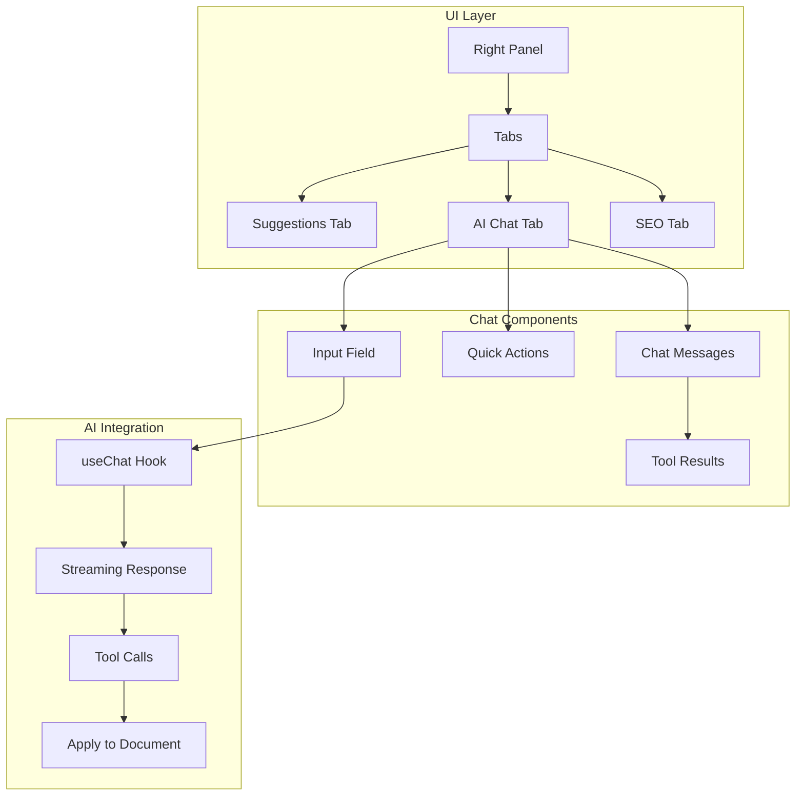

# Epic 3: AI Content Assistant

## Overview

Build a focused AI chat interface that helps users rewrite, generate, and improve their content. This epic leverages the Vercel AI SDK's `useChat` hook and tool calling to create a seamless content assistance experience.

## Core Principles

1. **Simple Integration**: Chat as a tab in the existing right panel
2. **Context Aware**: Always knows about the document and selected text
3. **Action Oriented**: Every AI response should be actionable
4. **Performance First**: Stream responses, cache aggressively

## Architecture Overview



## Sprint 1: Basic Chat Interface (Week 1)

### Goals
- Create chat UI in right panel
- Implement streaming with `useChat`
- Add document context awareness
- Support selected text operations

### Implementation

#### 1.1 Chat Panel Component

```typescript
// components/panels/AIChatPanel.tsx
'use client';

import { useChat } from 'ai/react';
import { useEditor } from '@tiptap/react';
import { Send, Sparkles } from 'lucide-react';
import { useDocumentContext } from '@/hooks/useDocumentContext';

export function AIChatPanel() {
  const editor = useEditor();
  const { selectedText, documentStats } = useDocumentContext(editor);
  
  const {
    messages,
    input,
    handleInputChange,
    handleSubmit,
    isLoading,
    error
  } = useChat({
    api: '/api/chat',
    body: {
      documentContext: {
        selectedText,
        wordCount: documentStats.wordCount,
        title: documentStats.title
      }
    },
    onError: (error) => {
      console.error('Chat error:', error);
    }
  });
  
  return (
    <div className="flex flex-col h-full">
      {/* Header */}
      <div className="border-b px-4 py-3">
        <h3 className="font-medium flex items-center gap-2">
          <Sparkles className="w-5 h-5 text-purple-500" />
          AI Assistant
        </h3>
      </div>
      
      {/* Messages */}
      <div className="flex-1 overflow-y-auto p-4 space-y-4">
        {messages.length === 0 ? (
          <EmptyState selectedText={selectedText} />
        ) : (
          messages.map((message) => (
            <ChatMessage
              key={message.id}
              message={message}
              onApplyToDocument={(text) => applyToDocument(editor, text)}
            />
          ))
        )}
        
        {isLoading && <LoadingMessage />}
        {error && <ErrorMessage error={error} />}
      </div>
      
      {/* Selected text indicator */}
      {selectedText && (
        <div className="mx-4 mb-2 p-2 bg-blue-50 rounded text-sm">
          <span className="text-blue-700">Selected: </span>
          <span className="text-blue-900">"{truncate(selectedText, 50)}"</span>
        </div>
      )}
      
      {/* Input */}
      <form onSubmit={handleSubmit} className="border-t p-4">
        <div className="flex gap-2">
          <input
            className="flex-1 px-3 py-2 border rounded-lg focus:outline-none focus:ring-2 focus:ring-purple-500"
            value={input}
            onChange={handleInputChange}
            placeholder={
              selectedText 
                ? "Ask me to rewrite or improve the selection..."
                : "Ask me anything about your document..."
            }
            disabled={isLoading}
          />
          <button
            type="submit"
            disabled={isLoading || !input.trim()}
            className="px-4 py-2 bg-purple-600 text-white rounded-lg hover:bg-purple-700 disabled:opacity-50"
          >
            <Send className="w-5 h-5" />
          </button>
        </div>
      </form>
    </div>
  );
}
```

#### 1.2 Chat API Route

```typescript
// app/api/chat/route.ts
import { streamText } from 'ai';
import { openai } from '@ai-sdk/openai';
import { auth } from '@/lib/auth';

export async function POST(req: Request) {
  const session = await auth();
  if (!session || session.user.plan === 'free') {
    return new Response('Unauthorized', { status: 401 });
  }
  
  const { messages, documentContext } = await req.json();
  
  const result = await streamText({
    model: openai('gpt-4-turbo'),
    messages,
    system: `You are a helpful writing assistant. You have access to the user's document context:
      ${documentContext.selectedText ? `Selected text: "${documentContext.selectedText}"` : ''}
      Word count: ${documentContext.wordCount}
      ${documentContext.title ? `Title: ${documentContext.title}` : ''}
      
      Be concise and actionable. When the user asks you to rewrite text, provide the rewritten version directly.`,
    temperature: 0.7,
    maxTokens: 1000
  });
  
  return result.toDataStreamResponse();
}
```

#### 1.3 Quick Actions

```typescript
// components/chat/QuickActions.tsx
export function QuickActions({ 
  onAction, 
  hasSelection 
}: { 
  onAction: (action: string) => void;
  hasSelection: boolean;
}) {
  const actions = hasSelection ? [
    { id: 'improve', label: 'Improve', icon: Sparkles },
    { id: 'formal', label: 'Make formal', icon: Briefcase },
    { id: 'concise', label: 'Make concise', icon: Minimize },
    { id: 'expand', label: 'Expand', icon: Maximize }
  ] : [
    { id: 'outline', label: 'Create outline', icon: List },
    { id: 'intro', label: 'Write intro', icon: FileText },
    { id: 'conclusion', label: 'Write conclusion', icon: CheckCircle }
  ];
  
  return (
    <div className="flex flex-wrap gap-2 p-4 border-b">
      {actions.map((action) => (
        <button
          key={action.id}
          onClick={() => onAction(action.id)}
          className="flex items-center gap-2 px-3 py-1.5 text-sm bg-gray-100 hover:bg-gray-200 rounded-lg"
        >
          <action.icon className="w-4 h-4" />
          {action.label}
        </button>
      ))}
    </div>
  );
}
```

## Sprint 2: Tool Calling Implementation (Week 2)

### Goals
- Implement rewrite tool with multiple styles
- Add generate tool for content creation
- Create apply-to-document functionality
- Show tool results in UI

### Implementation

#### 2.1 Tools Definition

```typescript
// app/api/chat/route.ts (enhanced)
import { streamText, tool } from 'ai';
import { z } from 'zod';

const tools = {
  rewriteText: tool({
    description: 'Rewrite text with a specific style',
    parameters: z.object({
      text: z.string().describe('The text to rewrite'),
      style: z.enum(['formal', 'casual', 'concise', 'expanded', 'engaging'])
        .describe('The target style'),
      preserveKeywords: z.boolean().optional()
        .describe('Whether to preserve SEO keywords')
    }),
    execute: async ({ text, style, preserveKeywords }) => {
      // This runs on the server
      const rewritten = await generateRewrite(text, style, preserveKeywords);
      return {
        original: text,
        rewritten,
        style,
        wordCountChange: rewritten.split(' ').length - text.split(' ').length
      };
    }
  }),
  
  generateContent: tool({
    description: 'Generate new content',
    parameters: z.object({
      type: z.enum(['outline', 'introduction', 'conclusion', 'paragraph']),
      topic: z.string(),
      length: z.enum(['short', 'medium', 'long']).optional(),
      tone: z.string().optional()
    }),
    execute: async ({ type, topic, length = 'medium', tone }) => {
      const content = await generateContent(type, topic, length, tone);
      return {
        type,
        content,
        wordCount: content.split(' ').length
      };
    }
  }),
  
  improveText: tool({
    description: 'Improve text clarity and engagement',
    parameters: z.object({
      text: z.string(),
      focusAreas: z.array(z.enum(['clarity', 'engagement', 'grammar', 'flow']))
        .optional()
    }),
    execute: async ({ text, focusAreas = ['clarity', 'engagement'] }) => {
      const improved = await improveText(text, focusAreas);
      return {
        original: text,
        improved,
        changes: detectChanges(text, improved)
      };
    }
  })
};

// Update the POST handler
export async function POST(req: Request) {
  // ... auth check ...
  
  const result = await streamText({
    model: openai('gpt-4-turbo'),
    messages,
    system: systemPrompt,
    tools,
    toolChoice: 'auto', // Let AI decide when to use tools
    temperature: 0.7,
    maxTokens: 1000,
    onToolCall: async ({ toolCall }) => {
      // Track tool usage
      await trackToolUsage(session.user.id, toolCall.toolName);
    }
  });
  
  return result.toDataStreamResponse();
}
```

#### 2.2 Tool Result Components

```typescript
// components/chat/ToolResult.tsx
import { motion } from 'framer-motion';
import { Check, Copy, RefreshCw } from 'lucide-react';

export function ToolResult({ 
  toolName, 
  result,
  onApply,
  onRegenerate 
}: ToolResultProps) {
  if (toolName === 'rewriteText') {
    return <RewriteResult result={result} onApply={onApply} />;
  }
  
  if (toolName === 'generateContent') {
    return <GenerateResult result={result} onApply={onApply} />;
  }
  
  return null;
}

function RewriteResult({ result, onApply }: RewriteResultProps) {
  const [showDiff, setShowDiff] = useState(false);
  
  return (
    <motion.div
      initial={{ opacity: 0, y: 10 }}
      animate={{ opacity: 1, y: 0 }}
      className="mt-3 border rounded-lg overflow-hidden"
    >
      <div className="bg-purple-50 px-4 py-2 flex items-center justify-between">
        <span className="text-sm font-medium">
          Rewritten ({result.style})
        </span>
        <button
          onClick={() => setShowDiff(!showDiff)}
          className="text-sm text-purple-600 hover:text-purple-700"
        >
          {showDiff ? 'Hide' : 'Show'} changes
        </button>
      </div>
      
      <div className="p-4">
        {showDiff ? (
          <DiffView original={result.original} rewritten={result.rewritten} />
        ) : (
          <p className="text-gray-700">{result.rewritten}</p>
        )}
        
        <div className="flex items-center justify-between mt-4">
          <span className="text-sm text-gray-500">
            {result.wordCountChange > 0 ? '+' : ''}{result.wordCountChange} words
          </span>
          
          <div className="flex gap-2">
            <button
              onClick={() => navigator.clipboard.writeText(result.rewritten)}
              className="px-3 py-1 text-sm border rounded hover:bg-gray-50"
            >
              <Copy className="w-4 h-4" />
            </button>
            <button
              onClick={() => onApply(result.rewritten)}
              className="px-3 py-1 text-sm bg-purple-600 text-white rounded hover:bg-purple-700"
            >
              Apply
            </button>
          </div>
        </div>
      </div>
    </motion.div>
  );
}
```

#### 2.3 Apply to Document

```typescript
// utils/editor-operations.ts
export function applyToDocument(
  editor: Editor,
  text: string,
  replaceSelection = true
) {
  if (!editor) return;
  
  editor.chain().focus().command(({ tr, state }) => {
    if (replaceSelection && !state.selection.empty) {
      // Replace selected text
      tr.replaceSelectionWith(state.schema.text(text));
    } else {
      // Insert at cursor
      tr.insertText(text);
    }
    return true;
  }).run();
  
  // Track application
  trackEvent('ai_text_applied', {
    length: text.length,
    replaceSelection
  });
}
```

## Sprint 3: Templates & Quick Actions (Week 3)

### Goals
- Create template system for common tasks
- Add keyboard shortcuts
- Implement conversation memory
- Build command palette integration

### Implementation

#### 3.1 Template System

```typescript
// services/ai/templates.ts
export const contentTemplates = {
  blogIntro: {
    name: 'Blog Introduction',
    prompt: (topic: string) => 
      `Write an engaging introduction for a blog post about "${topic}". 
       Include a hook, context, and preview of what's to come.`,
    variables: ['topic'],
    category: 'writing'
  },
  
  metaDescription: {
    name: 'SEO Meta Description',
    prompt: (title: string, keyword: string) =>
      `Write a compelling meta description for "${title}".
       Include the keyword "${keyword}" naturally.
       Keep it between 150-160 characters.`,
    variables: ['title', 'keyword'],
    category: 'seo'
  },
  
  emailSubject: {
    name: 'Email Subject Lines',
    prompt: (topic: string, audience: string) =>
      `Write 5 compelling email subject lines about "${topic}" 
       for ${audience}. Vary the style and approach.`,
    variables: ['topic', 'audience'],
    category: 'marketing'
  }
};

// Hook to use templates
export function useAITemplates() {
  const { append } = useChat();
  
  const executeTemplate = useCallback((
    templateId: string,
    variables: Record<string, string>
  ) => {
    const template = contentTemplates[templateId];
    if (!template) return;
    
    const prompt = template.prompt(...template.variables.map(v => variables[v]));
    
    append({
      role: 'user',
      content: prompt,
      metadata: { template: templateId }
    });
  }, [append]);
  
  return { templates: contentTemplates, executeTemplate };
}
```

#### 3.2 Keyboard Shortcuts

```typescript
// hooks/useAIShortcuts.ts
export function useAIShortcuts(editor: Editor) {
  const { append } = useChat();
  
  useEffect(() => {
    const handleKeyDown = (e: KeyboardEvent) => {
      // Cmd/Ctrl + K: Open AI chat
      if ((e.metaKey || e.ctrlKey) && e.key === 'k') {
        e.preventDefault();
        openAIChat();
      }
      
      // Cmd/Ctrl + Shift + I: Improve selection
      if ((e.metaKey || e.ctrlKey) && e.shiftKey && e.key === 'i') {
        e.preventDefault();
        const selection = editor.state.selection;
        if (!selection.empty) {
          append({
            role: 'user',
            content: 'Improve this text for clarity and engagement'
          });
        }
      }
      
      // Cmd/Ctrl + Shift + R: Rewrite formal
      if ((e.metaKey || e.ctrlKey) && e.shiftKey && e.key === 'r') {
        e.preventDefault();
        append({
          role: 'user',
          content: 'Rewrite this text in a more formal style'
        });
      }
    };
    
    document.addEventListener('keydown', handleKeyDown);
    return () => document.removeEventListener('keydown', handleKeyDown);
  }, [editor, append]);
}
```

#### 3.3 Conversation Memory

```typescript
// hooks/useChatMemory.ts
export function useChatMemory(documentId: string) {
  const [savedChats, setSavedChats] = useState<SavedChat[]>([]);
  
  // Load previous conversations
  useEffect(() => {
    const stored = localStorage.getItem(`chat-${documentId}`);
    if (stored) {
      setSavedChats(JSON.parse(stored));
    }
  }, [documentId]);
  
  // Save conversation
  const saveChat = useCallback((messages: Message[]) => {
    const chat: SavedChat = {
      id: Date.now().toString(),
      timestamp: new Date(),
      messages: messages.slice(-20), // Keep last 20 messages
      summary: generateSummary(messages)
    };
    
    const updated = [...savedChats, chat].slice(-5); // Keep last 5 chats
    setSavedChats(updated);
    localStorage.setItem(`chat-${documentId}`, JSON.stringify(updated));
  }, [documentId, savedChats]);
  
  return { savedChats, saveChat };
}
```

## Sprint 4: Polish & Launch (Week 4)

### Goals
- Implement error handling and retry logic
- Add rate limiting
- Create usage analytics
- Polish UI/UX

### Implementation

#### 4.1 Error Handling

```typescript
// components/chat/ErrorBoundary.tsx
export function ChatErrorBoundary({ children }: { children: ReactNode }) {
  return (
    <ErrorBoundary
      fallback={<ChatErrorFallback />}
      onError={(error) => {
        console.error('Chat error:', error);
        trackError('chat_error', error);
      }}
    >
      {children}
    </ErrorBoundary>
  );
}

function ChatErrorFallback() {
  return (
    <div className="flex flex-col items-center justify-center h-64 text-center">
      <AlertCircle className="w-12 h-12 text-red-500 mb-4" />
      <h3 className="font-medium text-gray-900 mb-2">
        Something went wrong
      </h3>
      <p className="text-sm text-gray-600 mb-4">
        We couldn't connect to the AI service. Please try again.
      </p>
      <button
        onClick={() => window.location.reload()}
        className="px-4 py-2 bg-purple-600 text-white rounded hover:bg-purple-700"
      >
        Reload Chat
      </button>
    </div>
  );
}
```

#### 4.2 Rate Limiting

```typescript
// middleware/rateLimit.ts
import { Ratelimit } from '@upstash/ratelimit';
import { Redis } from '@upstash/redis';

const ratelimit = new Ratelimit({
  redis: Redis.fromEnv(),
  limiter: Ratelimit.slidingWindow(20, '1 m'), // 20 requests per minute
  analytics: true
});

export async function rateLimitMiddleware(userId: string) {
  const { success, limit, reset, remaining } = await ratelimit.limit(userId);
  
  if (!success) {
    throw new Response('Too many requests', {
      status: 429,
      headers: {
        'X-RateLimit-Limit': limit.toString(),
        'X-RateLimit-Remaining': remaining.toString(),
        'X-RateLimit-Reset': reset.toString()
      }
    });
  }
  
  return { limit, remaining, reset };
}
```

#### 4.3 Analytics

```typescript
// services/analytics/chat-analytics.ts
export class ChatAnalytics {
  async trackMessage(
    userId: string,
    message: Message,
    metadata: MessageMetadata
  ) {
    await db.insert(chatAnalytics).values({
      userId,
      messageRole: message.role,
      hasToolCall: !!message.toolInvocations,
      wordCount: message.content.split(' ').length,
      responseTime: metadata.responseTime,
      model: metadata.model,
      timestamp: new Date()
    });
  }
  
  async getDashboardStats(userId: string) {
    const stats = await db.query.chatAnalytics.findMany({
      where: eq(chatAnalytics.userId, userId),
      orderBy: desc(chatAnalytics.timestamp),
      limit: 1000
    });
    
    return {
      totalMessages: stats.length,
      averageResponseTime: average(stats.map(s => s.responseTime)),
      toolUsage: stats.filter(s => s.hasToolCall).length,
      dailyUsage: groupBy(stats, s => s.timestamp.toDateString())
    };
  }
}
```

## UI Polish

```typescript
// components/chat/ChatMessage.tsx
export function ChatMessage({ message, onApplyToDocument }: ChatMessageProps) {
  const [hovering, setHovering] = useState(false);
  
  return (
    <motion.div
      initial={{ opacity: 0, x: message.role === 'user' ? 20 : -20 }}
      animate={{ opacity: 1, x: 0 }}
      className={cn(
        "flex gap-3",
        message.role === 'user' ? 'justify-end' : 'justify-start'
      )}
      onMouseEnter={() => setHovering(true)}
      onMouseLeave={() => setHovering(false)}
    >
      {message.role === 'assistant' && (
        <Avatar>
          <Sparkles className="w-4 h-4" />
        </Avatar>
      )}
      
      <div
        className={cn(
          "max-w-[80%] rounded-lg px-4 py-2",
          message.role === 'user'
            ? 'bg-purple-600 text-white'
            : 'bg-gray-100 text-gray-900'
        )}
      >
        <div className="prose prose-sm max-w-none">
          {message.content}
        </div>
        
        {message.toolInvocations?.map((tool) => (
          <ToolResult
            key={tool.toolCallId}
            toolName={tool.toolName}
            result={tool.result}
            onApply={onApplyToDocument}
          />
        ))}
        
        {hovering && message.role === 'assistant' && (
          <MessageActions message={message} />
        )}
      </div>
      
      {message.role === 'user' && (
        <Avatar>
          <User className="w-4 h-4" />
        </Avatar>
      )}
    </motion.div>
  );
}
```

## Success Metrics

1. **Adoption**
   - 60% of premium users try AI chat in first week
   - 40% become weekly active users
   - Average 5+ messages per session

2. **Performance**
   - First token latency < 500ms
   - Complete response < 3s for most queries
   - Tool execution < 2s

3. **Quality**
   - Apply rate > 50% for tool results
   - User satisfaction > 4.5/5
   - Support ticket rate < 2%

## Cost Optimization

1. **Smart Caching** - Cache tool results aggressively
2. **Model Selection** - Use GPT-3.5 for simple queries
3. **Token Limits** - Set reasonable max tokens
4. **Rate Limiting** - Prevent abuse

## Future Enhancements

1. **Voice Input** - Speech-to-text for queries
2. **Multi-turn Workflows** - Complex editing tasks
3. **Custom Instructions** - User-defined writing style
4. **Export/Import** - Save and share conversations