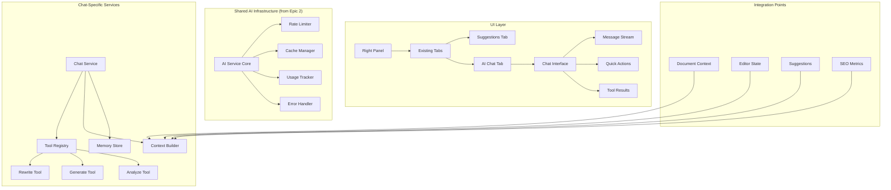

# Epic 3: AI Chat & Content Assistant - Unified Implementation Plan

## Overview

Build an integrated AI chat interface that leverages Epic 2's AI infrastructure to provide interactive content assistance, rewriting, generation, and document analysis capabilities. The chat interface complements the automated suggestions by providing on-demand, conversational AI help.

## Core Principles

1. **Unified Architecture**: Builds on Epic 2's AI service layer, not parallel to it
2. **Context-Aware**: Always aware of document state, suggestions, and user intent
3. **Performance-Conscious**: Streaming responses, intelligent caching, and rate limiting
4. **Progressive Enhancement**: Core features first, advanced capabilities added incrementally
5. **Accessibility-First**: Full keyboard navigation and screen reader support

## Architecture Overview



## Dependency on Epic 2

This epic assumes Epic 2 is implemented first, providing:
- Base AI service infrastructure (`AIService` class)
- Cache manager for response caching
- Rate limiting for API protection
- Usage tracking for billing
- Error handling patterns

## Sprint 1: Chat Foundation (Week 1-2)

### Goals
- Extend Epic 2's AI service for chat functionality
- Implement streaming chat API
- Create basic chat UI with proper state management
- Integrate document context

### 1.1 Extend AI Service for Chat

```typescript
// services/ai/chat/chat-service.ts
import { AIService } from '../ai-service';
import { streamText, CoreMessage, ToolCall } from 'ai';
import { openai } from '@ai-sdk/openai';
import { z } from 'zod';
import type { DocumentContext } from '@/types/chat';

export class ChatService extends AIService {
  private tools: ToolRegistry;
  private contextBuilder: ContextBuilder;
  
  constructor() {
    super();
    this.tools = new ToolRegistry();
    this.contextBuilder = new ContextBuilder();
    this.registerTools();
  }
  
  async streamChat(
    messages: CoreMessage[],
    context: DocumentContext,
    userId: string
  ) {
    // Check rate limits using parent class
    await this.checkRateLimit(userId);
    
    // Build system prompt with context
    const systemPrompt = this.contextBuilder.buildSystemPrompt(context);
    
    // Stream response with tools
    const result = await streamText({
      model: this.model,
      messages,
      system: systemPrompt,
      tools: this.tools.getAll(),
      toolChoice: 'auto',
      temperature: 0.7,
      maxSteps: 5,
      
      onFinish: async ({ usage, finishReason }) => {
        // Track usage using parent class method
        await this.trackUsage(userId, 'chat', usage.totalTokens);
        
        // Log for monitoring
        await this.logInteraction({
          userId,
          type: 'chat',
          tokens: usage.totalTokens,
          finishReason
        });
      }
    });
    
    return result;
  }
  
  private registerTools() {
    // Register rewrite tool
    this.tools.register({
      name: 'rewriteText',
      description: 'Rewrite text with a specific style',
      parameters: z.object({
        text: z.string(),
        style: z.enum(['formal', 'casual', 'concise', 'expanded', 'engaging']),
        preserveKeywords: z.boolean().optional()
      }),
      execute: async (args, context) => this.executeRewrite(args, context)
    });
    
    // Register other tools...
  }
}
```

### 1.2 Create Context Builder

```typescript
// services/ai/chat/context-builder.ts
import type { DocumentContext, ChatContext } from '@/types/chat';

export class ContextBuilder {
  buildSystemPrompt(context: DocumentContext): string {
    const parts = [
      this.getBasePrompt(),
      this.getDocumentInfo(context),
      this.getSuggestionInfo(context),
      this.getCapabilities(),
      this.getGuidelines()
    ];
    
    return parts.filter(Boolean).join('\n\n');
  }
  
  private getDocumentInfo(context: DocumentContext): string {
    return `
Current Document:
- Title: ${context.title || 'Untitled'}
- Word Count: ${context.wordCount}
- Target Keyword: ${context.targetKeyword || 'None'}
- SEO Score: ${context.seoScore}/100
- Readability: ${context.readabilityLevel || 'Not analyzed'}
${context.selectedText ? `\nSelected Text: "${context.selectedText}"` : ''}
${context.currentSuggestions > 0 ? `\nActive Suggestions: ${context.currentSuggestions}` : ''}`;
  }
  
  private getCapabilities(): string {
    return `
Your Capabilities:
1. Rewrite text (formal, casual, concise, expanded, engaging)
2. Generate content (outlines, intros, conclusions, paragraphs, ideas)
3. Analyze document (tone, structure, clarity, SEO, engagement)
4. Fix issues identified by the suggestion system
5. Expand or condense content while maintaining meaning`;
  }
}
```

### 1.3 Create Chat API Route

```typescript
// app/api/ai/chat/route.ts
import { auth } from '@/lib/auth';
import { ChatService } from '@/services/ai/chat/chat-service';
import { db } from '@/lib/db';
import { eq } from 'drizzle-orm';

const chatService = new ChatService();

export async function POST(request: Request) {
  try {
    // Authenticate user
    const session = await auth();
    if (!session?.user) {
      return new Response('Unauthorized', { status: 401 });
    }
    
    // Check user plan
    const user = await db.query.users.findFirst({
      where: eq(users.id, session.user.id),
      with: { subscription: true }
    });
    
    if (!user?.subscription || user.subscription.plan === 'free') {
      return new Response(
        JSON.stringify({ 
          error: 'AI chat requires a paid plan',
          code: 'PLAN_REQUIRED' 
        }), 
        { status: 403, headers: { 'Content-Type': 'application/json' } }
      );
    }
    
    // Parse request
    const { messages, context } = await request.json();
    
    // Validate input
    if (!messages || !Array.isArray(messages)) {
      return new Response('Invalid messages', { status: 400 });
    }
    
    // Stream response
    const result = await chatService.streamChat(
      messages,
      context,
      session.user.id
    );
    
    return result.toDataStreamResponse();
    
  } catch (error) {
    console.error('Chat API error:', error);
    
    // Handle rate limit errors
    if (error.code === 'RATE_LIMIT_EXCEEDED') {
      return new Response(
        JSON.stringify({ 
          error: 'Too many requests. Please wait a moment.',
          retryAfter: error.retryAfter 
        }),
        { status: 429, headers: { 'Content-Type': 'application/json' } }
      );
    }
    
    // Generic error
    return new Response(
      JSON.stringify({ error: 'Chat service unavailable' }),
      { status: 500, headers: { 'Content-Type': 'application/json' } }
    );
  }
}
```

### 1.4 Update Chat UI Component

```typescript
// components/panels/AIChatPanel.tsx
'use client';

import { useChat } from 'ai/react';
import { useEffect, useRef, useCallback } from 'react';
import { useDocumentContext } from '@/hooks/useDocumentContext';
import { ChatMessage } from './chat/ChatMessage';
import { ChatInput } from './chat/ChatInput';
import { QuickActions } from './chat/QuickActions';
import { ChatHeader } from './chat/ChatHeader';
import { EmptyState } from './chat/EmptyState';
import { ErrorBoundary } from '@/components/ErrorBoundary';
import type { Editor } from '@tiptap/core';

interface AIChatPanelProps {
  editor: Editor | null;
  documentId: string;
  document: {
    title: string;
    targetKeyword?: string;
  };
}

export function AIChatPanel({ editor, documentId, document }: AIChatPanelProps) {
  const scrollRef = useRef<HTMLDivElement>(null);
  const { context, selectedText, updateSelection } = useDocumentContext(editor);
  
  // Initialize chat with error handling
  const {
    messages,
    input,
    handleInputChange,
    handleSubmit,
    isLoading,
    error,
    reload,
    append,
    setMessages
  } = useChat({
    api: '/api/ai/chat',
    body: { context },
    onError: (error) => {
      console.error('Chat error:', error);
      // Show user-friendly error message
    },
    onFinish: (message) => {
      // Auto-save conversation
      saveConversation(documentId, messages);
    }
  });
  
  // Load previous conversation
  useEffect(() => {
    loadConversation(documentId).then(saved => {
      if (saved) setMessages(saved);
    });
  }, [documentId]);
  
  // Update selection context
  useEffect(() => {
    if (!editor) return;
    
    const updateHandler = () => {
      updateSelection(editor);
    };
    
    editor.on('selectionUpdate', updateHandler);
    return () => editor.off('selectionUpdate', updateHandler);
  }, [editor]);
  
  // Auto-scroll to bottom
  useEffect(() => {
    scrollRef.current?.scrollToEnd({ behavior: 'smooth' });
  }, [messages]);
  
  // Handle quick actions
  const handleQuickAction = useCallback((action: QuickAction) => {
    const prompt = buildPromptForAction(action, selectedText, context);
    append({ role: 'user', content: prompt });
  }, [selectedText, context, append]);
  
  // Handle tool results
  const handleApplyToDocument = useCallback((text: string, range?: Range) => {
    if (!editor) return;
    
    editor.chain()
      .focus()
      .command(({ tr }) => {
        if (range) {
          tr.replaceRangeWith(range.from, range.to, editor.schema.text(text));
        } else {
          tr.insertText(text);
        }
        return true;
      })
      .run();
  }, [editor]);
  
  return (
    <ErrorBoundary fallback={<ChatErrorFallback />}>
      <div className="flex flex-col h-full bg-white">
        <ChatHeader 
          messageCount={messages.length}
          onClear={() => {
            setMessages([]);
            clearConversation(documentId);
          }}
        />
        
        {selectedText && (
          <SelectedTextIndicator text={selectedText} />
        )}
        
        <QuickActions
          onAction={handleQuickAction}
          hasSelection={!!selectedText}
          isLoading={isLoading}
        />
        
        <div className="flex-1 overflow-y-auto" ref={scrollRef}>
          {messages.length === 0 ? (
            <EmptyState />
          ) : (
            <div className="p-4 space-y-4">
              {messages.map((message, index) => (
                <ChatMessage
                  key={message.id}
                  message={message}
                  isLast={index === messages.length - 1}
                  onApplyToDocument={handleApplyToDocument}
                  onCopy={copyToClipboard}
                />
              ))}
              
              {isLoading && <LoadingIndicator />}
              {error && <ErrorMessage error={error} onRetry={reload} />}
            </div>
          )}
        </div>
        
        <ChatInput
          value={input}
          onChange={handleInputChange}
          onSubmit={handleSubmit}
          isLoading={isLoading}
          placeholder={
            selectedText 
              ? "Ask me to rewrite or improve the selected text..."
              : "Ask me anything about your document..."
          }
        />
      </div>
    </ErrorBoundary>
  );
}
```

## Sprint 2: Tool Implementation (Week 3-4)

### Goals
- Implement rewrite, generate, and analyze tools
- Create preview UI for tool results
- Add undo/redo support
- Implement tool result caching

### 2.1 Tool Registry System

```typescript
// services/ai/chat/tools/tool-registry.ts
import { z } from 'zod';
import { CoreTool } from 'ai';

export interface Tool<TParams = any, TResult = any> {
  name: string;
  description: string;
  parameters: z.ZodSchema<TParams>;
  execute: (params: TParams, context: ChatContext) => Promise<TResult>;
  formatResult?: (result: TResult) => string;
  cacheKey?: (params: TParams) => string;
  cacheTTL?: number;
}

export class ToolRegistry {
  private tools = new Map<string, Tool>();
  private cache: CacheManager;
  
  register<TParams, TResult>(tool: Tool<TParams, TResult>) {
    this.tools.set(tool.name, tool);
  }
  
  async execute(name: string, params: any, context: ChatContext) {
    const tool = this.tools.get(name);
    if (!tool) throw new Error(`Tool ${name} not found`);
    
    // Check cache if applicable
    if (tool.cacheKey && tool.cacheTTL) {
      const key = tool.cacheKey(params);
      const cached = await this.cache.get(key);
      if (cached) return cached;
    }
    
    // Execute tool
    const result = await tool.execute(params, context);
    
    // Cache result if applicable
    if (tool.cacheKey && tool.cacheTTL) {
      const key = tool.cacheKey(params);
      await this.cache.set(key, result, tool.cacheTTL);
    }
    
    return result;
  }
  
  getAll(): Record<string, CoreTool> {
    const tools: Record<string, CoreTool> = {};
    
    for (const [name, tool] of this.tools) {
      tools[name] = {
        description: tool.description,
        parameters: tool.parameters,
        execute: async (params) => this.execute(name, params, context)
      };
    }
    
    return tools;
  }
}
```

### 2.2 Rewrite Tool Implementation

```typescript
// services/ai/chat/tools/rewrite-tool.ts
import { z } from 'zod';
import { generateText } from 'ai';
import type { Tool } from './tool-registry';

const rewriteSchema = z.object({
  text: z.string().describe('The text to rewrite'),
  style: z.enum(['formal', 'casual', 'concise', 'expanded', 'engaging'])
    .describe('The target writing style'),
  preserveKeywords: z.boolean().optional()
    .describe('Whether to preserve SEO keywords'),
  targetLength: z.enum(['shorter', 'same', 'longer']).optional()
    .describe('Target length relative to original')
});

export const rewriteTool: Tool<z.infer<typeof rewriteSchema>, RewriteResult> = {
  name: 'rewriteText',
  description: 'Rewrite text with a specific style while preserving meaning',
  parameters: rewriteSchema,
  
  async execute(params, context) {
    const { text, style, preserveKeywords, targetLength } = params;
    
    // Build rewrite prompt
    const prompt = buildRewritePrompt({
      text,
      style,
      targetLength,
      keywords: preserveKeywords ? context.document.keywords : [],
      tone: context.preferences?.tone
    });
    
    // Generate multiple versions
    const versions = await Promise.all([
      generateRewrite(prompt, 0.3), // Conservative
      generateRewrite(prompt, 0.7), // Balanced
      generateRewrite(prompt, 1.0), // Creative
    ]);
    
    return {
      original: text,
      rewrites: versions.filter(v => v.quality > 0.7),
      style,
      metrics: {
        originalLength: text.length,
        versions: versions.length,
        keywordPreserved: preserveKeywords
      }
    };
  },
  
  cacheKey: (params) => `rewrite:${params.style}:${hashText(params.text)}`,
  cacheTTL: 3600 // 1 hour
};

async function generateRewrite(prompt: string, temperature: number) {
  const { text } = await generateText({
    model: openai('gpt-4-turbo'),
    prompt,
    temperature,
    maxTokens: 1000
  });
  
  // Calculate quality score
  const quality = calculateRewriteQuality(text, original);
  
  return { text, quality, temperature };
}
```

### 2.3 Generate Tool Implementation

```typescript
// services/ai/chat/tools/generate-tool.ts
export const generateTool: Tool<GenerateParams, GenerateResult> = {
  name: 'generateContent',
  description: 'Generate new content based on context and requirements',
  parameters: generateSchema,
  
  async execute(params, context) {
    const { type, topic, length, keywords, tone } = params;
    
    // Get relevant context
    const relevantContext = await this.gatherContext(type, context);
    
    // Build generation prompt
    const prompt = buildGenerationPrompt({
      type,
      topic,
      length,
      keywords: keywords || context.document.keywords,
      tone: tone || context.preferences?.tone,
      context: relevantContext
    });
    
    // Generate with streaming for better UX
    const generated = await streamGeneration(prompt, {
      onChunk: (chunk) => {
        // Could emit progress events here
      }
    });
    
    // Post-process based on type
    const processed = await this.postProcess(generated, type, context);
    
    return {
      type,
      content: processed,
      metadata: {
        wordCount: countWords(processed),
        readabilityScore: calculateReadability(processed),
        keywordDensity: keywords ? calculateKeywordDensity(processed, keywords) : 0
      }
    };
  }
};
```

### 2.4 Tool Result UI Components

```typescript
// components/chat/tool-results/RewriteResult.tsx
import { useState } from 'react';
import { motion, AnimatePresence } from 'framer-motion';
import { Check, Copy, RefreshCw, ChevronLeft, ChevronRight } from 'lucide-react';
import { Button } from '@/components/ui/button';
import { Badge } from '@/components/ui/badge';
import type { RewriteResult } from '@/types/chat';

interface RewriteResultProps {
  result: RewriteResult;
  onApply: (text: string) => void;
  onCopy: (text: string) => void;
  onRegenerate: () => void;
}

export function RewriteResult({ 
  result, 
  onApply, 
  onCopy, 
  onRegenerate 
}: RewriteResultProps) {
  const [selectedIndex, setSelectedIndex] = useState(0);
  const [showDiff, setShowDiff] = useState(false);
  
  const selected = result.rewrites[selectedIndex];
  
  return (
    <motion.div
      initial={{ opacity: 0, y: 10 }}
      animate={{ opacity: 1, y: 0 }}
      className="mt-3 border rounded-lg overflow-hidden"
    >
      {/* Header */}
      <div className="bg-purple-50 px-4 py-2 flex items-center justify-between">
        <div className="flex items-center gap-2">
          <Badge variant="secondary">{result.style}</Badge>
          <span className="text-sm text-gray-600">
            {result.rewrites.length} version{result.rewrites.length > 1 ? 's' : ''}
          </span>
        </div>
        <Button
          size="sm"
          variant="ghost"
          onClick={() => setShowDiff(!showDiff)}
        >
          {showDiff ? 'Hide' : 'Show'} changes
        </Button>
      </div>
      
      {/* Content */}
      <div className="p-4">
        {showDiff ? (
          <DiffView
            original={result.original}
            rewritten={selected.text}
          />
        ) : (
          <div className="prose prose-sm max-w-none">
            {selected.text}
          </div>
        )}
        
        {/* Version selector */}
        {result.rewrites.length > 1 && (
          <div className="flex items-center justify-center gap-2 mt-4">
            <Button
              size="icon"
              variant="ghost"
              onClick={() => setSelectedIndex(Math.max(0, selectedIndex - 1))}
              disabled={selectedIndex === 0}
            >
              <ChevronLeft className="w-4 h-4" />
            </Button>
            
            <span className="text-sm text-gray-600">
              Version {selectedIndex + 1} of {result.rewrites.length}
            </span>
            
            <Button
              size="icon"
              variant="ghost"
              onClick={() => setSelectedIndex(Math.min(result.rewrites.length - 1, selectedIndex + 1))}
              disabled={selectedIndex === result.rewrites.length - 1}
            >
              <ChevronRight className="w-4 h-4" />
            </Button>
          </div>
        )}
        
        {/* Actions */}
        <div className="flex gap-2 mt-4">
          <Button
            className="flex-1"
            onClick={() => onApply(selected.text)}
          >
            <Check className="w-4 h-4 mr-2" />
            Apply
          </Button>
          
          <Button
            variant="outline"
            onClick={() => onCopy(selected.text)}
          >
            <Copy className="w-4 h-4" />
          </Button>
          
          <Button
            variant="outline"
            onClick={onRegenerate}
          >
            <RefreshCw className="w-4 h-4" />
          </Button>
        </div>
      </div>
      
      {/* Metrics */}
      <div className="bg-gray-50 px-4 py-2 flex items-center justify-between text-xs text-gray-600">
        <span>
          {selected.text.length} characters 
          ({getPercentageChange(result.original.length, selected.text.length)}%)
        </span>
        <span>Quality: {Math.round(selected.quality * 100)}%</span>
      </div>
    </motion.div>
  );
}
```

## Sprint 3: Advanced Features (Week 5-6)

### Goals
- Implement conversation memory with IndexedDB
- Add template system for common tasks
- Create workflow system for multi-step enhancements
- Add keyboard shortcuts and command palette

### 3.1 Conversation Memory Store

```typescript
// services/ai/chat/memory-store.ts
import Dexie, { Table } from 'dexie';
import { encode } from '@/lib/embeddings';

interface Conversation {
  id?: number;
  documentId: string;
  messages: Message[];
  summary: string;
  embedding?: number[];
  metadata: {
    wordCount: number;
    timestamp: Date;
    keywords: string[];
  };
}

class ChatMemoryDatabase extends Dexie {
  conversations!: Table<Conversation>;
  
  constructor() {
    super('ChatMemory');
    this.version(1).stores({
      conversations: '++id, documentId, timestamp'
    });
  }
}

export class MemoryStore {
  private db: ChatMemoryDatabase;
  
  constructor() {
    this.db = new ChatMemoryDatabase();
  }
  
  async saveConversation(
    documentId: string, 
    messages: Message[]
  ) {
    // Generate summary and embedding
    const summary = await this.summarizeConversation(messages);
    const embedding = await encode(summary);
    
    // Extract keywords from conversation
    const keywords = await this.extractKeywords(messages);
    
    await this.db.conversations.put({
      documentId,
      messages: messages.slice(-50), // Keep last 50 messages
      summary,
      embedding,
      metadata: {
        wordCount: messages.reduce((sum, m) => sum + m.content.length, 0),
        timestamp: new Date(),
        keywords
      }
    });
  }
  
  async getRelevantMemories(
    documentId: string,
    query: string,
    limit = 5
  ): Promise<Message[]> {
    // Get all conversations for document
    const conversations = await this.db.conversations
      .where('documentId')
      .equals(documentId)
      .toArray();
    
    if (conversations.length === 0) return [];
    
    // Encode query
    const queryEmbedding = await encode(query);
    
    // Find most relevant conversations
    const scored = conversations
      .map(conv => ({
        ...conv,
        similarity: cosineSimilarity(queryEmbedding, conv.embedding || [])
      }))
      .sort((a, b) => b.similarity - a.similarity)
      .slice(0, limit);
    
    // Extract relevant messages
    return scored.flatMap(conv => 
      conv.messages.filter(m => 
        m.content.toLowerCase().includes(query.toLowerCase())
      )
    );
  }
  
  async clearMemory(documentId: string) {
    await this.db.conversations
      .where('documentId')
      .equals(documentId)
      .delete();
  }
}
```

### 3.2 Template System

```typescript
// services/ai/chat/templates/template-manager.ts
export interface ContentTemplate {
  id: string;
  name: string;
  description: string;
  category: 'writing' | 'seo' | 'structure' | 'editing';
  variables: TemplateVariable[];
  prompt: string;
  examples?: string[];
  requiredContext?: ('selection' | 'document' | 'keyword')[];
}

interface TemplateVariable {
  name: string;
  type: 'text' | 'number' | 'select' | 'boolean';
  label: string;
  placeholder?: string;
  options?: string[];
  default?: any;
  validation?: z.ZodSchema;
}

export class TemplateManager {
  private templates = new Map<string, ContentTemplate>();
  
  constructor() {
    this.loadBuiltInTemplates();
  }
  
  private loadBuiltInTemplates() {
    // Writing templates
    this.register({
      id: 'blog-intro-hook',
      name: 'Blog Introduction with Hook',
      description: 'Create an engaging introduction with different hook styles',
      category: 'writing',
      variables: [
        {
          name: 'topic',
          type: 'text',
          label: 'Blog Topic',
          placeholder: 'e.g., sustainable living'
        },
        {
          name: 'hookType',
          type: 'select',
          label: 'Hook Type',
          options: ['question', 'statistic', 'story', 'quote', 'surprising_fact'],
          default: 'question'
        },
        {
          name: 'targetAudience',
          type: 'text',
          label: 'Target Audience',
          placeholder: 'e.g., eco-conscious millennials'
        }
      ],
      prompt: `Write an engaging blog introduction about {topic} for {targetAudience}.
               Start with a {hookType} hook that grabs attention.
               Make it 2-3 paragraphs that set up the value proposition.`,
      examples: [
        'Did you know that the average person generates...',
        'Sarah never imagined that one simple change...'
      ]
    });
    
    // SEO templates
    this.register({
      id: 'meta-description-optimizer',
      name: 'SEO Meta Description',
      description: 'Generate optimized meta descriptions',
      category: 'seo',
      variables: [
        {
          name: 'title',
          type: 'text',
          label: 'Page Title',
          validation: z.string().min(10).max(60)
        },
        {
          name: 'keyword',
          type: 'text',
          label: 'Target Keyword'
        },
        {
          name: 'cta',
          type: 'select',
          label: 'Call to Action',
          options: ['Learn more', 'Discover how', 'Find out why', 'Get started'],
          default: 'Learn more'
        }
      ],
      prompt: `Write 3 meta descriptions for "{title}".
               Include the keyword "{keyword}" naturally.
               End with "{cta}" as a call to action.
               Each should be 150-160 characters.`,
      requiredContext: ['document']
    });
  }
  
  async executeTemplate(
    templateId: string,
    variables: Record<string, any>,
    context: ChatContext
  ): Promise<string> {
    const template = this.templates.get(templateId);
    if (!template) throw new Error(`Template ${templateId} not found`);
    
    // Validate required context
    this.validateContext(template, context);
    
    // Validate variables
    this.validateVariables(template, variables);
    
    // Build prompt
    const prompt = this.interpolateTemplate(template.prompt, variables);
    
    // Execute with caching
    const cacheKey = `template:${templateId}:${hashObject(variables)}`;
    return this.cache.getOrGenerate(cacheKey, async () => {
      const { text } = await generateText({
        model: this.model,
        prompt,
        temperature: 0.7
      });
      return text;
    }, 3600); // Cache for 1 hour
  }
}
```

### 3.3 Command Palette Integration

```typescript
// components/command-palette/ai-commands.ts
import { Command } from '@/components/command-palette';
import { useChat } from '@/hooks/useChat';

export function useAICommands(): Command[] {
  const { openChat, executeQuickAction } = useChat();
  
  return [
    {
      id: 'ai.rewrite.formal',
      name: 'AI: Make Selection More Formal',
      shortcut: 'cmd+shift+f',
      icon: <Wand2 />,
      execute: () => executeQuickAction('rewrite', { style: 'formal' })
    },
    {
      id: 'ai.rewrite.concise',
      name: 'AI: Make Selection More Concise',
      shortcut: 'cmd+shift+c',
      icon: <Minimize />,
      execute: () => executeQuickAction('rewrite', { style: 'concise' })
    },
    {
      id: 'ai.generate.outline',
      name: 'AI: Generate Blog Outline',
      shortcut: 'cmd+shift+o',
      icon: <List />,
      execute: () => openChat({ 
        prompt: 'Generate an outline for this blog post',
        autoSubmit: true 
      })
    },
    {
      id: 'ai.fix.all',
      name: 'AI: Fix All Suggestions',
      shortcut: 'cmd+shift+a',
      icon: <Sparkles />,
      execute: () => executeQuickAction('fixAll')
    },
    {
      id: 'ai.chat.open',
      name: 'Open AI Chat',
      shortcut: 'cmd+k',
      icon: <MessageSquare />,
      execute: () => openChat()
    }
  ];
}
```

### 3.4 Multi-Step Workflows

```typescript
// services/ai/chat/workflows/workflow-engine.ts
export interface WorkflowStep {
  id: string;
  name: string;
  description: string;
  tool: string;
  params: Record<string, any>;
  condition?: (context: WorkflowContext) => boolean;
  onComplete?: (result: any, context: WorkflowContext) => void;
}

export interface Workflow {
  id: string;
  name: string;
  description: string;
  category: string;
  steps: WorkflowStep[];
  requiredContext?: string[];
}

export class WorkflowEngine {
  private workflows = new Map<string, Workflow>();
  private currentExecution: WorkflowExecution | null = null;
  
  async executeWorkflow(
    workflowId: string,
    context: ChatContext,
    callbacks: WorkflowCallbacks
  ): Promise<WorkflowResult> {
    const workflow = this.workflows.get(workflowId);
    if (!workflow) throw new Error(`Workflow ${workflowId} not found`);
    
    // Create execution context
    this.currentExecution = {
      workflow,
      context,
      currentStep: 0,
      results: [],
      state: 'running'
    };
    
    // Execute steps
    for (const step of workflow.steps) {
      // Check condition
      if (step.condition && !step.condition(this.currentExecution)) {
        continue;
      }
      
      // Notify UI
      callbacks.onStepStart?.(step);
      
      try {
        // Execute tool
        const result = await this.toolRegistry.execute(
          step.tool,
          step.params,
          context
        );
        
        // Store result
        this.currentExecution.results.push({
          stepId: step.id,
          result
        });
        
        // Run completion handler
        step.onComplete?.(result, this.currentExecution);
        
        // Notify UI
        callbacks.onStepComplete?.(step, result);
        
      } catch (error) {
        this.currentExecution.state = 'failed';
        callbacks.onStepError?.(step, error);
        throw error;
      }
      
      this.currentExecution.currentStep++;
    }
    
    this.currentExecution.state = 'completed';
    return this.currentExecution;
  }
  
  // Built-in workflows
  private loadBuiltInWorkflows() {
    this.register({
      id: 'blog-post-polish',
      name: 'Polish Blog Post',
      description: 'Complete blog post enhancement workflow',
      category: 'editing',
      steps: [
        {
          id: 'grammar',
          name: 'Fix Grammar & Spelling',
          description: 'Correct all language errors',
          tool: 'fixGrammar',
          params: { aggressive: false }
        },
        {
          id: 'clarity',
          name: 'Improve Clarity',
          description: 'Simplify complex sentences',
          tool: 'improveClarity',
          params: { targetLevel: 'general_audience' }
        },
        {
          id: 'engagement',
          name: 'Boost Engagement',
          description: 'Add hooks and improve flow',
          tool: 'enhanceEngagement',
          params: { style: 'conversational' }
        },
        {
          id: 'seo',
          name: 'SEO Optimization',
          description: 'Optimize for search engines',
          tool: 'optimizeSEO',
          params: { preserveVoice: true },
          condition: (ctx) => !!ctx.context.document.targetKeyword
        }
      ]
    });
  }
}
```

## Sprint 4: Performance & Polish (Week 7-8)

### Goals
- Implement comprehensive error handling
- Add offline support with service workers
- Create analytics dashboard
- Polish UI/UX with micro-interactions

### 4.1 Error Handling & Resilience

```typescript
// services/ai/chat/error-handler.ts
export class ChatErrorHandler {
  private retryQueue: RetryQueue;
  private fallbackService: FallbackService;
  
  async handleError(
    error: Error,
    context: ErrorContext
  ): Promise<ErrorResponse> {
    // Categorize error
    const category = this.categorizeError(error);
    
    switch (category) {
      case 'rate_limit':
        return this.handleRateLimit(error, context);
        
      case 'network':
        return this.handleNetworkError(error, context);
        
      case 'quota':
        return this.handleQuotaError(error, context);
        
      case 'invalid_input':
        return this.handleValidationError(error, context);
        
      default:
        return this.handleGenericError(error, context);
    }
  }
  
  private async handleRateLimit(
    error: RateLimitError,
    context: ErrorContext
  ): Promise<ErrorResponse> {
    // Add to retry queue
    await this.retryQueue.add({
      request: context.request,
      retryAfter: error.retryAfter,
      attempts: 0
    });
    
    return {
      type: 'rate_limit',
      message: 'Too many requests. Your request has been queued.',
      userAction: 'wait',
      retryAfter: error.retryAfter,
      fallback: await this.fallbackService.getSuggestion(context)
    };
  }
  
  private async handleNetworkError(
    error: Error,
    context: ErrorContext
  ): Promise<ErrorResponse> {
    // Check if we have offline capability
    if ('serviceWorker' in navigator) {
      const cached = await this.getCachedResponse(context);
      if (cached) {
        return {
          type: 'network',
          message: 'Using cached response (offline mode)',
          userAction: 'none',
          data: cached
        };
      }
    }
    
    return {
      type: 'network',
      message: 'Connection error. Please check your internet.',
      userAction: 'retry',
      fallback: this.getOfflineFallback(context)
    };
  }
}
```

### 4.2 Analytics & Monitoring

```typescript
// services/analytics/ai-analytics.ts
export class AIAnalytics {
  private events: AnalyticsEvent[] = [];
  
  track(event: AIEvent) {
    this.events.push({
      ...event,
      timestamp: new Date(),
      sessionId: this.sessionId,
      userId: this.userId
    });
    
    // Batch send events
    this.batchSend();
  }
  
  // Track specific AI interactions
  trackToolUse(tool: string, params: any, result: any) {
    this.track({
      type: 'tool_use',
      tool,
      params: this.sanitizeParams(params),
      success: !!result,
      responseTime: result.responseTime,
      tokensUsed: result.tokensUsed
    });
  }
  
  trackChatMessage(message: Message, context: ChatContext) {
    this.track({
      type: 'chat_message',
      role: message.role,
      hasTools: !!message.toolInvocations,
      wordCount: message.content.split(' ').length,
      documentWordCount: context.document.wordCount,
      suggestionCount: context.suggestions.length
    });
  }
  
  // Get insights
  async getUsageInsights(userId: string): Promise<UsageInsights> {
    const events = await this.fetchUserEvents(userId, 30); // Last 30 days
    
    return {
      totalMessages: events.filter(e => e.type === 'chat_message').length,
      toolUsage: this.aggregateToolUsage(events),
      averageResponseTime: this.calculateAverageResponseTime(events),
      popularTemplates: this.getPopularTemplates(events),
      peakUsageHours: this.calculatePeakHours(events),
      improvementMetrics: await this.calculateImprovementMetrics(userId)
    };
  }
}
```

### 4.3 Progressive Web App Features

```typescript
// public/service-worker.ts
import { precacheAndRoute } from 'workbox-precaching';
import { registerRoute } from 'workbox-routing';
import { StaleWhileRevalidate, CacheFirst } from 'workbox-strategies';

// Precache app shell
precacheAndRoute(self.__WB_MANIFEST);

// Cache AI responses
registerRoute(
  ({ url }) => url.pathname.startsWith('/api/ai/'),
  new StaleWhileRevalidate({
    cacheName: 'ai-cache',
    plugins: [
      {
        cacheWillUpdate: async ({ response }) => {
          // Only cache successful responses
          if (response?.status === 200) {
            return response;
          }
          return null;
        }
      }
    ]
  })
);

// Offline fallback for chat
self.addEventListener('fetch', (event) => {
  if (event.request.url.includes('/api/ai/chat')) {
    event.respondWith(
      fetch(event.request).catch(() => {
        return new Response(
          JSON.stringify({
            error: 'Offline',
            fallback: true,
            suggestions: getOfflineSuggestions()
          }),
          { headers: { 'Content-Type': 'application/json' } }
        );
      })
    );
  }
});
```

### 4.4 Accessibility Enhancements

```typescript
// components/chat/ChatAccessibility.tsx
export function ChatContainer({ children }: { children: React.ReactNode }) {
  const { announce } = useAnnouncer();
  const { messages } = useChat();
  
  // Announce new messages
  useEffect(() => {
    const lastMessage = messages[messages.length - 1];
    if (lastMessage) {
      announce(
        `${lastMessage.role === 'user' ? 'You' : 'AI'}: ${lastMessage.content}`,
        'polite'
      );
    }
  }, [messages]);
  
  return (
    <div
      role="log"
      aria-label="AI chat conversation"
      aria-live="polite"
      className="flex flex-col h-full"
    >
      <KeyboardNavigation>
        {children}
      </KeyboardNavigation>
    </div>
  );
}

// Keyboard navigation
function KeyboardNavigation({ children }: { children: React.ReactNode }) {
  const handleKeyDown = (e: KeyboardEvent) => {
    // Cmd/Ctrl + Enter to submit
    if ((e.metaKey || e.ctrlKey) && e.key === 'Enter') {
      submitChat();
    }
    
    // Escape to close tool results
    if (e.key === 'Escape') {
      closeActiveToolResult();
    }
    
    // Arrow keys to navigate messages
    if (e.key === 'ArrowUp' || e.key === 'ArrowDown') {
      navigateMessages(e.key === 'ArrowUp' ? 'up' : 'down');
    }
  };
  
  return (
    <div onKeyDown={handleKeyDown}>
      {children}
    </div>
  );
}
```

## Testing Strategy

### Unit Tests
```typescript
// tests/ai/chat-service.test.ts
describe('ChatService', () => {
  it('should handle rate limiting gracefully', async () => {
    const service = new ChatService();
    
    // Simulate rate limit
    mockRateLimit();
    
    const result = await service.streamChat(messages, context, userId);
    
    expect(result.error).toBe('RATE_LIMITED');
    expect(result.retryAfter).toBeGreaterThan(0);
  });
  
  it('should cache tool results', async () => {
    const tool = rewriteTool;
    const params = { text: 'test', style: 'formal' };
    
    // First call
    const result1 = await tool.execute(params, context);
    
    // Second call should be cached
    const start = Date.now();
    const result2 = await tool.execute(params, context);
    const duration = Date.now() - start;
    
    expect(result2).toEqual(result1);
    expect(duration).toBeLessThan(10); // Should be instant
  });
});
```

### Integration Tests
```typescript
// tests/integration/chat-flow.test.ts
describe('Chat Integration', () => {
  it('should rewrite selected text and apply to document', async () => {
    const { user } = render(<BlogEditor />);
    
    // Select text
    await user.selectText('original text');
    
    // Open chat and request rewrite
    await user.click(screen.getByRole('tab', { name: 'AI Chat' }));
    await user.type(screen.getByRole('textbox'), 'Make this more formal');
    await user.click(screen.getByRole('button', { name: 'Send' }));
    
    // Wait for response
    await waitFor(() => {
      expect(screen.getByText('Apply')).toBeInTheDocument();
    });
    
    // Apply rewrite
    await user.click(screen.getByText('Apply'));
    
    // Verify document updated
    expect(editor.getText()).not.toContain('original text');
  });
});
```

## Deployment Checklist

- [ ] Environment variables configured
  - [ ] OPENAI_API_KEY
  - [ ] Rate limit settings
  - [ ] Cache TTL values
- [ ] Database migrations run
  - [ ] User AI preferences table
  - [ ] Usage tracking tables
- [ ] Service worker registered
- [ ] Error tracking configured (Sentry)
- [ ] Analytics configured
- [ ] Feature flags set up
- [ ] Load testing completed
- [ ] Security audit passed
- [ ] Accessibility audit passed
- [ ] Documentation updated

## Success Metrics

1. **Adoption**
   - 70% of premium users use AI chat weekly
   - Average of 10+ messages per session
   - 80% of tool results are applied

2. **Performance**
   - First message response < 2s (p95)
   - Tool execution < 3s (p95)
   - Cache hit rate > 40%

3. **Quality**
   - User satisfaction score > 4.5/5
   - Error rate < 0.5%
   - Successful tool execution > 95%

4. **Business Impact**
   - 20% increase in document completion rate
   - 15% improvement in content quality scores
   - 25% reduction in time to publish

## Future Enhancements

1. **Voice Interface**: Add voice input/output
2. **Collaborative AI**: Multi-user chat sessions
3. **Custom Models**: Fine-tuned models for specific industries
4. **Plugin System**: Third-party tool integration
5. **Advanced Analytics**: ML-based writing insights