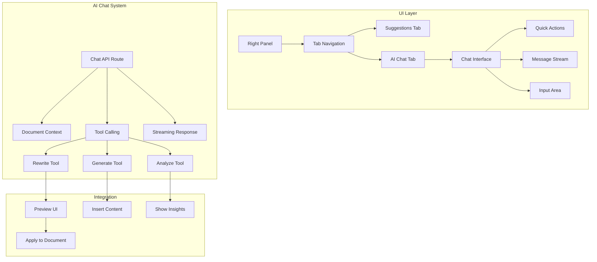

# Epic 2: AI Chat & Content Tools - Detailed Implementation

## Overview

Build an interactive AI chat system that understands document context and provides powerful rewriting, content generation, and document analysis capabilities. The chat lives in a second tab in the right panel.

## Architecture



## Sprint 1: Chat Infrastructure

### 1.1 Update Right Panel with Tabs

```typescript
// components/panels/RightPanel.tsx
import { useState } from 'react';
import { Tabs, TabsContent, TabsList, TabsTrigger } from '@/components/ui/tabs';
import { MessageSquare, Lightbulb } from 'lucide-react';
import { EnhancedSuggestionsPanel } from './EnhancedSuggestionsPanel';
import { AIChatPanel } from './AIChatPanel';

interface RightPanelProps {
  editor: Editor;
  document: Document;
  suggestions: UnifiedSuggestion[];
  isAnalyzing: boolean;
  analysisSource: 'local' | 'hybrid';
  onApplySuggestion: (suggestion: UnifiedSuggestion) => void;
  onIgnoreSuggestion: (id: string) => void;
}

export function RightPanel({
  editor,
  document,
  suggestions,
  isAnalyzing,
  analysisSource,
  onApplySuggestion,
  onIgnoreSuggestion
}: RightPanelProps) {
  const [activeTab, setActiveTab] = useState('suggestions');
  
  return (
    <div className="h-full flex flex-col bg-white">
      <Tabs value={activeTab} onValueChange={setActiveTab} className="flex-1 flex flex-col">
        <TabsList className="grid w-full grid-cols-2 px-4 pt-4">
          <TabsTrigger value="suggestions" className="flex items-center gap-2">
            <Lightbulb className="w-4 h-4" />
            Suggestions
          </TabsTrigger>
          <TabsTrigger value="ai-chat" className="flex items-center gap-2">
            <MessageSquare className="w-4 h-4" />
            AI Assistant
          </TabsTrigger>
        </TabsList>
        
        <TabsContent value="suggestions" className="flex-1 mt-0">
          <EnhancedSuggestionsPanel
            suggestions={suggestions}
            isAnalyzing={isAnalyzing}
            analysisSource={analysisSource}
            onApply={onApplySuggestion}
            onIgnore={onIgnoreSuggestion}
          />
        </TabsContent>
        
        <TabsContent value="ai-chat" className="flex-1 mt-0">
          <AIChatPanel
            editor={editor}
            document={document}
          />
        </TabsContent>
      </Tabs>
    </div>
  );
}
```

### 1.2 Create AI Chat Service

```typescript
// services/ai/chat-service.ts
import { CoreMessage, ToolCallPart, ToolResultPart } from 'ai';
import { z } from 'zod';

// Tool schemas
const rewriteTextSchema = z.object({
  text: z.string().describe('The text to rewrite'),
  style: z.enum(['formal', 'casual', 'concise', 'expanded', 'persuasive', 'humorous'])
    .describe('The target style'),
  preserveKeywords: z.array(z.string()).optional()
    .describe('Keywords to preserve in the rewrite')
});

const generateContentSchema = z.object({
  type: z.enum(['outline', 'introduction', 'conclusion', 'paragraph', 'ideas'])
    .describe('Type of content to generate'),
  context: z.string().describe('Context or topic for generation'),
  keywords: z.array(z.string()).optional().describe('Keywords to include'),
  length: z.enum(['short', 'medium', 'long']).optional().describe('Desired length')
});

const analyzeDocumentSchema = z.object({
  aspect: z.enum(['tone', 'structure', 'clarity', 'engagement', 'seo'])
    .describe('What aspect to analyze'),
  detailed: z.boolean().optional().describe('Whether to provide detailed analysis')
});

export interface ChatContext {
  document: {
    title: string;
    content: string;
    targetKeyword?: string;
    wordCount: number;
    seoScore?: number;
    readabilityScore?: number;
  };
  selectedText?: string;
  cursorPosition?: number;
}

export class AIChatService {
  buildSystemPrompt(context: ChatContext): string {
    return `You are an AI writing assistant integrated into WordWise, helping bloggers create better content.

Current Document Context:
- Title: ${context.document.title || 'Untitled'}
- Word Count: ${context.document.wordCount}
- Target Keyword: ${context.document.targetKeyword || 'None set'}
- SEO Score: ${context.document.seoScore || 'Not analyzed'}
- Readability: ${context.document.readabilityScore || 'Not analyzed'}

${context.selectedText ? `Selected Text: "${context.selectedText}"` : ''}

Your Capabilities:
1. Rewrite text with different styles (formal, casual, concise, etc.)
2. Generate content (outlines, introductions, conclusions, ideas)
3. Analyze document quality and provide insights
4. Help overcome writer's block with creative suggestions

Guidelines:
- Be concise and actionable in responses
- When rewriting, maintain the original meaning unless asked to change it
- Consider SEO when generating content (use target keyword naturally)
- Provide multiple options when possible
- Use a friendly, professional tone
- If user references "this" or "the text", assume they mean the selected text or entire document`;
  }

  buildTools() {
    return {
      rewriteText: {
        description: 'Rewrite text with a specific style or goal',
        parameters: rewriteTextSchema,
        execute: async (args: z.infer<typeof rewriteTextSchema>) => {
          // This executes server-side
          return {
            rewritten: await this.performRewrite(args),
            style: args.style,
            originalLength: args.text.length
          };
        }
      },
      
      generateContent: {
        description: 'Generate new content like outlines, introductions, or ideas',
        parameters: generateContentSchema,
        execute: async (args: z.infer<typeof generateContentSchema>) => {
          return {
            generated: await this.performGeneration(args),
            type: args.type,
            keywords: args.keywords
          };
        }
      },
      
      analyzeDocument: {
        description: 'Analyze the document for specific aspects',
        parameters: analyzeDocumentSchema,
        execute: async (args: z.infer<typeof analyzeDocumentSchema>, context: ChatContext) => {
          return {
            analysis: await this.performAnalysis(args, context),
            aspect: args.aspect
          };
        }
      }
    };
  }
  
  // Tool implementations
  private async performRewrite(args: z.infer<typeof rewriteTextSchema>): Promise<string> {
    // In a real implementation, this would call the AI model
    // For now, return a placeholder that shows the transformation
    const styleTransformations: Record<string, string> = {
      formal: 'Formal version: ' + args.text,
      casual: 'Casual version: ' + args.text,
      concise: args.text.substring(0, Math.floor(args.text.length * 0.7)) + '...',
      expanded: args.text + ' (with additional details and examples)',
      persuasive: 'Compelling point: ' + args.text,
      humorous: args.text + ' (but make it funny!)'
    };
    
    return styleTransformations[args.style] || args.text;
  }
  
  private async performGeneration(args: z.infer<typeof generateContentSchema>): Promise<string> {
    // Placeholder for content generation
    const templates: Record<string, string> = {
      outline: `I. Introduction\nII. Main Points\n   A. ${args.context}\n   B. Supporting ideas\nIII. Conclusion`,
      introduction: `In this article, we'll explore ${args.context}...`,
      conclusion: `In summary, ${args.context} demonstrates the importance of...`,
      paragraph: `Regarding ${args.context}, it's important to consider...`,
      ideas: `1. ${args.context} from a beginner's perspective\n2. Common mistakes in ${args.context}\n3. Future of ${args.context}`
    };
    
    return templates[args.type] || `Generated content about ${args.context}`;
  }
  
  private async performAnalysis(
    args: z.infer<typeof analyzeDocumentSchema>,
    context: ChatContext
  ): Promise<string> {
    // Placeholder for document analysis
    const analyses: Record<string, string> = {
      tone: 'The document has a professional yet approachable tone.',
      structure: 'The document follows a logical flow with clear sections.',
      clarity: 'The writing is clear with minimal jargon.',
      engagement: 'The content maintains reader interest with varied sentence structure.',
      seo: `SEO Score: ${context.document.seoScore}/100. Target keyword usage is optimal.`
    };
    
    return analyses[args.aspect] || 'Analysis complete.';
  }
}
```

### 1.3 Create Chat API Route

```typescript
// app/api/ai/chat/route.ts
import { streamText } from 'ai';
import { openai } from '@ai-sdk/openai';
import { auth } from '@/lib/auth';
import { AIChatService } from '@/services/ai/chat-service';

export async function POST(request: Request) {
  try {
    const session = await auth();
    if (!session) {
      return new Response('Unauthorized', { status: 401 });
    }
    
    const { messages, context } = await request.json();
    
    // Check user plan
    const userPlan = await getUserPlan(session.user.id);
    if (userPlan.plan === 'free') {
      return new Response('AI chat requires a paid plan', { status: 403 });
    }
    
    const chatService = new AIChatService();
    const tools = chatService.buildTools();
    
    const result = streamText({
      model: openai('gpt-4-turbo'),
      messages,
      system: chatService.buildSystemPrompt(context),
      tools,
      toolChoice: 'auto',
      temperature: 0.7,
      maxSteps: 5, // Allow multiple tool calls
      
      async onFinish({ text, toolCalls, usage }) {
        // Track usage for billing
        await trackAIUsage({
          userId: session.user.id,
          type: 'chat',
          tokensUsed: usage.totalTokens,
          toolCalls: toolCalls?.length || 0
        });
      }
    });
    
    return result.toDataStreamResponse();
  } catch (error) {
    console.error('Chat API error:', error);
    return new Response('Chat service unavailable', { status: 500 });
  }
}
```

## Sprint 2: Chat UI & Interactions

### 2.1 Create AI Chat Panel Component

```typescript
// components/panels/AIChatPanel.tsx
'use client';

import { useChat } from 'ai/react';
import { useState, useRef, useEffect } from 'react';
import { Send, Loader, RefreshCw, Wand2, FileText, Lightbulb } from 'lucide-react';
import { motion, AnimatePresence } from 'framer-motion';
import { Button } from '@/components/ui/button';
import { Textarea } from '@/components/ui/textarea';
import { ChatMessage } from './ChatMessage';
import { QuickActions } from './QuickActions';
import type { Editor } from '@tiptap/core';

interface AIChatPanelProps {
  editor: Editor;
  document: {
    id: string;
    title: string;
    targetKeyword?: string;
  };
}

export function AIChatPanel({ editor, document }: AIChatPanelProps) {
  const [selectedText, setSelectedText] = useState('');
  const messagesEndRef = useRef<HTMLDivElement>(null);
  
  // Get selected text when selection changes
  useEffect(() => {
    const updateSelection = () => {
      const { from, to } = editor.state.selection;
      if (from !== to) {
        const text = editor.state.doc.textBetween(from, to, ' ');
        setSelectedText(text);
      }
    };
    
    editor.on('selectionUpdate', updateSelection);
    return () => editor.off('selectionUpdate', updateSelection);
  }, [editor]);
  
  // Build context for AI
  const buildContext = () => ({
    document: {
      title: document.title,
      content: editor.getText(),
      targetKeyword: document.targetKeyword,
      wordCount: editor.storage.characterCount.words(),
      seoScore: 85, // Get from your analysis
      readabilityScore: 8.5 // Get from your analysis
    },
    selectedText,
    cursorPosition: editor.state.selection.from
  });
  
  const {
    messages,
    input,
    handleInputChange,
    handleSubmit,
    isLoading,
    reload,
    append
  } = useChat({
    api: '/api/ai/chat',
    body: {
      context: buildContext()
    },
    onError: (error) => {
      console.error('Chat error:', error);
    }
  });
  
  // Scroll to bottom on new messages
  useEffect(() => {
    messagesEndRef.current?.scrollIntoView({ behavior: 'smooth' });
  }, [messages]);
  
  // Quick action handler
  const handleQuickAction = (prompt: string) => {
    append({
      role: 'user',
      content: prompt
    });
  };
  
  return (
    <div className="flex flex-col h-full">
      {/* Header */}
      <div className="px-4 py-3 border-b">
        <h3 className="font-medium flex items-center gap-2">
          <Wand2 className="w-4 h-4" />
          AI Assistant
        </h3>
        {selectedText && (
          <p className="text-xs text-gray-500 mt-1 truncate">
            Selected: "{selectedText}"
          </p>
        )}
      </div>
      
      {/* Quick Actions */}
      <QuickActions
        onAction={handleQuickAction}
        hasSelection={!!selectedText}
      />
      
      {/* Messages */}
      <div className="flex-1 overflow-y-auto px-4 py-4 space-y-4">
        {messages.length === 0 && (
          <div className="text-center py-8 text-gray-500">
            <Wand2 className="w-12 h-12 mx-auto mb-4 text-gray-300" />
            <p className="text-sm">
              Hi! I'm your AI writing assistant. I can help you:
            </p>
            <ul className="text-sm mt-2 space-y-1">
              <li>✨ Rewrite text in different styles</li>
              <li>💡 Generate ideas and outlines</li>
              <li>📝 Write introductions and conclusions</li>
              <li>🔍 Analyze your content quality</li>
            </ul>
          </div>
        )}
        
        <AnimatePresence>
          {messages.map((message, index) => (
            <ChatMessage
              key={message.id}
              message={message}
              isLast={index === messages.length - 1}
              editor={editor}
            />
          ))}
        </AnimatePresence>
        
        {isLoading && (
          <div className="flex items-center gap-2 text-gray-500">
            <Loader className="w-4 h-4 animate-spin" />
            <span className="text-sm">AI is thinking...</span>
          </div>
        )}
        
        <div ref={messagesEndRef} />
      </div>
      
      {/* Input */}
      <form onSubmit={handleSubmit} className="p-4 border-t">
        <div className="flex gap-2">
          <Textarea
            value={input}
            onChange={handleInputChange}
            placeholder={
              selectedText 
                ? "Ask me to rewrite or improve the selected text..."
                : "Ask me anything about your document..."
            }
            className="min-h-[60px] resize-none"
            onKeyDown={(e) => {
              if (e.key === 'Enter' && !e.shiftKey) {
                e.preventDefault();
                handleSubmit(e as any);
              }
            }}
          />
          <div className="flex flex-col gap-2">
            <Button
              type="submit"
              size="icon"
              disabled={isLoading || !input.trim()}
            >
              {isLoading ? (
                <Loader className="w-4 h-4 animate-spin" />
              ) : (
                <Send className="w-4 h-4" />
              )}
            </Button>
            {messages.length > 0 && (
              <Button
                type="button"
                size="icon"
                variant="outline"
                onClick={() => reload()}
                disabled={isLoading}
              >
                <RefreshCw className="w-4 h-4" />
              </Button>
            )}
          </div>
        </div>
      </form>
    </div>
  );
}
```

### 2.2 Create Chat Message Component

```typescript
// components/panels/ChatMessage.tsx
import { motion } from 'framer-motion';
import { User, Bot, Copy, Check, FileText, Wand2 } from 'lucide-react';
import { useState } from 'react';
import { Button } from '@/components/ui/button';
import ReactMarkdown from 'react-markdown';
import type { Message } from 'ai';
import type { Editor } from '@tiptap/core';

interface ChatMessageProps {
  message: Message;
  isLast: boolean;
  editor: Editor;
}

export function ChatMessage({ message, isLast, editor }: ChatMessageProps) {
  const [copied, setCopied] = useState(false);
  const isUser = message.role === 'user';
  
  // Handle tool results
  const handleApplyRewrite = (text: string) => {
    const { from, to } = editor.state.selection;
    editor
      .chain()
      .focus()
      .deleteRange({ from, to })
      .insertContent(text)
      .run();
  };
  
  const handleInsertContent = (text: string) => {
    editor
      .chain()
      .focus()
      .insertContent(text)
      .run();
  };
  
  const copyToClipboard = async (text: string) => {
    await navigator.clipboard.writeText(text);
    setCopied(true);
    setTimeout(() => setCopied(false), 2000);
  };
  
  return (
    <motion.div
      initial={{ opacity: 0, y: 10 }}
      animate={{ opacity: 1, y: 0 }}
      className={`flex gap-3 ${isUser ? 'justify-end' : 'justify-start'}`}
    >
      {!isUser && (
        <div className="w-8 h-8 rounded-full bg-purple-100 flex items-center justify-center flex-shrink-0">
          <Bot className="w-4 h-4 text-purple-600" />
        </div>
      )}
      
      <div className={`
        max-w-[80%] rounded-lg px-4 py-2
        ${isUser ? 'bg-gray-100' : 'bg-white border'}
      `}>
        <ReactMarkdown className="text-sm prose prose-sm max-w-none">
          {message.content}
        </ReactMarkdown>
        
        {/* Tool Results */}
        {message.toolInvocations?.map((invocation, index) => (
          <ToolResult
            key={index}
            invocation={invocation}
            onApply={handleApplyRewrite}
            onInsert={handleInsertContent}
            onCopy={copyToClipboard}
          />
        ))}
      </div>
      
      {isUser && (
        <div className="w-8 h-8 rounded-full bg-gray-200 flex items-center justify-center flex-shrink-0">
          <User className="w-4 h-4 text-gray-600" />
        </div>
      )}
    </motion.div>
  );
}

// Tool Result Component
function ToolResult({ 
  invocation, 
  onApply, 
  onInsert, 
  onCopy 
}: {
  invocation: any;
  onApply: (text: string) => void;
  onInsert: (text: string) => void;
  onCopy: (text: string) => void;
}) {
  const [showPreview, setShowPreview] = useState(true);
  
  if (invocation.state !== 'result') {
    return (
      <div className="mt-2 p-3 bg-gray-50 rounded text-sm">
        <Loader className="w-4 h-4 animate-spin inline mr-2" />
        Processing...
      </div>
    );
  }
  
  const { toolName, result } = invocation;
  
  if (toolName === 'rewriteText') {
    return (
      <motion.div
        initial={{ opacity: 0, height: 0 }}
        animate={{ opacity: 1, height: 'auto' }}
        className="mt-3 p-3 bg-purple-50 rounded-lg border border-purple-200"
      >
        <div className="flex items-center justify-between mb-2">
          <span className="text-xs font-medium text-purple-700">
            {result.style.charAt(0).toUpperCase() + result.style.slice(1)} Rewrite
          </span>
          <Button
            size="sm"
            variant="ghost"
            onClick={() => setShowPreview(!showPreview)}
          >
            {showPreview ? 'Hide' : 'Show'}
          </Button>
        </div>
        
        {showPreview && (
          <>
            <div className="text-sm mb-3 p-2 bg-white rounded">
              {result.rewritten}
            </div>
            
            <div className="flex gap-2">
              <Button
                size="sm"
                onClick={() => onApply(result.rewritten)}
                className="flex-1"
              >
                <Wand2 className="w-3 h-3 mr-1" />
                Apply
              </Button>
              <Button
                size="sm"
                variant="outline"
                onClick={() => onCopy(result.rewritten)}
              >
                <Copy className="w-3 h-3" />
              </Button>
            </div>
          </>
        )}
      </motion.div>
    );
  }
  
  if (toolName === 'generateContent') {
    return (
      <motion.div
        initial={{ opacity: 0, height: 0 }}
        animate={{ opacity: 1, height: 'auto' }}
        className="mt-3 p-3 bg-green-50 rounded-lg border border-green-200"
      >
        <div className="flex items-center justify-between mb-2">
          <span className="text-xs font-medium text-green-700">
            Generated {result.type}
          </span>
        </div>
        
        <div className="text-sm mb-3 p-2 bg-white rounded whitespace-pre-wrap">
          {result.generated}
        </div>
        
        <div className="flex gap-2">
          <Button
            size="sm"
            onClick={() => onInsert(result.generated)}
            className="flex-1"
          >
            <FileText className="w-3 h-3 mr-1" />
            Insert
          </Button>
          <Button
            size="sm"
            variant="outline"
            onClick={() => onCopy(result.generated)}
          >
            <Copy className="w-3 h-3" />
          </Button>
        </div>
      </motion.div>
    );
  }
  
  return null;
}
```

### 2.3 Create Quick Actions Component

```typescript
// components/panels/QuickActions.tsx
import { Button } from '@/components/ui/button';
import { 
  ArrowUpDown, 
  FileText, 
  Lightbulb, 
  MessageSquare,
  Target,
  Sparkles
} from 'lucide-react';

interface QuickActionsProps {
  onAction: (prompt: string) => void;
  hasSelection: boolean;
}

export function QuickActions({ onAction, hasSelection }: QuickActionsProps) {
  const rewriteActions = [
    { icon: ArrowUpDown, label: 'Formal', prompt: 'Make this text more formal and professional' },
    { icon: MessageSquare, label: 'Casual', prompt: 'Make this text more casual and conversational' },
    { icon: Target, label: 'Concise', prompt: 'Make this text more concise' },
    { icon: Sparkles, label: 'Engaging', prompt: 'Make this text more engaging and interesting' }
  ];
  
  const generateActions = [
    { icon: Lightbulb, label: 'Ideas', prompt: 'Generate 5 blog post ideas about this topic' },
    { icon: FileText, label: 'Outline', prompt: 'Create an outline for this blog post' },
    { icon: FileText, label: 'Intro', prompt: 'Write an engaging introduction' },
    { icon: FileText, label: 'Conclusion', prompt: 'Write a strong conclusion' }
  ];
  
  const actions = hasSelection ? rewriteActions : generateActions;
  
  return (
    <div className="px-4 py-2 border-b bg-gray-50">
      <p className="text-xs text-gray-600 mb-2">
        {hasSelection ? 'Rewrite selected text:' : 'Quick actions:'}
      </p>
      <div className="flex flex-wrap gap-2">
        {actions.map((action) => (
          <Button
            key={action.label}
            size="sm"
            variant="outline"
            onClick={() => onAction(action.prompt)}
            className="text-xs"
          >
            <action.icon className="w-3 h-3 mr-1" />
            {action.label}
          </Button>
        ))}
      </div>
    </div>
  );
}
```

## Sprint 3: Advanced Features & Polish

### 3.1 Add Conversation Memory

```typescript
// hooks/useChatMemory.ts
import { useState, useEffect } from 'react';

interface ChatMemory {
  documentId: string;
  messages: Message[];
  lastUpdated: Date;
}

export function useChatMemory(documentId: string) {
  const [memory, setMemory] = useState<ChatMemory | null>(null);
  
  // Load conversation from localStorage
  useEffect(() => {
    const key = `chat-memory-${documentId}`;
    const stored = localStorage.getItem(key);
    if (stored) {
      setMemory(JSON.parse(stored));
    }
  }, [documentId]);
  
  // Save conversation
  const saveMemory = (messages: Message[]) => {
    const memory: ChatMemory = {
      documentId,
      messages: messages.slice(-20), // Keep last 20 messages
      lastUpdated: new Date()
    };
    localStorage.setItem(`chat-memory-${documentId}`, JSON.stringify(memory));
    setMemory(memory);
  };
  
  // Clear conversation
  const clearMemory = () => {
    localStorage.removeItem(`chat-memory-${documentId}`);
    setMemory(null);
  };
  
  return { memory, saveMemory, clearMemory };
}
```

### 3.2 Add Template System

```typescript
// services/ai/templates.ts
export interface ContentTemplate {
  id: string;
  name: string;
  description: string;
  prompt: string;
  category: 'structure' | 'content' | 'seo';
  requiresSelection: boolean;
}

export const contentTemplates: ContentTemplate[] = [
  // Structure Templates
  {
    id: 'how-to-outline',
    name: 'How-To Guide Outline',
    description: 'Create a structured how-to guide',
    prompt: 'Create a detailed outline for a how-to guide about: {topic}. Include prerequisites, step-by-step sections, tips, and common mistakes.',
    category: 'structure',
    requiresSelection: false
  },
  {
    id: 'listicle-outline',
    name: 'Listicle Outline',
    description: 'Structure for a list-based article',
    prompt: 'Create an outline for a listicle about: {topic}. Include an engaging intro, 5-10 list items with subpoints, and a conclusion.',
    category: 'structure',
    requiresSelection: false
  },
  
  // Content Templates
  {
    id: 'hook-intro',
    name: 'Hook Introduction',
    description: 'Start with a compelling hook',
    prompt: 'Write 3 different introduction hooks for an article about: {topic}. Include a question hook, a statistic hook, and a story hook.',
    category: 'content',
    requiresSelection: false
  },
  {
    id: 'expand-point',
    name: 'Expand Bullet Point',
    description: 'Turn a bullet into a paragraph',
    prompt: 'Expand this bullet point into a full paragraph with examples and details: {selection}',
    category: 'content',
    requiresSelection: true
  },
  
  // SEO Templates
  {
    id: 'meta-description',
    name: 'Meta Description',
    description: 'SEO-optimized meta description',
    prompt: 'Write 3 meta descriptions (150-160 chars) for an article titled: {title}. Include the keyword: {keyword}',
    category: 'seo',
    requiresSelection: false
  },
  {
    id: 'keyword-integration',
    name: 'Natural Keyword Integration',
    description: 'Add keywords naturally',
    prompt: 'Rewrite this text to naturally include the keyword "{keyword}" 2-3 times: {selection}',
    category: 'seo',
    requiresSelection: true
  }
];

// Template UI Component
export function TemplateSelector({ 
  onSelect 
}: { 
  onSelect: (template: ContentTemplate) => void 
}) {
  const [category, setCategory] = useState<string>('all');
  
  const filtered = contentTemplates.filter(
    t => category === 'all' || t.category === category
  );
  
  return (
    <div className="p-4">
      <div className="flex gap-2 mb-4">
        <Button
          size="sm"
          variant={category === 'all' ? 'default' : 'outline'}
          onClick={() => setCategory('all')}
        >
          All
        </Button>
        <Button
          size="sm"
          variant={category === 'structure' ? 'default' : 'outline'}
          onClick={() => setCategory('structure')}
        >
          Structure
        </Button>
        <Button
          size="sm"
          variant={category === 'content' ? 'default' : 'outline'}
          onClick={() => setCategory('content')}
        >
          Content
        </Button>
        <Button
          size="sm"
          variant={category === 'seo' ? 'default' : 'outline'}
          onClick={() => setCategory('seo')}
        >
          SEO
        </Button>
      </div>
      
      <div className="space-y-2">
        {filtered.map(template => (
          <button
            key={template.id}
            onClick={() => onSelect(template)}
            className="w-full text-left p-3 rounded-lg border hover:bg-gray-50 transition-colors"
          >
            <h4 className="font-medium text-sm">{template.name}</h4>
            <p className="text-xs text-gray-600 mt-1">{template.description}</p>
          </button>
        ))}
      </div>
    </div>
  );
}
```

### 3.3 Add Multi-Step Enhancements

```typescript
// components/panels/MultiStepEnhancement.tsx
import { useState } from 'react';
import { ChevronRight, Check } from 'lucide-react';
import { Button } from '@/components/ui/button';

interface EnhancementStep {
  id: string;
  name: string;
  description: string;
  action: string;
}

const enhancementWorkflows = {
  'blog-post-polish': {
    name: 'Polish Blog Post',
    steps: [
      {
        id: 'grammar',
        name: 'Fix Grammar & Spelling',
        description: 'Correct all grammar and spelling errors',
        action: 'Fix all grammar and spelling errors in this text'
      },
      {
        id: 'clarity',
        name: 'Improve Clarity',
        description: 'Simplify complex sentences',
        action: 'Improve clarity by simplifying complex sentences'
      },
      {
        id: 'engagement',
        name: 'Boost Engagement',
        description: 'Add hooks and transitions',
        action: 'Make this more engaging with better hooks and transitions'
      },
      {
        id: 'seo',
        name: 'Optimize for SEO',
        description: 'Naturally integrate keywords',
        action: 'Optimize for SEO by naturally integrating the target keyword'
      }
    ]
  },
  'content-expansion': {
    name: 'Expand Content',
    steps: [
      {
        id: 'examples',
        name: 'Add Examples',
        description: 'Include relevant examples',
        action: 'Add relevant examples to illustrate the main points'
      },
      {
        id: 'details',
        name: 'Add Details',
        description: 'Provide more context and depth',
        action: 'Add more details and context to expand the content'
      },
      {
        id: 'data',
        name: 'Add Data/Stats',
        description: 'Include supporting data',
        action: 'Add relevant statistics or data to support the claims'
      }
    ]
  }
};

export function MultiStepEnhancement({ 
  onRunStep,
  selectedText 
}: {
  onRunStep: (action: string) => void;
  selectedText: string;
}) {
  const [activeWorkflow, setActiveWorkflow] = useState<string | null>(null);
  const [completedSteps, setCompletedSteps] = useState<Set<string>>(new Set());
  const [currentStep, setCurrentStep] = useState(0);
  
  const workflow = activeWorkflow ? enhancementWorkflows[activeWorkflow] : null;
  
  const runStep = (step: EnhancementStep) => {
    onRunStep(step.action);
    setCompletedSteps(prev => new Set(prev).add(step.id));
    setCurrentStep(prev => prev + 1);
  };
  
  if (!activeWorkflow) {
    return (
      <div className="p-4">
        <h4 className="font-medium mb-3">Multi-Step Enhancements</h4>
        <div className="space-y-2">
          {Object.entries(enhancementWorkflows).map(([key, workflow]) => (
            <button
              key={key}
              onClick={() => setActiveWorkflow(key)}
              className="w-full text-left p-3 rounded-lg border hover:bg-gray-50"
            >
              <h5 className="font-medium text-sm">{workflow.name}</h5>
              <p className="text-xs text-gray-600 mt-1">
                {workflow.steps.length} steps to enhance your content
              </p>
            </button>
          ))}
        </div>
      </div>
    );
  }
  
  return (
    <div className="p-4">
      <button
        onClick={() => {
          setActiveWorkflow(null);
          setCompletedSteps(new Set());
          setCurrentStep(0);
        }}
        className="text-sm text-gray-600 mb-3"
      >
        ← Back
      </button>
      
      <h4 className="font-medium mb-3">{workflow!.name}</h4>
      
      <div className="space-y-2">
        {workflow!.steps.map((step, index) => {
          const isCompleted = completedSteps.has(step.id);
          const isCurrent = index === currentStep;
          
          return (
            <div
              key={step.id}
              className={`
                p-3 rounded-lg border transition-all
                ${isCompleted ? 'bg-green-50 border-green-200' : ''}
                ${isCurrent ? 'border-blue-400 shadow-sm' : ''}
              `}
            >
              <div className="flex items-start justify-between">
                <div className="flex-1">
                  <h5 className="font-medium text-sm flex items-center gap-2">
                    {isCompleted && <Check className="w-4 h-4 text-green-600" />}
                    {step.name}
                  </h5>
                  <p className="text-xs text-gray-600 mt-1">{step.description}</p>
                </div>
                
                {isCurrent && !isCompleted && (
                  <Button
                    size="sm"
                    onClick={() => runStep(step)}
                  >
                    Run
                    <ChevronRight className="w-3 h-3 ml-1" />
                  </Button>
                )}
              </div>
            </div>
          );
        })}
      </div>
      
      {completedSteps.size === workflow!.steps.length && (
        <div className="mt-4 p-3 bg-green-50 rounded-lg text-center">
          <p className="text-sm text-green-700">
            ✨ All enhancements complete!
          </p>
        </div>
      )}
    </div>
  );
}
```

## Testing & Integration

### Test Scenarios

```typescript
// tests/ai-chat.test.ts
describe('AI Chat Integration', () => {
  it('should rewrite selected text', async () => {
    // Select text in editor
    editor.commands.setTextSelection({ from: 10, to: 20 });
    
    // Send rewrite request
    await userEvent.type(chatInput, 'Make this more formal');
    await userEvent.click(sendButton);
    
    // Verify rewrite appears with apply button
    await waitFor(() => {
      expect(screen.getByText('Apply')).toBeInTheDocument();
    });
  });
  
  it('should generate content at cursor', async () => {
    // Place cursor at position
    editor.commands.focus();
    
    // Request intro generation
    await userEvent.type(chatInput, 'Write an introduction');
    await userEvent.click(sendButton);
    
    // Verify insert button appears
    await waitFor(() => {
      expect(screen.getByText('Insert')).toBeInTheDocument();
    });
  });
  
  it('should handle errors gracefully', async () => {
    // Simulate API error
    server.use(
      rest.post('/api/ai/chat', (req, res, ctx) => {
        return res(ctx.status(500));
      })
    );
    
    // Send request
    await userEvent.type(chatInput, 'Help me');
    await userEvent.click(sendButton);
    
    // Verify error message
    await waitFor(() => {
      expect(screen.getByText(/service unavailable/i)).toBeInTheDocument();
    });
  });
});
```

## Key Implementation Notes

1. **Streaming Responses**: Uses AI SDK's streaming for real-time feedback
2. **Tool Results**: Properly typed and handled with preview UI
3. **Context Awareness**: Always sends document context with requests
4. **Selection Handling**: Tracks selected text for targeted rewrites
5. **Error Handling**: Graceful fallbacks for API failures
6. **Cost Control**: Tracks token usage for billing

## Deliverables

- [ ] Tab navigation in right panel
- [ ] AI chat service with proper tool implementations
- [ ] Streaming chat UI with message history
- [ ] Quick action buttons for common tasks
- [ ] Rewrite preview with apply functionality
- [ ] Content generation with insert capability
- [ ] Template system for structured content
- [ ] Multi-step enhancement workflows
- [ ] Conversation memory per document
- [ ] Full integration with editor selection
- [ ] Error handling and loading states
- [ ] Token usage tracking for billing

This implementation creates a powerful AI assistant that understands document context and provides actionable help for content creation and improvement. 