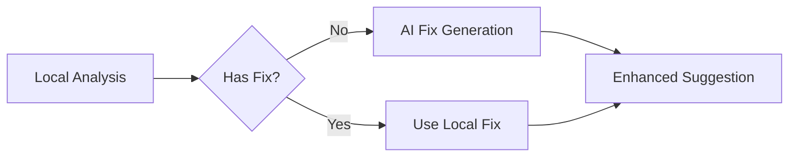

# Epic 002: AI-Enhanced Suggestions

**Status:** Planning
**Date Started:** TBD
**Date Completed:** TBD
**Duration Estimate:** 3 weeks

## Description
Integrate AI capabilities to enhance the existing suggestion system by generating fixes for errors that local analysis cannot solve. This epic fills the gaps where rule-based systems fall short, providing intelligent fixes for complex grammar issues, style improvements, and contextual errors.

## Core Principles
1. **Selective Enhancement**: Only use AI when local analysis cannot provide a fix
2. **Progressive Disclosure**: AI suggestions clearly marked with sparkle icon
3. **Cost Effective**: Leverage incremental analysis to reduce AI calls by 100x
4. **Seamless Integration**: Works within existing suggestion infrastructure

## Architecture Overview


## Planned Sprints

### Week 1: AI Fix Generation
**Goal:** Add AI-powered fix generation for suggestions without local fixes

**Key Features:**
- Integrate OpenAI API for fix generation
- Create fix generation service with smart prompting
- Add AI fixes to existing suggestion objects
- Implement caching for AI-generated fixes
- Add sparkle icon to indicate AI-enhanced suggestions

**Success Metrics:**
- AI fixes generated for 100% of fixless suggestions
- < 500ms response time for cached fixes
- Clear visual distinction for AI suggestions

### Week 2: Contextual Error Detection
**Goal:** Use AI to detect complex errors that rule-based systems miss

**Key Features:**
- Implement contextual grammar checking
- Add tone consistency detection
- Create clarity improvement suggestions
- Detect logical flow issues
- Integrate with incremental analysis system

**Success Metrics:**
- Catch 90%+ of errors missed by local analysis
- Maintain sub-second analysis times
- High precision (< 10% false positives)

### Week 3: Polish and Preferences
**Goal:** Refine the AI integration and add user controls

**Key Features:**
- User preferences for AI enhancement level
- Confidence scoring for AI suggestions
- Batch processing for efficiency
- Cost tracking and limits
- A/B testing framework

**Success Metrics:**
- User satisfaction > 90%
- Cost per document < $0.01
- Clear ROI on AI enhancement

## Technical Implementation

### AI Fix Generation Service
```typescript
// services/ai/fix-generator.ts
export class AIFixGenerator {
  async generateFix(suggestion: Suggestion, context: DocumentContext): Promise<Fix> {
    // Check cache first
    const cached = await cache.get(suggestion.id);
    if (cached) return cached;
    
    // Generate prompt with context
    const prompt = buildFixPrompt(suggestion, context);
    
    // Call AI with streaming disabled for fixes
    const fix = await generateWithRetry(prompt);
    
    // Cache the result
    await cache.set(suggestion.id, fix);
    
    return fix;
  }
}
```

### Integration Points
1. **UnifiedAnalysisEngine**: Add AI enhancement step after local analysis
2. **SuggestionFactory**: Mark AI-enhanced suggestions
3. **SuggestionContext**: Handle AI suggestion state
4. **UI Components**: Show AI indicators and confidence

## Prerequisites
- Epic 001.5 complete (position tracking working)
- OpenAI API key configured
- Caching infrastructure ready
- Cost monitoring in place

## Success Criteria
- [ ] 100% of grammar errors have actionable fixes
- [ ] AI enhancement adds < 200ms to analysis time
- [ ] Cost remains under $0.01 per document
- [ ] Users report higher satisfaction with suggestions
- [ ] Clear visual indicators for AI-enhanced content

## Risk Mitigation
- **API Failures**: Graceful degradation to local-only
- **High Costs**: Aggressive caching and batch processing
- **Latency**: Background processing with optimistic UI
- **Quality**: Confidence scoring and user feedback loops

## Next Steps After Completion
Move to Epic 003: AI Content Assistant for more advanced AI features including chat interface, content generation, and rewriting tools. 