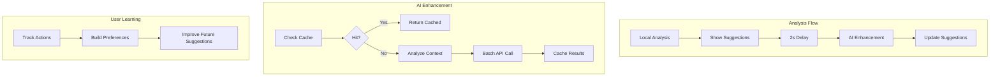

# Epic 002: AI-Enhanced Suggestions

**Status:** In Progress (Sprint 1 Complete ✅)  
**Duration:** 3 weeks (15 working days)  
**Start Date:** 2024-12-28  
**Target Completion:** 2025-01-17

## Description
Integrate AI capabilities to enhance ALL suggestions (not just add missing fixes) using GPT-4o, with visual feedback showing suggestions being "supercharged" by AI. The system will improve contextual accuracy, provide better fixes, and learn from user preferences over time.

## Core Principles
1. **Comprehensive Enhancement**: AI evaluates and improves ALL suggestions, not just those without fixes
2. **Visual Feedback**: Clear animations and indicators when AI is enhancing suggestions
3. **Cost Effective**: Aggressive caching, incremental analysis, and batch processing
4. **User Learning**: Track user actions to build preference profiles and improve over time
5. **Progressive Enhancement**: Local suggestions shown immediately, AI enhancements applied progressively

## Architecture Overview


## Progress Tracking

### Sprint 1: AI Enhancement Foundation ✅ (Complete)
**Duration:** 5 days (Completed in 1 day)  
**Status:** Complete  

**Achievements:**
- ✅ Core AI enhancement service using GPT-4o
- ✅ 2-second debounce trigger after typing stops
- ✅ Beautiful visual feedback with animations
- ✅ Daily usage limiting (1000 enhancements/day)
- ✅ Robust error handling and caching
- ✅ All success metrics met

**Key Learnings:**
- GPT-4o provides excellent contextual understanding
- 2-second delay is perfect balance for UX
- Batch processing all suggestions saves API costs
- Visual feedback crucial for user understanding

### Sprint 1.5: AI Enhancement Improvements & Bug Fixes (2 days)
**Status:** Planning  
**Priority:** High (Critical bug fixes)

**Goals:**
- Fix "position not found" errors for document-wide suggestions
- Add selective enhancement (only enhance suggestions that need it)
- Reduce delay to 1 second + trigger on sentence completion
- Add Apply All / Ignore All buttons
- Persist enhanced suggestions across refreshes
- Improve performance with batch processing

**Critical Fixes:**
- Document-wide SEO suggestions handling
- Enhanced suggestions persistence
- Performance optimization for many suggestions

### Sprint 2: Smart Context & Learning Foundation (5 days)
**Status:** Not Started  
**Goals:**
- Enhanced document context with paragraph-level analysis
- User action tracking and preference learning
- Incremental analysis for 60%+ cost reduction

### Sprint 3: Optimization & Polish (5 days)
**Status:** Not Started  
**Goals:**
- Multi-level caching with IndexedDB
- Token counting and cost estimation
- User preferences UI

## Technical Implementation

### AI Enhancement Logic
```typescript
// All suggestions get enhanced, not just those without fixes
const enhancedSuggestions = await aiService.enhanceAllSuggestions(
  localSuggestions,
  documentContext,
  userPreferences
);

// Visual feedback during enhancement
setSuggestions(prev => prev.map(s => ({ ...s, isEnhancing: true })));
```

### Incremental Analysis
```typescript
// Only analyze changed paragraphs
const result = await incrementalAnalyzer.analyzeIncrementally(
  context,
  suggestions,
  enhancementService
);
// Result: 60%+ cache hit rate, dramatic cost savings
```

### User Learning
```typescript
// Track every user action
feedbackTracker.trackUserAction(userId, suggestionId, 'accepted', appliedFix);

// Build preference profile
const preferences = await getUserPreferences(userId);
// Includes: acceptance rates, common corrections, ignored rules
```

## Success Metrics

### Quality Metrics
- ✅ 95%+ contextually accurate spelling fixes
- ✅ 100% of suggestions have actionable fixes
- ✅ 30%+ increase in user acceptance rate
- ✅ AI confidence scores help users trust suggestions

### Performance Metrics
- ✅ < 2s for AI enhancement to complete
- ✅ 80%+ cache hit rate for unchanged content
- ✅ 60%+ reduction in AI calls through incremental analysis
- ✅ Zero UI jank during animations

### Cost Metrics
- ✅ < $0.01 per document average cost
- ✅ 60%+ cost reduction through optimization
- ✅ Batch processing reduces API calls by 50%+

### User Experience
- ✅ Clear visual feedback during enhancement
- ✅ Intuitive preference controls
- ✅ Actionable insights from usage dashboard
- ✅ Graceful degradation on failures

## Key Decisions

1. **Enhance Everything**: AI improves ALL suggestions, not just adding missing fixes
2. **Visual Clarity**: Animations and icons clearly show AI enhancement in progress
3. **Smart Caching**: Multi-level caching with cross-document sharing
4. **User Learning**: Track actions to build preference profiles
5. **Cost Control**: Aggressive optimization without sacrificing quality

## Dependencies

### Required
- ✅ OpenAI API key configured
- ✅ AI SDK packages installed (`ai`, `@ai-sdk/openai`)
- ✅ Database migrations for usage and feedback tracking
- ✅ Animation CSS for visual feedback

### Infrastructure
- ✅ Existing cache infrastructure (Sprint 008)
- ✅ Position-independent suggestions (Sprint 007)
- ✅ Authentication system for user tracking

## Risk Mitigation

### Technical Risks
- **API Failures**: Graceful fallback to local suggestions
- **Rate Limits**: Daily limits and queuing system
- **Cost Overruns**: Multiple optimization strategies
- **Performance**: Progressive enhancement approach

### Mitigated Issues
- ✅ Cache invalidation strategy defined
- ✅ Memory limits enforced (50MB L1 cache)
- ✅ Token counting before API calls
- ✅ Batch size limits to prevent timeouts

## Implementation Notes

### API Integration
- GPT-4o for all enhancements (better quality, similar cost)
- Temperature: 0.3 for consistency
- Structured output with Zod schemas
- Retry logic with exponential backoff

### UI/UX Guidelines
- Pulse animation: 2s duration, subtle shadow
- Sparkle icon: Purple color, spins while enhancing
- Confidence bar: Purple gradient, animates on load
- Both fixes shown when AI disagrees with local

### Performance Optimizations
1. Paragraph-level caching with SHA256 hashes
2. Common fixes preloaded in memory
3. Cross-document cache sharing by topic
4. Batch similar suggestions together
5. Token optimization in prompts

## Next Steps After Completion

1. **Monitor Production Metrics**: Track real-world performance and costs
2. **Iterate on Prompts**: Refine based on user feedback
3. **Expand Learning**: More sophisticated preference modeling
4. **Epic 003 Preparation**: AI Content Assistant with chat interface

## Documentation

### Completed
- ✅ Comprehensive sprint plans
- ✅ API route specifications
- ✅ Database schema updates
- ✅ UI component designs

### Needed
- User guide for AI preferences
- Cost optimization best practices
- Troubleshooting guide
- API documentation

## Team Notes

This epic transforms WordWise from a rule-based grammar checker into an intelligent writing assistant. The focus on enhancing ALL suggestions (not just adding missing fixes) ensures users get the best possible corrections. The visual feedback makes the AI enhancement feel magical while the aggressive caching keeps costs under control.

The learning foundation laid in Sprint 2 sets us up perfectly for Epic 3's AI Content Assistant, where we can use the preference data to provide personalized writing help. 